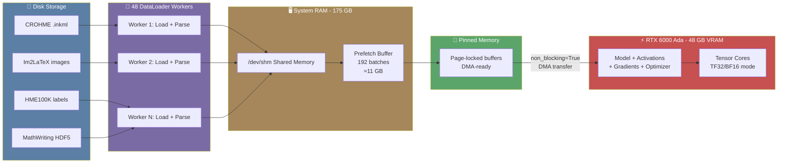

# 7. Hardware Optimization and GPU Utilization

## Overview

Training a model like TAMER OCR — with its Swin-v2 encoder processing 384×384 images and a Transformer decoder generating LaTeX sequences — is computationally demanding. Without careful hardware optimization, even a powerful GPU like the RTX 6000 Ada can spend most of its time **waiting for data** rather than computing. This note covers the full suite of hardware optimizations used in the TAMER project, from GPU-specific precision modes to DataLoader tuning, and explains why each one matters for achieving maximum training throughput.

## The RTX 6000 Ada GPU

The TAMER project targets the **NVIDIA RTX 6000 Ada Generation** GPU, a professional-grade card built on the Ada Lovelace architecture. Key specifications:

- **48 GB GDDR6 VRAM** — enough to hold the Swin-v2 encoder (≈280M parameters), the Transformer decoder (≈70M parameters), optimizer states, and a substantial batch of image-label pairs simultaneously.
- **Ada Lovelace architecture** — the successor to Ampere, featuring 3rd-generation Tensor Cores that support BF16, FP16, TF32, INT8, and FP8 precision modes.
- **BF16 Tensor Cores** — natively accelerate BFloat16 matrix multiplications, which is the primary compute format used in TAMER training. BF16 provides the same dynamic range as FP32 (8 exponent bits) with reduced mantissa precision (7 bits), making it far more stable than FP16 for training.
- **18,176 CUDA cores** — massive parallel compute capacity for the non-matrix operations in the model.

The 48 GB VRAM is the critical resource. Every optimization in the TAMER pipeline is designed to either maximize compute utilization within that 48 GB budget or minimize the overhead of moving data in and out of the GPU.

## TF32 (TensorFloat-32) Precision

**TF32** is a math mode available on Ampere and later GPUs (including Ada Lovelace) that uses **19-bit precision** for matrix multiplications instead of the full 32-bit FP32. TF32 uses the same 8-bit exponent as FP32 (preserving the full dynamic range) but truncates the mantissa to 10 bits (matching FP16's mantissa). This allows the Tensor Cores to use their FP16 data paths while maintaining FP32-like dynamic range.

For deep learning training, TF32 provides essentially the same model quality as full FP32 while delivering significantly higher throughput on matrix operations. The TAMER project enables TF32 with the following flags:

```python
# Enable TF32 for matrix multiplications
torch.backends.cuda.matmul.allow_tf32 = True

# Enable TF32 for cuDNN convolutions (Swin-v2 uses depthwise convolutions)
torch.backends.cudnn.allow_tf32 = True

# For torch.compile models, allow high-precision matmul
torch.set_float32_matmul_precision('high')
```

The `torch.set_float32_matmul_precision('high')` setting is particularly important when using `torch.compile`. It tells the compiled model that it is acceptable to use TF32 for FP32 matrix multiplications. Without this flag, compiled models may fall back to slower FP32 paths.

The impact is substantial: TF32 can deliver **2-3x higher FLOPS** for matmul operations compared to FP32, because the Tensor Cores process TF32 data through their optimized FP16 pathways. For the Swin-v2 encoder, where matrix multiplications dominate the compute, this translates directly into faster training.

## cuDNN Benchmark Mode

```python
torch.backends.cudnn.benchmark = True
```

When `cudnn.benchmark` is enabled, PyTorch's cuDNN library **auto-tunes** the convolution algorithms at the start of training. It benchmarks several candidate algorithms for each convolution operation and selects the fastest one for the given input size, data type, and hardware.

The Swin-v2 encoder uses depthwise convolutions in its Shifted Window attention blocks. The optimal algorithm for these convolutions depends on the exact input dimensions (batch size, image resolution, channel count) and the GPU architecture. With `benchmark=True`, cuDNN finds the best algorithm on the first few iterations and caches it for the rest of training.

The trade-off is that if input sizes change (which they should not in the TAMER project due to fixed image resolution and batch size), cuDNN will re-benchmark, adding overhead. Since the TAMER pipeline uses consistent sizes, this is not a concern.

## Memory Optimization: pin_memory and Data Transfer

```python
DataLoader(..., pin_memory=True)
```

**Page-locked (pinned) memory** is host (CPU) memory that is guaranteed not to be swapped out to disk. When data is loaded into pinned memory, the GPU can transfer it using **Direct Memory Access (DMA)**, which is significantly faster than the default transfer path that requires an intermediate copy through the operating system's page cache.

Without `pin_memory=True`, the GPU transfer involves:
1. The CPU copies data from pageable memory to a temporary pinned buffer
2. The GPU DMA engine transfers from the pinned buffer to GPU memory

With `pin_memory=True`:
1. The GPU DMA engine transfers directly from the pinned buffer to GPU memory

For the TAMER project, where each batch contains multiple 384×384 images plus token sequences, the difference in transfer time is meaningful. The pinned memory eliminates the extra CPU copy, reducing the latency of each `tensor.to(device)` call.

## Persistent Workers

```python
DataLoader(..., persistent_workers=True)
```

By default, PyTorch DataLoader workers are **spawned fresh** at the beginning of each epoch and **terminated** at the end. This spawning process involves forking Python processes, initializing dataset objects, and warming up file handles. For a dataset as complex as TAMER's (with four different sources and multiple parsing paths), this startup cost can be **5-10 seconds per epoch**.

With `persistent_workers=True`, the workers **survive between epochs**. They remain alive and ready, maintaining their dataset objects, file handles, and internal state. When a new epoch begins, they immediately start yielding data without the spawn overhead. Over a 10-epoch training run, this saves 50-100 seconds of pure overhead.

## Prefetch Factor

```python
DataLoader(..., prefetch_factor=4)
```

The `prefetch_factor` controls how many batches each worker prepares ahead of time. With 48 workers and a prefetch factor of 4, the DataLoader maintains up to **48 × 4 = 192 batches** pre-loaded in system RAM at any given time.

On the TAMER training machine with 175 GB of system RAM, this is a wise use of resources. The pre-loaded batches are ready to be transferred to the GPU the instant the previous batch finishes processing. This creates a deep **buffer** between the I/O-bound data loading and the compute-bound GPU training, ensuring the GPU never has to wait for data.

The memory cost is manageable: each batch contains images (e.g., 32 × 3 × 384 × 384 = 56 MB in float32) plus token IDs (e.g., 32 × 512 × 8 bytes = 131 KB). 192 batches would consume roughly 10-11 GB of system RAM, well within the 175 GB budget.

## Non-Blocking Transfers

```python
images = images.to(device, non_blocking=True)
labels = labels.to(device, non_blocking=True)
```

The `non_blocking=True` flag allows the CPU-GPU transfer to **overlap with computation**. Without it, the CPU blocks (waits) until the transfer is complete before executing the next Python statement. With it, the transfer is initiated asynchronously, and the CPU can proceed to queue up the next operations (like the forward pass) while the transfer is still in progress.

This is especially powerful when combined with `pin_memory=True`. Pinned memory enables true asynchronous DMA transfers, and `non_blocking=True` tells PyTorch to exploit this capability. The result is that data transfer latency is effectively hidden behind computation, contributing to the overall throughput improvement.

## The Stress Test: Finding Maximum Batch Size

The TAMER project includes a **stress test** (Cell 0 in the Kaggle notebook) that systematically determines the maximum batch size the GPU can handle. This is not a trivial operation — the VRAM usage of a training step depends on:

- **Model parameters**: ≈350M parameters × 4 bytes (FP32 optimizer states) × 2 (Adam momentum + variance) = ≈2.8 GB
- **Activations**: intermediate tensors saved for the backward pass, which scale with batch size
- **Gradients**: one tensor per parameter, stored in FP32
- **CUDA context and fragmentation**: ≈1-2 GB overhead

The stress test gradually increases the batch size until an OOM (Out of Memory) error occurs, then reports the maximum successful size. From this, the **safe batch size** is calculated as:

```python
safe_batch_size = round(max_batch_size * 0.85 / 32) * 32
```

This formula does two things:
1. **85% margin**: Leaves 15% VRAM headroom for peak memory usage during the backward pass, gradient accumulation, and any temporary allocations.
2. **Align to 32**: Tensor Cores on Ada Lovelace GPUs achieve maximum throughput when the first dimension of matrix operations is a multiple of 32. Rounding to the nearest multiple of 32 ensures that every matmul in the model benefits from full Tensor Core utilization.

## /dev/shm: Shared Memory for DataLoader Workers

PyTorch DataLoader workers communicate with the main process through **shared memory** (`/dev/shm` on Linux). Each worker loads a batch of data, places it in shared memory, and signals the main process. The main process then transfers the data from shared memory to the GPU.

If `/dev/shm` is too small (the default on many cloud instances is only 64 MB), the workers will crash or slow down dramatically. The TAMER project requires at least **8-16 GB** of shared memory for 48 workers with prefetch_factor=4. On Kaggle notebooks and cloud instances, this can be increased by mounting a larger tmpfs:

```bash
sudo mount -o remount,size=16G /dev/shm
```

## GPU-CPU Data Flow Diagram

The following diagram illustrates the complete data flow from disk to GPU, showing how each optimization fits into the pipeline:



## Why These Flags Matter Together

No single optimization in isolation delivers the full speedup. The power comes from **combining them all**:

- **TF32** makes each matmul 2-3x faster on the GPU
- **cuDNN benchmark** picks the fastest convolution algorithms
- **pin_memory + non_blocking** eliminates the CPU-side copy and hides transfer latency
- **persistent_workers** eliminates 5-10 seconds of spawn overhead per epoch
- **prefetch_factor=4** ensures data is always ready when the GPU needs it
- **Batch size aligned to 32** maximizes Tensor Core utilization

Without the DataLoader optimizations, the GPU would **starve for data** — completing its computation in milliseconds and then waiting hundreds of milliseconds for the next batch to arrive from disk. The DataLoader tuning ensures that data is always pre-loaded and ready, keeping the GPU's Tensor Cores busy on every cycle.

## Summary

Hardware optimization in the TAMER project is a holistic effort that spans GPU compute, memory management, and CPU-GPU data transfer. The RTX 6000 Ada's 48 GB VRAM and BF16 Tensor Cores provide the raw compute power, but extracting that power requires careful configuration: TF32 for fast matmul, pinned memory for efficient transfers, persistent workers for reduced overhead, and batch sizes aligned to Tensor Core requirements. Each optimization contributes a few percent of throughput improvement, and together they transform a potentially I/O-bound training loop into a compute-bound one that fully utilizes the GPU.
