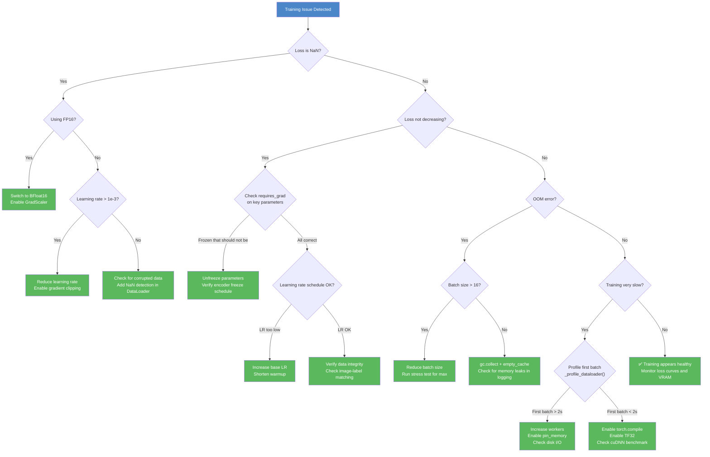

# 8. Debugging Training Issues

## Overview

Training a deep learning model is rarely a smooth process. Things go wrong — often in subtle, hard-to-diagnose ways. The TAMER OCR project, with its complex encoder-decoder architecture, mixed precision training, and multi-dataset pipeline, presents numerous opportunities for failure. This note covers the most common training issues encountered in the TAMER project, their root causes, and the specific debugging strategies and tools used to resolve them. A systematic approach to debugging can save hours or days of wasted GPU time.

## Common Failure: NaN Loss

**NaN (Not a Number) loss** is one of the most alarming training failures. When the loss becomes NaN, it typically propagates through the entire model within a few steps, rendering all parameters useless. The gradient of NaN is NaN, so every parameter update corrupts the corresponding weights.

### Root Causes in the TAMER Context

1. **FP16 overflow**: In half-precision training, values exceeding ±65,504 overflow to infinity, producing NaN in subsequent operations. This was the primary motivation for using **BFloat16** instead of FP16 in the TAMER project. BFloat16's 8-bit exponent (matching FP32's range) means it can represent values up to ±3.39×10³⁸, virtually eliminating overflow.

2. **Learning rate too high**: If the learning rate is set too aggressively, the optimizer can take steps so large that the loss landscape is overshot, pushing activations into extreme regions where numerical stability breaks down. This is especially dangerous in the early stages of training when the decoder's output projection layer is randomly initialized.

3. **Corrupted data**: A training sample with NaN pixel values (from a corrupted image file) or invalid token IDs (outside the vocabulary range) will produce NaN outputs immediately. The multi-dataset pipeline in TAMER, pulling from CROHME, Im2LaTeX, HME100K, and MathWriting, increases the surface area for data corruption.

### Fixes in the TAMER Project

- **BFloat16 instead of FP16**: The most impactful fix. BFloat16 eliminates the overflow problem that causes NaN in FP16 training. The `GradScaler` is still used as a safety measure, but it rarely needs to intervene with BFloat16.
- **Gradient clipping**: `torch.nn.utils.clip_grad_norm_(model.parameters(), max_norm=1.0)` prevents exploding gradients from causing NaN. Even with BFloat16, gradient clipping is cheap insurance.
- **Data sanitization**: The data pipeline includes NaN checks that filter out corrupted samples before they reach the model.

```python
# The standard NaN recovery pattern in the training loop
if torch.isnan(loss):
    print(f"⚠️ NaN loss at step {step}, skipping update")
    optimizer.zero_grad()
    continue
```

## Common Failure: Loss Not Decreasing

When the training loss plateaus or remains flat, it indicates that the model is not learning. This can be more frustrating than NaN loss because the training continues without obvious errors — it just does not improve.

### Root Causes

1. **Learning rate too low**: The optimizer takes steps so small that the loss barely moves. This is common when using warmup schedules where the learning rate starts very low and may not have ramped up yet. It can also happen if the learning rate was manually set too conservatively.

2. **Frozen layers that should not be frozen**: If `requires_grad=False` is set on parameters that should be updated, those layers will not learn. In the TAMER project, the encoder freeze strategy deliberately freezes the Swin-v2 backbone during certain training phases. If the freeze is not released at the right time (or if the decoder is accidentally frozen), training will stall.

3. **Bad data or label mismatch**: If the data loader returns mismatched image-label pairs (e.g., the image and LaTeX string come from different dataset entries), the model cannot learn a consistent mapping. This is a real risk with the multi-dataset pipeline.

4. **Wrong loss function or target format**: If the loss function expects token IDs but receives raw strings, or if the vocabulary mapping is incorrect, the loss will be meaningless.

### Debugging Strategies

```python
# Verify that all expected parameters are being updated
for name, param in model.named_parameters():
    if param.requires_grad:
        if param.grad is not None and param.grad.abs().sum() == 0:
            print(f"⚠️ Zero gradients for: {name}")
    else:
        print(f"❄️ Frozen parameter: {name}")
```

Check the learning rate at each step (the TAMER project logs this every 10 steps). Verify that the scheduler is advancing correctly and that the warmup phase is not excessively long. Profile a small batch of data manually to ensure that image-label pairs are correct.

## Common Failure: Out of Memory (OOM)

OOM errors occur when the GPU's VRAM is exhausted. The error message from CUDA is often cryptic (`CUDA out of memory. Tried to allocate X.XX GiB`), but the cause is always the same: the total memory required by the model, activations, gradients, and optimizer states exceeds what is available.

### Root Causes

1. **Batch size too large**: The most common cause. Activations scale linearly with batch size, and the backward pass requires storing all intermediate activations. A batch of 32 images at 384×384 through Swin-v2 produces activations that consume several GB of VRAM.

2. **Memory leaks**: If tensors are retained in Python data structures (lists, dictionaries, global variables) across training steps, VRAM gradually fills up. This is a common bug in logging code that stores loss values as tensors instead of Python floats.

3. **Not deleting temporary tensors**: Intermediate tensors created during the forward pass that are not needed for the backward pass should be explicitly deleted. Python's garbage collector may not free them promptly enough.

### Fixes

```python
# Reduce batch size
config.batch_size = config.batch_size // 2

# Force garbage collection
import gc
gc.collect()
torch.cuda.empty_cache()

# Fix logging: use .item() to convert to Python float
loss_value = loss.item()  # NOT: loss_value = loss
# .item() extracts the scalar and releases the tensor's GPU memory
```

The `torch.cuda.empty_cache()` call releases cached (but unused) memory back to the CUDA allocator, making it available for subsequent operations. It does not free tensors that are still referenced — those must be handled by deleting the Python references.

## Common Failure: Very Slow Training

Slow training is often an **I/O bottleneck** rather than a compute bottleneck. The GPU is capable of processing data faster than the data loader can supply it, leading to idle GPU time.

### Root Causes

1. **Too few workers**: Each DataLoader worker loads and parses data in parallel. Too few workers means the data loading cannot keep up with the GPU.
2. **No pin_memory**: Without pinned memory, every CPU-to-GPU transfer requires an extra copy, adding latency.
3. **Disk I/O bottleneck**: If the training data is stored on a slow disk (network-attached storage, HDD), reading images can become the bottleneck regardless of the number of workers.

### The _profile_dataloader() Function

The TAMER project includes a dedicated profiling function that measures the time to load the first batch:

```python
def _profile_dataloader(loader, name=""):
    """Time the first batch to detect I/O issues."""
    import time
    start = time.time()
    batch = next(iter(loader))
    elapsed = time.time() - start
    print(f"[{name}] First batch: {elapsed:.2f}s")
    if elapsed > 2.0:
        print(f"⚠️ Slow first batch - possible I/O bottleneck")
    return elapsed
```

If the first batch takes more than 2 seconds, it indicates that the data loading pipeline is underperforming. This could be due to insufficient workers, missing `pin_memory`, or a slow storage backend. The profiling function helps identify the issue before committing to a full training run.

## Monitoring Training Progress

The TAMER project implements two levels of monitoring: **step-level** and **epoch-level** logging.

### Step-Level Logging (Every 10 Steps)

At every 10th training step, the following metrics are logged:

- **Loss**: The cross-entropy loss for the current batch, indicating how well the model is predicting the next token.
- **Learning Rate**: The current learning rate from the scheduler, useful for verifying warmup and decay schedules.
- **Temperature**: The sampling temperature (if using temperature scaling during training), which affects the diversity of predictions.
- **Time per Step**: The wall-clock time for the current step, useful for detecting slowdowns.

### Epoch-Level Logging

At the end of each epoch:

- **Average Loss**: The mean loss across all steps in the epoch, smoothing out batch-to-batch noise.
- **Total Time**: The wall-clock time for the complete epoch.
- **Encoder Status**: Whether the encoder is frozen or unfrozen, confirming the curriculum training phase.

### VRAM Report

After training completes (or at key checkpoints), a VRAM report is generated:

```python
def _vram_report():
    allocated = torch.cuda.memory_allocated() / 1024**3
    reserved = torch.cuda.memory_reserved() / 1024**3
    max_allocated = torch.cuda.max_memory_allocated() / 1024**3
    print(f"VRAM: {allocated:.1f}GB used / {reserved:.1f}GB reserved / {max_allocated:.1f}GB peak")
```

This report shows the current memory usage, the total reserved memory (which may be higher due to CUDA's memory caching), and the peak usage during training. The peak is particularly important for ensuring that the batch size does not leave too little headroom for temporary allocations.

## Debugging Decision Tree

The following diagram provides a systematic approach to diagnosing and resolving common training issues:



## Gradient Norm Monitoring

Beyond loss monitoring, **gradient norms** provide early warning of training instability. If gradient norms spike suddenly, it often precedes a NaN loss event. The TAMER project computes and logs the total gradient norm:

```python
total_norm = 0.0
for p in model.parameters():
    if p.grad is not None:
        total_norm += p.grad.data.norm(2).item() ** 2
total_norm = total_norm ** 0.5
```

A healthy training run shows gradient norms that are relatively stable or gradually decreasing. Sudden spikes or a steadily increasing gradient norm indicates that the model is entering an unstable region of the loss landscape, and intervention (lower learning rate, stronger gradient clipping) may be needed.

## Summary

Debugging training issues in the TAMER project requires a systematic approach that considers the interplay between numerical precision, data quality, memory management, and I/O performance. The most impactful single decision — using BFloat16 instead of FP16 — eliminates the most common source of NaN loss. The remaining issues (loss plateaus, OOM errors, slow training) are addressed through a combination of proper configuration (learning rate schedules, batch size selection, DataLoader tuning) and monitoring tools (step-level logging, VRAM reports, data loader profiling). The debugging decision tree provides a structured way to diagnose issues quickly and apply the correct fix.
