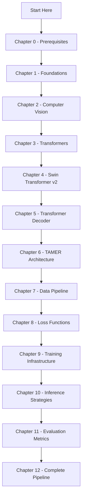

# TAMER OCR — Complete Knowledge Vault

> **TAMER** = **T**ransformer-based **A**rchitecture for **M**ath **E**xpression **R**ecognition
>
> A deep learning system that takes images of mathematical formulas and outputs their LaTeX representation.

---

## What Is This Vault?

This Obsidian vault is a **complete, self-contained knowledge base** that explains every concept behind the TAMER OCR project — from the fundamentals of machine learning to the specific architecture decisions, data pipeline, loss functions, training infrastructure, and inference strategies used in the codebase. No prior deep learning expertise is assumed beyond basic programming familiarity.

If you "vibe-coded" this project and want to truly understand **why it works**, this vault is your roadmap.

---

## Vault Structure

---

## Chapter Index

### Chapter 0 — Prerequisites
Background knowledge you need before diving into ML and the project.

| Note | Topic |
|------|-------|
| [[1. LaTeX Syntax Primer]] | LaTeX math syntax: Greek letters, operators, structural environments, matrices |
| [[2. The OCR Problem and Why Math Is Hard]] | Why math OCR is fundamentally harder than text OCR |
| [[3. Python and Project Structure]] | Directory layout, lazy imports, config pattern, how to navigate the codebase |

### Chapter 1 — Foundations
Prerequisites you must understand before anything else.

| Note | Topic |
|------|-------|
| [[1. What is Machine Learning]] | ML fundamentals, supervised learning, the training loop |
| [[2. Deep Learning Fundamentals]] | Neural networks, activation functions, backpropagation, residual connections |
| [[3. Tensors and PyTorch Basics]] | Tensor operations, autograd, GPU management, BFloat16 vs Float16 vs Float32 |
| [[4. Gradient Descent and Optimizers]] | AdamW, OneCycleLR, differential learning rates, gradient clipping |
| [[5. Sequence Modeling and Autoregressive Generation]] | Autoregressive models, teacher forcing, SOS/EOS/PAD tokens |
| [[6. Linear Algebra for Deep Learning]] | Vectors, matrices, dot product as similarity, d_model=768, GPU parallelism |
| [[7. Probability and Information Theory for ML]] | Softmax, cross-entropy, MLE, conditional probability, Bayesian pretraining |
| [[8. Regularization Techniques]] | Weight decay, dropout, stochastic depth, label smoothing, early stopping |

### Chapter 2 — Computer Vision and Image Processing
How images are represented, preprocessed, and augmented for the model.

| Note | Topic |
|------|-------|
| [[1. Digital Images and Representation]] | Pixels, RGB, resolution, the 256x1024 format |
| [[2. Image Preprocessing and Normalization]] | ImageNet normalization, aspect ratio handling, adaptive resizing |
| [[3. Data Augmentation for OCR]] | Albumentations, gentle transforms for math, white fill |

### Chapter 3 — The Transformer Architecture
The core architecture that powers both the encoder and decoder.

| Note | Topic |
|------|-------|
| [[1. Attention Mechanism]] | Self-attention, cross-attention, multi-head attention, causal masking |
| [[2. Positional Encoding and Embeddings]] | Learned vs sinusoidal PE, token embeddings, position info |
| [[3. The Transformer Block]] | Encoder block, decoder block, LayerNorm, FFN, residual connections |
| [[4. Encoder-Decoder Architecture]] | The encoder-decoder paradigm, information flow, teacher forcing |
| [[5. The Mathematics of Attention in Detail]] | Concrete numerical walkthrough, QKV shapes, parameter counts |
| [[6. Layer Normalization and Residual Connections]] | BN vs LN, pre-norm vs post-norm, gradient highways |

### Chapter 4 — Swin Transformer v2
The vision encoder that processes the input image.

| Note | Topic |
|------|-------|
| [[1. Vision Transformers and the Patch Approach]] | ViT patches, the O(n²) problem, why Swin was invented |
| [[2. Swin Transformer Architecture]] | Window attention, shifted windows, hierarchical stages, patch merging |
| [[3. Swin Transformer v2 Improvements]] | Post-normalization, cosine attention, Log-CPB, SafeTensors, encoder freezing |
| [[4. Patch Merging and Spatial Resolution]] | 2x2 merge, channel doubling 96→768, spatial halving to 256 patches |
| [[5. Relative Position Bias and Window Attention]] | Bias tables, CPB, cyclic shift, window partitioning |

### Chapter 5 — Transformer Decoder and Sequence Generation
The language decoder that generates LaTeX tokens.

| Note | Topic |
|------|-------|
| [[1. The Transformer Decoder in Detail]] | Decoder layers, cross-attention to encoder, output projection |
| [[2. Causal Masking and Autoregressive Decoding]] | Causal mask, generate_causal_mask, parallel training vs sequential inference |
| [[3. Teacher Forcing and Training vs Inference]] | Teacher forcing, exposure bias, greedy decoding limitations |
| [[4. Output Projection and Softmax]] | Linear head 768→522, logits vs probabilities, temperature, top-k |
| [[5. Handling Variable-Length Sequences]] | Padding, ignore_index, unfinished mask, EOS truncation, max_len |

### Chapter 6 — The TAMER Model Architecture
How the encoder and decoder come together as TAMER.

| Note | Topic |
|------|-------|
| [[1. The TAMER Model Overview]] | Two-component design, encode() vs forward(), parameter counts |
| [[2. From Image to LaTeX - The Complete Data Flow]] | 10-step data flow with exact tensor shapes |
| [[3. Model Configuration and Hyperparameters]] | Config class, all hyperparameters explained |
| [[4. The Model Submodules - Attention, Encoder, Decoder]] | attention.py, encoder.py, decoder.py, tamer.py — module hierarchy |

### Chapter 7 — Data Pipeline and Preprocessing
How the four datasets are loaded, cleaned, and fed to the model.

| Note | Topic |
|------|-------|
| [[1. The Four Datasets]] | CROHME, HME100K, Im2LaTeX, MathWriting — sources and characteristics |
| [[2. LaTeX Tokenization]] | LaTeXTokenizer, vocab building, encode/decode, special tokens |
| [[3. Data Sanitization and Filtering]] | Pixel/token filters, JSONL caching, image path resolution |
| [[4. Curriculum Learning]] | Complexity scoring, simple → medium → complex schedule |
| [[5. The MathDataset and DataLoader]] | Dataset class, collation, workers, prefetch, batch sampling |
| [[6. LaTeX Normalization]] | Whitespace, macros, brackets, command normalization, complexity scoring |
| [[7. Data Validation and Integrity]] | Image checks, JSON validity, manifest.json, cache invalidation |
| [[8. The Downloader and Dataset Registry]] | HF/Kaggle/Zenodo/GitHub downloads, parsers, data_manager, three-stage loading |

### Chapter 8 — Loss Functions and Optimization
How the model learns from its mistakes.

| Note | Topic |
|------|-------|
| [[1. Cross-Entropy Loss for Sequence Models]] | CE formula, autoregressive shift, ignore_index, flattening |
| [[2. Label Smoothing]] | Overconfidence, smoothed targets, epsilon=0.1 |
| [[3. Structure-Aware Loss]] | Structural tokens (\\, &, \begin, \end), 3x weighting, register_buffer |

### Chapter 9 — Training Infrastructure and Techniques
The engineering that makes training possible at scale.

| Note | Topic |
|------|-------|
| [[1. Mixed Precision Training with BFloat16]] | AMP, GradScaler, BF16 vs FP16, torch.autocast |
| [[2. Multi-GPU Training with DataParallel]] | DataParallel, _unwrap_model, scatter/gather, wrapping order |
| [[3. Training Loop and Engine Functions]] | train_step, optimizer_step, eval_step, early stopping |
| [[4. Encoder Freeze and Differential Learning Rates]] | Freeze strategy, 5e-5 vs 5e-4, param groups, linear scaling |
| [[5. Checkpointing and Model Persistence]] | Save/load, auto-resume, HuggingFace push, SafeTensors |
| [[6. torch.compile Deep Dive]] | JIT compilation, kernel fusion, 30% speedup, graph breaks, _orig_mod |
| [[7. Hardware Optimization and GPU Utilization]] | TF32, cuDNN benchmark, pin_memory, persistent_workers, prefetch |
| [[8. Debugging Training Issues]] | NaN loss, OOM, slow training, I/O bottlenecks, monitoring |

### Chapter 10 — Inference and Decoding Strategies
How the model generates LaTeX from images at test time.

| Note | Topic |
|------|-------|
| [[1. Greedy Decoding]] | Argmax at each step, batched decoding, unfinished mask |
| [[2. Beam Search]] | Top-k hypotheses, length penalty, deduplication, encoder replication |

### Chapter 11 — Evaluation Metrics for OCR
How we measure model quality.

| Note | Topic |
|------|-------|
| [[1. Exact Match Rate and Edit Distance]] | ExpRate, Levenshtein distance, normalization |
| [[2. Structural Accuracy and Token-Level Metrics]] | Structural token recall, complexity breakdown, SER, Leq1 |

### Chapter 12 — The Complete Training Pipeline
Putting it all together — the end-to-end pipeline.

| Note | Topic |
|------|-------|
| [[1. End-to-End Pipeline Walkthrough]] | Trainer.run(), 6 phases, Kaggle cell mapping |
| [[2. Kaggle Notebook Cells Explained]] | All 9 cells: stress test, setup, validation, sanitizer, config, smoke tests, launch, reports |
| [[3. The train.py Entry Point]] | CLI arguments, config loading, Trainer instantiation, eval-only mode |
| [[4. The OCR Landscape - How TAMER Compares]] | Evolution of math OCR, related systems, TAMER's differentiating features |

---

## The Project at a Glance

**Key Facts:**
- **Architecture**: Swin-v2-Base (encoder) + 10-layer Transformer (decoder)
- **Input**: 256 x 1024 RGB image
- **Output**: LaTeX string (max 200 tokens from 522-token vocabulary)
- **Datasets**: CROHME, HME100K, Im2LaTeX, MathWriting
- **Training**: BFloat16 AMP, DataParallel, torch.compile, OneCycleLR
- **Inference**: Greedy decode (fast) or Beam search (accurate)
- **Hardware**: Designed for RTX 6000 Ada (48GB VRAM), batch_size=864

---

## Vault Statistics

- **61 notes** across **13 chapters**
- **~118,000 words** of detailed educational content
- **30+ Mermaid diagrams** (no ASCII art)
- Every note connects concepts to the actual TAMER codebase

---

## How to Use This Vault

1. **Start with Chapter 0** — if you're unfamiliar with LaTeX or the project structure
2. **Read sequentially** — Chapters 1 through 12 follow a logical progression from basics to the complete pipeline
3. **Use Obsidian's graph view** — The links between notes reveal conceptual dependencies
4. **Refer back during coding** — Each note connects concepts back to the actual TAMER codebase
5. **Search for specifics** — Use Obsidian's search to find any concept, formula, or code pattern

---

## Conventions

- **Numbered section titles** (e.g., "1. Introduction") — no underscores anywhere
- **Mermaid diagrams** for all visual explanations — no ASCII art
- **Bold** for key terms on first introduction
- **Code blocks** for mathematical formulas and Python examples
- **Tip boxes** for practical insights that are easy to miss
