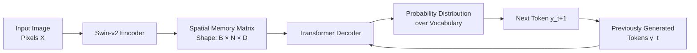

## 1. Introduction to Image-to-Sequence Models

### What Is Mathematical OCR?

Mathematical Optical Character Recognition (OCR) is the task of taking a raw image of a mathematical expression and producing a machine-readable, semantically correct representation of that expression, specifically in LaTeX source code.

This is fundamentally different from classical OCR (which reads printed English text) in several critical ways:

| Property | Classical OCR | Mathematical OCR |
|---|---|---|
| Output type | Linear characters | Nested hierarchical structure |
| Directionality | Left to right only | Left, right, up, down (2D) |
| Ambiguity | Low | High (e.g., `x` vs `×`) |
| Grammar | None required | Strict LaTeX grammar |
| Token types | Characters | Commands, environments, digits |

The formal problem is an **Image-to-Sequence translation** task. Unlike image classification (which maps an image to a single label), Image-to-Sequence maps a fixed 2D pixel grid to a variable-length 1D sequence of discrete symbols.

---

### The Mathematical Framework: Chain Rule Decomposition

The model's job is to learn the conditional probability distribution:

$$P(Y \mid X)$$

Where:
- $X$ is the input image, represented as a 3D tensor of shape $[C, H, W]$ (Channels × Height × Width).
- $Y = (y_1, y_2, \ldots, y_T)$ is the target LaTeX token sequence of length $T$.

Because generating the entire sequence simultaneously is computationally intractable, we use the **chain rule of conditional probability** to factorize it into a product of simpler, sequential decisions:

$$P(Y \mid X) = \prod_{t=1}^{T} P(y_t \mid y_{<t}, X)$$

This decomposition means:
- At every time step $t$, the model predicts only one token.
- That prediction conditions on the image $X$ and everything it has already predicted ($y_{<t}$).
- The probabilities of all individual step predictions multiply together to form the joint probability of the entire sequence.

This is called **autoregressive generation**, because each output feeds back as an input to generate the next output.

> **Important reminder:** Maximizing $P(Y \mid X)$ in log space is equivalent to minimizing the negative log-likelihood, which is precisely the Cross-Entropy loss. These two formulations are mathematically identical. The loss function is not arbitrary. It is derived directly from the probabilistic objective.

---

### The Encoder-Decoder Architecture

To implement the factorized probability $P(y_t \mid y_{<t}, X)$, the model is split into two components with distinct responsibilities:

**The Encoder:**
- Processes the raw image $X$.
- Outputs a compact, continuous, high-dimensional representation called the **memory matrix** or **spatial features**.
- This memory matrix summarizes what the image looks like in a form a neural network can reason over.
- In TAMER, the encoder is a **Swin Transformer v2**.

**The Decoder:**
- Takes the memory matrix from the encoder.
- Also takes the previously generated tokens $y_{<t}$ as input.
- At each step, produces a probability distribution over the entire vocabulary.
- The next token $y_t$ is sampled or selected from this distribution.
- In TAMER, the decoder is a stack of **Transformer Decoder layers**.

> **Key reminder:** The encoder runs exactly once per image. The decoder runs once per output token. This asymmetry is crucial to understanding computational cost. A long formula (100 tokens) means 100 decoder forward passes but still only 1 encoder forward pass.

---