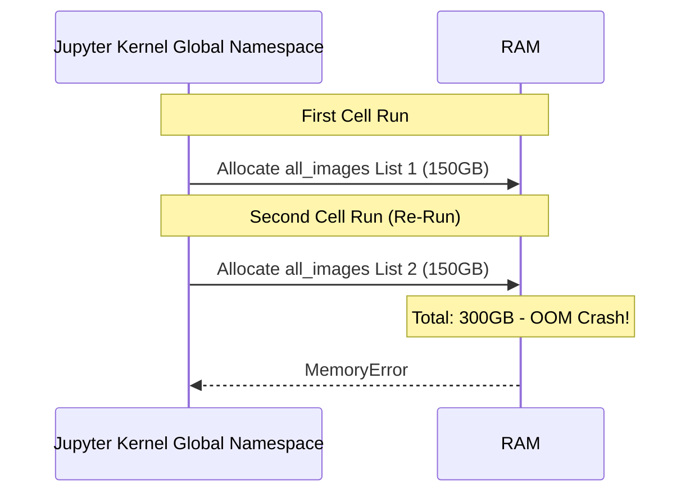
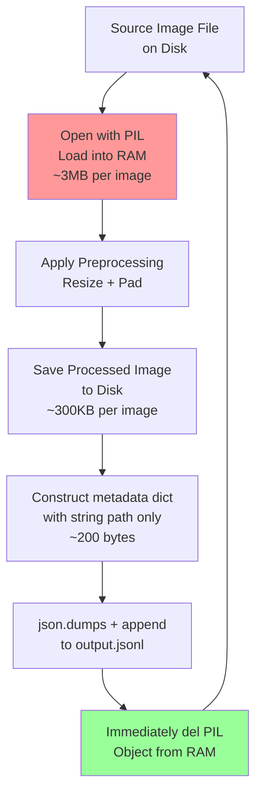

## 2. Python Memory Leaks and The OOM Caching Bug

### The Root Cause: Python's Reference Counting GC

Python manages memory using **reference counting**. Every object (list, dict, PIL Image, tensor) has an internal counter tracking how many variables point to it. When that counter reaches zero, the memory is freed.

In a Jupyter/Kaggle notebook:
- The kernel maintains a global namespace that persists indefinitely.
- If a variable like `all_images = [...]` exists in the global namespace, its reference count never reaches zero.
- Rerunning the cell does not clear the old list. It creates a new one and reassigns the name.
- For a brief moment, both the old and new lists exist in RAM simultaneously.
- If each list holds 50,000 PIL images at ~3MB each, that is 150GB per list. Two lists = 300GB RAM peak, causing immediate OOM.



---

### The Re-Sanitization Bug: Relative vs Absolute Paths

The caching check typically looks like this:

```python
if os.path.exists(output_dir):
    print("Cache found, loading...")
    load_from_cache(output_dir)
else:
    print("No cache, sanitizing...")
    run_full_sanitization(output_dir)
```

The bug occurs when `output_dir` resolves to different locations in different cells or sessions:

- Cell 1 runs: `output_dir = "./sanitized_data"` → resolves to `/kaggle/working/sanitized_data`. Cache is built and saved here.
- Kernel restarts (Kaggle auto-saves to `/kaggle/working/`, but your working directory might shift).
- Cell 2 runs: `output_dir = "sanitized_data"` (no dot-slash) → `os.getcwd()` is now `/kaggle/`, so it resolves to `/kaggle/sanitized_data`.
- `os.path.exists("/kaggle/sanitized_data")` returns `False` (the cache is at `/kaggle/working/sanitized_data`).
- Full re-sanitization triggers. OOM occurs.

**The TAMER Fix:**
Always use `os.path.abspath()` at the top of the script, once, and never redefine the path:

```python
BASE_DIR = os.path.abspath("/kaggle/working/tamer_cache")
```

Every downstream reference uses `BASE_DIR`. There is no relative path anywhere in the codebase.

---

### The Disk-Backed Streaming Architecture

The correct solution eliminates the problem by never storing large objects in RAM at all. The TAMER pipeline implements **line-by-line disk streaming** using JSONL format (JSON Lines: one JSON object per line, newline-separated).

**Why JSONL instead of a single JSON file?**
A single JSON file must be parsed entirely into RAM before any data is accessible. A JSONL file can be read one line at a time using Python's standard file iteration, which uses a constant-size RAM buffer regardless of how large the file is.

**The TAMER streaming flow:**



The key insight: at any given moment, exactly one image (3MB) lives in RAM. The rest of the data lives on disk. Regardless of dataset size (10K or 10M images), RAM usage is constant.

---

### The String Path Pattern

When the JSONL is later read by the PyTorch Dataset class:

```python
class TAMERDataset(Dataset):
    def __getitem__(self, idx):
        # Only store paths, not images
        record = self.records[idx]
        img_path = record["image_path"]  # This is just a string: "/path/img_0001.png"
        
        # Load image ON DEMAND when the DataLoader requests it
        image = Image.open(img_path).convert("RGB")
        image = self.transform(image)  # Apply augmentation
        return image, record["tokens"]
```

The RAM footprint of `self.records` (storing paths) is trivially small. 100,000 image path strings consume about 10MB of RAM. 100,000 PIL images would consume ~300GB. This is the factor-of-30,000 memory reduction.

> **Critical reminder:** `del` in Python does not guarantee immediate deallocation. It decrements the reference count. If any other variable still points to the same object, the memory is not freed. Always ensure no other aliases exist before calling `del`. In the streaming loop, the image variable is local to each loop iteration, so its reference count automatically drops to zero at the end of each iteration. No explicit `del` is needed if you do not store the variable anywhere else.

---