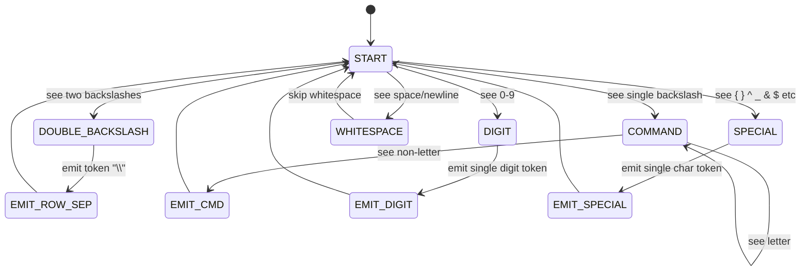

## 1. Lexical Analysis of LaTeX

### Why Standard NLP Tokenizers Fail on LaTeX

Standard NLP tokenizers like Byte-Pair Encoding (BPE, used in GPT) or WordPiece (used in BERT) are built on a statistical principle: find the most frequent substrings in the training corpus and merge them into single tokens. This is optimal for natural language because word boundaries are probabilistic.

For LaTeX, this is catastrophically wrong.

**The BPE Failure Example:**

Suppose `\begin{pmatrix}` appears 500 times and `\begin{bmatrix}` appears 50 times in the training set. BPE might tokenize them as:

- `\begin{pmatrix}` → `['\begin', '{pmatrix}']` (merged as frequent unit)
- `\begin{bmatrix}` → `['\begin', '{', 'bmatrix', '}']` (split because less frequent)

Now the model learns a completely different token structure for semantically identical constructs. At inference time, if the model predicts `'{bmatrix}'` but the actual token is `'{'` + `'bmatrix'` + `'}'`, the tokenization is mismatched and the output is garbage.

More dangerously: if BPE has never seen `\begin{vmatrix}` in training, it tokenizes it as individual characters `['\', 'b', 'e', 'g', 'i', 'n', ...]`. This Out-of-Vocabulary (OOV) fragmentation makes it nearly impossible for the model to predict the correct token sequence.

---

### TAMER's Rule-Based Lexical Tokenizer

TAMER builds a deterministic tokenizer using explicit lexical rules, analogous to how a programming language compiler lexes source code.

**Rule 1: Backslash Commands**
Any sequence starting with `\` followed by alphabetic characters is scanned as a single token until a non-alphabetic character is encountered.
- `\frac` → single token `'\frac'`
- `\alpha` → single token `'\alpha'`
- `\sum` → single token `'\sum'`
- `\hat{x}` → three tokens: `'\hat'`, `'{'`, `'x'`, `'}'`

**Rule 2: Double Backslash Priority**
Before applying Rule 1, the scanner checks if the current position is `\\` (two backslashes). If yes, it emits a single `'\\\\'` token and advances by 2 characters. This check must come first because `\\` is the LaTeX row separator and is semantically completely different from two consecutive `\` commands.

If this rule is missing, `\\` becomes `['\\', '\\']` (two identical tokens). The model then treats row separation as two separate escape characters, completely losing its structural understanding.

**Rule 3: Atomic Environments**
The entire construct `\begin{matrix}` (including the `{` and `matrix}`) is merged into a single indivisible token: `'\begin{matrix}'`.

This is critical because the environment name must match exactly. `\begin{matrix}` must be closed by `\end{matrix}`. If the model predicts `'\begin'` + `'{'` + `'matrix'` + `'}'` as separate tokens, it might predict `'\begin'` + `'{'` + `'Matrix'` + `'}'` (wrong capitalization) and produce a LaTeX compile error.

By making the entire environment command atomic, the model either predicts the whole thing correctly or gets it completely wrong. There is no partial credit for getting the right environment name but wrong bracket.

**Rule 4: Digit-Level Tokenization**
All numeric digits are tokenized individually. `3.14159` becomes `['3', '.', '1', '4', '1', '5', '9']`.

The reason: In a math dataset, you might have numbers like `1024`, `2048`, `4096`. If `1024` is a single token, the model learns to predict it as a unit. If the test set contains `3072`, and `3072` is an OOV token, the model fails completely. By tokenizing digit by digit, the model learns the concept of numbers compositionally. It can predict any number from the digit vocabulary `{0, 1, 2, 3, 4, 5, 6, 7, 8, 9, .}`.

---

### The Tokenizer's Internal State Machine

The lexical scanner can be visualized as a state machine:

> **Important reminder:** LaTeX whitespace is semantically meaningless in math mode. `a + b` and `a+b` and `a  +  b` are identical in LaTeX. The tokenizer skips all whitespace. This is correct. Do not preserve spaces as tokens in math mode. Only in text environments like `\text{hello world}` does spacing matter, and TAMER handles this as a special-case atomic token for the `\text{...}` environment.

---