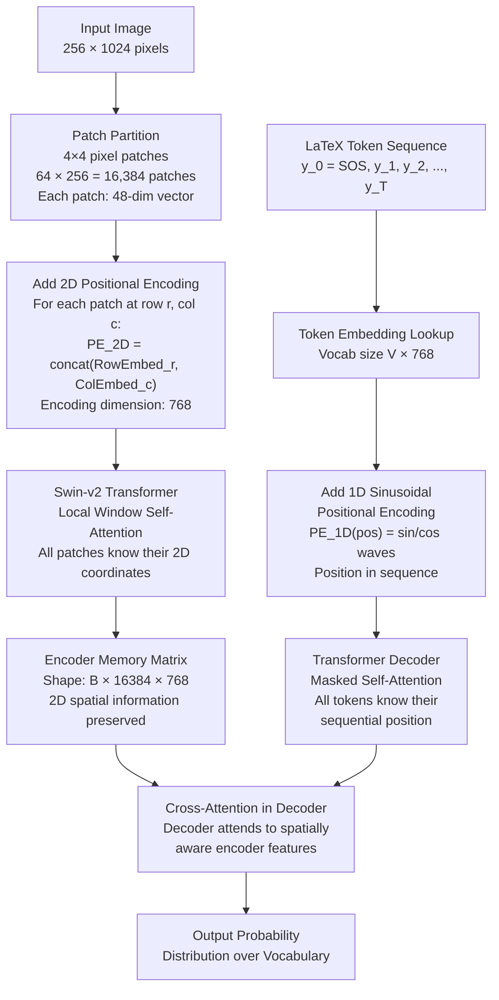

## 3.7 What Is Positional Encoding (1D vs 2D)

### The Fundamental Problem: Transformers Have No Spatial Awareness

Before explaining what positional encoding is, it is essential to understand in precise mathematical terms why Transformers need it at all, and why this requirement is unique to the Transformer architecture.

**The permutation equivariance property:**

Given an input sequence $X = [x_1, x_2, x_3, x_4]$ and a permutation $\pi$ that reorders it to $X_\pi = [x_3, x_1, x_4, x_2]$, the Self-Attention mechanism produces:

$$\text{Attention}(X_\pi) = \pi(\text{Attention}(X))$$

The attention output is simply the same values in the same permuted order. The actual values in each output position are identical regardless of where in the sequence the input was placed.

This means: if you feed a Swin Transformer the patches of an image in their correct spatial order, and then feed them in a completely scrambled random order, the feature vectors output by the attention mechanism contain exactly the same values, just scrambled in the same way the input was scrambled.

The Transformer is fundamentally a function of the **set** of input tokens, not their sequence or arrangement. It cannot distinguish between "patch A is above patch B" and "patch A is below patch B" because the attention computation treats both identically.

For image understanding, spatial arrangement is everything. The number `2` in the top-right of a formula is an exponent. The number `2` at the baseline is a coefficient. Without knowing position, these are indistinguishable.

Positional encoding is the mechanism by which we inject spatial coordinate information directly into the input tokens before they enter the attention mechanism. Once the position information is baked into the token representations, the attention mechanism can learn to use it.

---

### 1D Positional Encoding: The Decoder (Text Sequence)

The Transformer Decoder generates a one-dimensional sequence of LaTeX tokens. Tokens have a natural ordering: the 5th token comes after the 4th, before the 6th. The model must know which position in time each token occupies so it can learn sequential dependencies (e.g., after `\frac`, the next token is almost always `{`).

#### Fixed Sinusoidal Positional Encoding: Full Mathematical Derivation

TAMER uses the fixed sinusoidal positional encoding introduced by Vaswani et al. (2017) in the original "Attention Is All You Need" paper. It is defined as:

$$PE_{(pos, 2i)} = \sin\left(\frac{pos}{10000^{2i / d_{model}}}\right)$$

$$PE_{(pos, 2i+1)} = \cos\left(\frac{pos}{10000^{2i / d_{model}}}\right)$$

Where:
- $pos \in \{0, 1, 2, \ldots, T-1\}$: The position of the token in the sequence.
- $i \in \{0, 1, 2, \ldots, d_{model}/2 - 1\}$: The dimension index within the positional encoding vector.
- $d_{model}$: The model embedding dimension (e.g., 768 in TAMER).

The positional encoding $PE_{pos}$ is a vector of length $d_{model}$. Each pair of dimensions $(2i, 2i+1)$ oscillates at a specific angular frequency:

$$\omega_i = \frac{1}{10000^{2i / d_{model}}}$$

Let us compute a few values to build intuition:

| Dimension pair $i$ | Frequency $\omega_i$ | Period $2\pi / \omega_i$ | Behavior |
|---|---|---|---|
| $i = 0$ | $1.0$ | $\approx 6.28$ positions | Changes rapidly. Encodes fine-grained position. |
| $i = 48$ | $10000^{-96/768} \approx 0.127$ | $\approx 49$ positions | Changes at medium rate. Encodes medium-range position. |
| $i = 192$ | $10000^{-384/768} \approx 0.01$ | $\approx 628$ positions | Changes very slowly. Encodes coarse global position. |
| $i = 383$ | $10000^{-766/768} \approx 0.0001$ | $\approx 62{,}832$ positions | Nearly static across the sequence. |

The result: the positional encoding vector $PE_{pos}$ is a unique, deterministic "fingerprint" for every position. No two positions have the same positional encoding vector because the combination of all these different frequency sinusoids is unique at every integer position.

**The relative position property:**

The key mathematical property of sinusoidal encoding: $PE_{pos+k}$ can be expressed as a linear transformation of $PE_{pos}$. Specifically, using the angle addition formula:

$$\sin(pos \cdot \omega + k \cdot \omega) = \sin(pos \cdot \omega)\cos(k \cdot \omega) + \cos(pos \cdot \omega)\sin(k \cdot \omega)$$

This means $PE_{pos+k}$ is a rotation matrix applied to $PE_{pos}$, where the rotation angle depends only on $k$ (the offset) and not on $pos$ (the absolute position). The Transformer can learn to compute relative offsets between positions using linear attention operations.

This is important for TAMER because mathematical syntax has relative dependencies. "The token that appeared 3 steps ago was `\frac`, so the token right now should be `{`." The sinusoidal encoding makes these relative distance computations learnable.

**Generalization to unseen sequence lengths:**

Because the sinusoidal encoding is a mathematical function evaluated at integer positions, it is defined for any position, including positions never seen during training. If TAMER is trained on formulas up to 256 tokens long but encounters a 300-token formula at inference time, the positional encoding for positions 257-300 can be computed without any extrapolation issues. A learned embedding table (like those used in GPT) would have no embedding entry for position 300 and would fail.

#### How the 1D Positional Encoding Is Applied

The positional encoding is added to the token embedding, not concatenated:

$$X_{decoder,t} = \text{TokenEmbed}(y_t) + PE_t$$

Where $\text{TokenEmbed}$ is a learned embedding matrix mapping token indices to $d_{model}$-dimensional vectors. Both $\text{TokenEmbed}(y_t)$ and $PE_t$ have the same shape $[d_{model}]$, so element-wise addition is valid.

> **Important reminder:** The token embedding is learned. The positional encoding is fixed (not learned). During training, the gradient updates the token embedding weights but not the sinusoidal positional encoding values. This is intentional: the sinusoidal encoding has provably desirable mathematical properties (relative position linearity, infinite generalization) that we do not want to corrupt with gradient updates.

---

### 2D Positional Encoding: The Encoder (Image Patches)

The Swin Encoder processes the input image as a 2D grid of patches. Unlike the text decoder, which has a natural 1D left-to-right ordering, the image patches have a 2D spatial structure with both row and column coordinates. A 1D positional encoding is insufficient because it can only express one coordinate dimension.

#### Why 1D Encoding Fails for Images

Consider a $4 \times 4$ grid of image patches (16 total patches). If we naively assign 1D positions 0-15, reading patches left-to-right, top-to-bottom:

| Position | Patch Grid Coordinates |
|---|---|
| 0 | (row=0, col=0) |
| 1 | (row=0, col=1) |
| 4 | (row=1, col=0) |
| 5 | (row=1, col=1) |

The 1D positions of patch (0,0) and patch (1,0) are 0 and 4. The 1D positions of patch (0,0) and patch (0,1) are 0 and 1.

From the 1D encoding alone, patches (0,0) and (1,0) appear to be 4 apart, while (0,0) and (0,1) appear to be 1 apart. But spatially, both pairs are exactly one step apart (one row step versus one column step). A 1D encoding encodes the reading-order distance, not the 2D spatial distance. The attention mechanism sees patches in the same column as being "further" than patches in the same row, which is spatially incorrect.

#### TAMER's Factored Learned 2D Positional Encoding

TAMER uses separate learned embedding tables for the row and column dimensions:

**Row Embedding Table:** $E_R \in \mathbb{R}^{R_{max} \times (D/2)}$

- $R_{max}$: Maximum number of patch rows (e.g., 64 for a 256-pixel-tall image with 4-pixel patches).
- Each row $r$ has a learned embedding vector $E_R[r]$ of dimension $D/2 = 384$.

**Column Embedding Table:** $E_C \in \mathbb{R}^{C_{max} \times (D/2)}$

- $C_{max}$: Maximum number of patch columns (e.g., 256 for a 1024-pixel-wide image with 4-pixel patches).
- Each column $c$ has a learned embedding vector $E_C[c]$ of dimension $D/2 = 384$.

For a patch at position $(r, c)$, the 2D positional encoding is:

$$PE_{2D}(r, c) = [E_R[r] \;;\; E_C[c]]$$

Where $[;]$ denotes vector concatenation. The result has dimension $D/2 + D/2 = D = 768$.

This is added to the Swin visual features:

$$X_{enc}(r, c) = X_{swin}(r, c) + PE_{2D}(r, c)$$

**Why factored (row + column separately) instead of a full 2D table?**

A full 2D learned embedding table would have $R_{max} \times C_{max}$ entries. For $R_{max} = 64$ and $C_{max} = 256$: $64 \times 256 = 16{,}384$ embedding vectors, each of dimension 768. Total: $16{,}384 \times 768 = 12{,}582{,}912$ parameters ≈ 48 MB.

The factored approach has $(R_{max} + C_{max})$ embedding vectors: $64 + 256 = 320$ vectors, each of dimension 384. Total: $320 \times 384 = 122{,}880$ parameters ≈ 0.5 MB.

The factored approach uses 102× fewer parameters. More importantly, it generalizes better: if an image is taller than any image seen during training (e.g., a formula requiring 70 patch rows instead of the maximum training size of 64), the full 2D table would have no embedding for row indices 65-70. The factored table only needs the row embeddings for 65-70 to be interpolated, which is more robust.

---

### The Complete Positional Encoding Picture in TAMER

The following shows exactly where each type of positional encoding is applied in the full TAMER architecture:

#### Key Design Decisions Summarized

| Aspect | Encoder (Image) | Decoder (Text) |
|---|---|---|
| Dimensionality | 2D (row, column) | 1D (sequence position) |
| Type | Learned embedding tables | Fixed sinusoidal functions |
| Parameters | $(R_{max} + C_{max}) \times D/2$ | 0 (no learned parameters) |
| Generalization | Requires interpolation for new sizes | Analytically defined for any length |
| Reason for choice | Images need spatial 2D coordinates | Text needs sequential ordering |
| Applied where | After patch partition, before Swin layers | After token embedding, before decoder layers |

> **Critical reminder:** The 2D positional encoding for the encoder and the 1D positional encoding for the decoder serve different mathematical purposes. The 2D encoding tells the attention mechanism "this visual feature is spatially located at row 5, column 12 in the original image." The 1D encoding tells the attention mechanism "this token is the 8th item in the generated sequence." They are both positional encodings, but they encode fundamentally different types of coordinate information, and they are applied to completely different parts of the model.

---