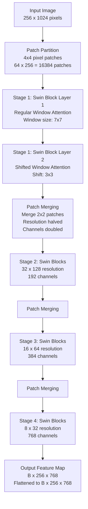

## 2. Swin Transformer v2 Architecture

### The Quadratic Complexity Problem

Standard ViT (Vision Transformer) applies global self-attention across all $N$ patches. For a 256×1024 image with 4×4 patches:

$$N = \frac{256}{4} \times \frac{1024}{4} = 64 \times 256 = 16{,}384 \text{ patches}$$

The attention matrix $Q K^T$ has shape $16{,}384 \times 16{,}384 = 268{,}435{,}456$ elements. At float32 (4 bytes each), this is ~1GB per head per layer. With 12 heads and 12 layers, this is 144GB just for attention matrices. Completely impossible on any GPU.

---

### Swin's Window-Based Solution

Swin (Shifted Window) Transformer solves this by restricting attention to local windows. Instead of computing attention globally over all $N$ patches, it partitions the feature map into non-overlapping windows of fixed size $M \times M$ (e.g., $7 \times 7$) and computes attention independently within each window.

**Complexity reduction:**
- Global ViT: $O(N^2)$ = $O(16384^2) = O(268M)$
- Swin with $M=7$ windows: Each window has $M^2 = 49$ patches. Attention within window is $O(M^2) = O(2401)$. Total windows: $N / M^2 = 16384 / 49 = 334$ windows. Total complexity: $O(N \cdot M^2) = O(N)$. Linear in $N$.

This is an improvement of $N / M^2 = 16384 / 49 \approx 334\times$ in computational complexity.

---

### The Shifted Window Mechanism

The problem with standard window attention: information cannot cross window boundaries. Two patches in adjacent windows never communicate.

The solution: alternate between two attention patterns.

**Layer 1: Regular Windows**
Windows are aligned to a fixed grid. Patches inside each window attend to each other.

**Layer 2: Shifted Windows**
Windows are shifted by $(\lfloor M/2 \rfloor, \lfloor M/2 \rfloor)$ positions. The new window boundaries cut across the old ones. Patches that were in different windows in Layer 1 are now in the same window in Layer 2, so they can finally communicate.

Over multiple layers, this alternating shift allows information to propagate globally despite local computation.

---

### v2-Specific Improvements Over Swin-v1

**Scaled Cosine Attention:**
Swin-v1 uses the standard dot-product attention where $Q K^T$ can produce very large or very small values. Swin-v2 uses cosine similarity instead:

$$\text{Attention}(Q, K, V) = \text{softmax}\left(\frac{\cos(Q, K)}{\tau}\right) V$$

Where $\tau$ is a learnable temperature parameter per head. This makes attention more stable when fine-tuning at resolutions different from pre-training resolution (which is exactly TAMER's use case: pre-trained on ImageNet images, fine-tuned on math formula images).

**Log-Spaced Continuous Positional Bias:**
Swin-v2 uses a log-space relative position bias instead of the linear spacing in v1. This allows the model to smoothly extrapolate to larger resolution inputs without performance degradation. This is critical for TAMER because math formula images may span a much wider range of resolutions than the ImageNet pre-training images.

---