## 4.8 The Full Decoder Training Loop End to End

To consolidate all decoder concepts, here is the complete training loop for the TAMER decoder, incorporating Teacher Forcing, Scheduled Sampling, the causal mask, structure-aware loss weighting, and label smoothing:

```mermaid
flowchart TD
    A["Training Batch\nImages: B × C × H × W\nTarget Tokens: B × T"] --> B["Run Swin Encoder\nOutput: B × N_patches × D\nEncoder Memory"]
    B --> C["Prepare Decoder Input\nShift right: prepend SOS\nDecoder input: B × T tokens"]
    C --> D["Decide Context Strategy\nEpoch < 20: Teacher Forcing 100 percent\nEpoch >= 20: Scheduled Sampling\np_sample increases over epochs"]
    D --> E["Build Decoder Input Tensor\nFor each position t:\n- With prob 1-p_sample: use ground truth y_t*\n- With prob p_sample: use previous prediction"]
    E --> F["Build Causal Mask\nT × T upper-triangular matrix\nentries above diagonal set to -inf"]
    F --> G["Build Padding Mask\nB × T boolean matrix\nTrue where token is padding"]
    G --> H["Decoder Forward Pass\nMasked Self-Attention\nCross-Attention with Encoder Memory\nFeed-Forward Layers\nOutput: B × T × vocab_size logits"]
    H --> I["Compute Structure-Aware Loss\nFor each position t:\nbase_loss_t = label_smoothed_CE(logit_t, target_t)\nif target_t is structural token: weight = 3.0\nelse: weight = 1.0\nweighted_loss_t = base_loss_t × weight\nfinal_loss = mean over non-padding positions"]
    I --> J["Backward Pass\nloss.backward() computes gradients\nfor all model parameters"]
    J --> K["Gradient Clipping\ntorch.nn.utils.clip_grad_norm max_norm 1.0\nPrevents gradient explosion on long sequences"]
    K --> L["Optimizer Step\nAdam: update weights using\ngradient and momentum estimates"]
    L --> M["LR Scheduler Step\nCosine annealing with warmup\nAdjust LR for next batch"]
```

> **Final important reminder:** The causal mask, the padding mask, the structure-aware loss weights, and the Scheduled Sampling token selection are all computed and applied per-batch, at training time. They have zero cost at inference time. Grammar masks are applied only at inference time. This clean separation means training and inference code paths are distinct, and you should never accidentally apply training-only logic during inference or vice versa. The most common bug in TAMER deployment is accidentally leaving `model.train()` mode active during inference, which enables dropout and causes non-deterministic, lower-quality predictions.

---

*End of TAMER Math OCR - Deep Learning Theory & Architecture Vault*