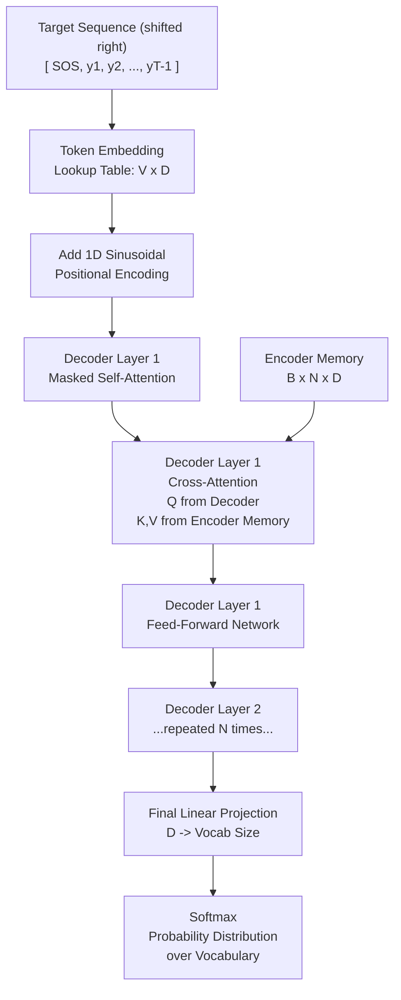

## 1. Transformer Decoder Architecture

### The Three Attention Sub-Layers

Each Transformer Decoder layer contains three sub-layers, each followed by Layer Normalization and a residual connection.

**Sub-layer 1: Masked Self-Attention**

The decoder attends to the sequence of tokens it has already generated. The "masked" qualifier is critical: at position $t$, the attention mask prevents the decoder from attending to positions $t+1, t+2, \ldots, T$.

The mask is a matrix $M \in \mathbb{R}^{T \times T}$ where:

$$M_{ij} = \begin{cases} 0 & \text{if } j \leq i \\ -\infty & \text{if } j > i \end{cases}$$

When this is added to the attention logits before softmax:

$$\text{softmax}(Q K^T / \sqrt{d_k} + M)$$

The $-\infty$ entries become 0 after softmax (since $e^{-\infty} = 0$), effectively zeroing out all future-position attention weights. The model is physically incapable of seeing future tokens.

This preserves the autoregressive property during training: even though the entire target sequence is fed at once (for parallelism), each position can only see its own past.

**Sub-layer 2: Cross-Attention**

The decoder uses the visual features from the encoder to decide what to generate next. The query comes from the decoder's own hidden state. The key and value come from the encoder's output.

$$\text{CrossAttention}(Q_{dec}, K_{enc}, V_{enc}) = \text{softmax}\left(\frac{Q_{dec} K_{enc}^T}{\sqrt{d_k}}\right) V_{enc}$$

Interpretation: The decoder's current "thought" (query) is compared against every spatial location in the encoder's feature map (keys). High similarity means "pay attention to this image region when deciding what token to write next." The output is a weighted blend of the encoder's visual content (values), weighted by this attention.

This is exactly how a human reads math: you move your eyes to the part of the formula you are currently trying to transcribe.

**Sub-layer 3: Feed-Forward Network**

A position-wise fully connected network applied independently to each position:

$$FFN(x) = \text{ReLU}(xW_1 + b_1)W_2 + b_2$$

With dimensions: $D \to D_{ff} \to D$, where $D_{ff} = 4D$ typically (e.g., 768 → 3072 → 768).

This sub-layer provides non-linear transformation capacity. The attention mechanism is linear (weighted sum). Without the FFN, the decoder would be limited to linear recombinations of features.

---

### Full Decoder Data Flow

---