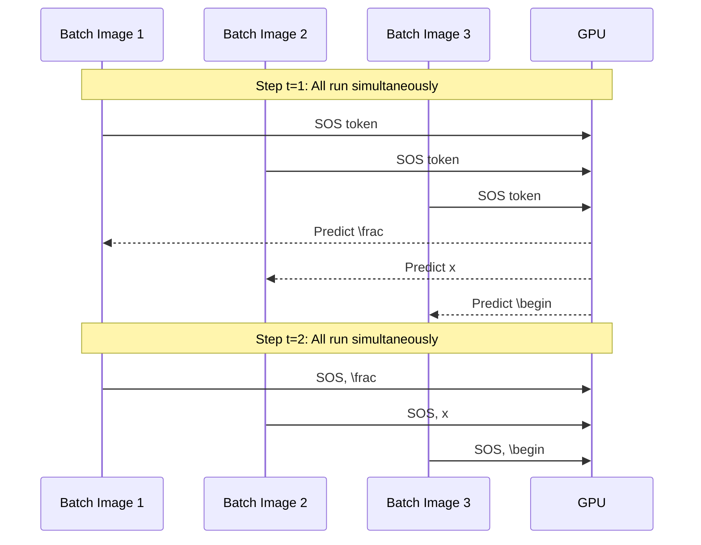

## 1. Batched Greedy Decoding

### The Greedy Algorithm

At each time step $t$, the model computes the probability distribution $P(y_t \mid y_{<t}, X)$ over the vocabulary. Greedy decoding selects the single highest-probability token:

$$\hat{y}_t = \arg\max_{j \in V} P(y_t = j \mid y_{<t}, X)$$

This decision is made irrevocably. The token $\hat{y}_t$ is appended to the sequence and fed back into the decoder for step $t+1$.

**Advantages:**
- $O(T)$ time complexity: one decoder forward pass per output token.
- Trivially parallelizable across the batch dimension.
- TAMER batches hundreds of images and decodes all of them simultaneously, using the GPU's massive parallelism.

**Disadvantages:**
- Sub-optimal. A greedy algorithm finds a local optimum, not the global optimum.
- Classic example: Suppose at step 2, the greedy token is `\frac` with probability 0.6. But `\sqrt` with probability 0.4 would, if followed by the globally optimal continuation, yield a final sequence with much higher total probability. Greedy irrevocably commits to `\frac`.

---

### Batched Decoding Implementation Logic

Naively, autoregressive decoding is sequential: you cannot compute step $t+1$ until step $t$ is done. However, you can process many independent sequences simultaneously:

The batch dimension allows images to be decoded independently in parallel. The sequential constraint is within a single sequence (step $t+1$ must wait for step $t$), not between sequences.

**Handling early termination in batched decoding:**
Different formulas in the same batch will produce `<eos>` at different time steps. TAMER uses an `active` boolean mask. When a sequence in the batch produces `<eos>`, it is marked as inactive and its decoder state is frozen. Inactive sequences still run through the decoder (for GPU efficiency - sparse computation on GPUs is slower than dense), but their outputs are discarded.

---