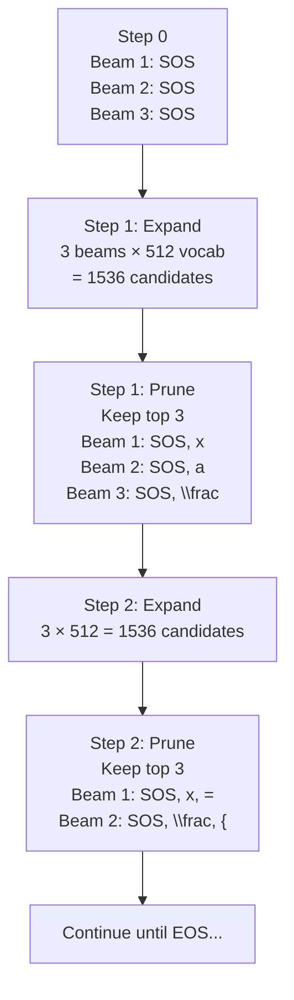

## 2. Beam Search Decoding

### The Core Algorithm

Beam Search maintains not one, but $K$ candidate sequences (called "beams") at every step. It is a form of breadth-first search pruned to width $K$.

**Step 0:** Initialize with $K$ identical beams, all starting with `<sos>`.

**Step $t$:**
1. Expand: For each of the $K$ beams, run the decoder and get a probability distribution over all $V$ vocabulary tokens. This yields $K \times V$ possible next-step continuations.
2. Score: Compute the score of each continuation as the sum of log-probabilities of all tokens in the sequence (log-probability instead of probability to avoid numerical underflow from multiplying many small numbers).
3. Prune: Keep only the top $K$ scoring continuations from all $K \times V$ candidates.

**Termination:** A beam is "completed" when it produces `<eos>`. Completed beams are moved to a "finished" list. Continue until all $K$ beams are completed or a maximum length is reached. Return the highest-scoring completed sequence.

---

### Log-Probability Scoring

Since $0 \leq P \leq 1$, multiplying many probabilities leads to vanishing values:

$$P(\hat{y}_1) \times P(\hat{y}_2) \times \cdots \times P(\hat{y}_{100}) \approx 10^{-100}$$

This is below the float32 minimum representable value ($\approx 10^{-38}$) and becomes exactly zero, which is numerically catastrophic.

The solution: work in log-space. The log-probability of a sequence is the sum of log-probabilities of individual tokens:

$$\log P(Y) = \sum_{t=1}^{T} \log P(y_t \mid y_{<t}, X)$$

Since $\log P \leq 0$ (probabilities are $\leq 1$), all scores are negative numbers summing toward $-\infty$. The best sequence has the least negative (highest) log-probability score.

---

### Length Normalization and Length Penalty

**The length bias problem:**
A sequence of length 10 with average per-token log-probability $-0.1$ has total score $-1.0$.
A sequence of length 100 with average per-token log-probability $-0.08$ (slightly better per-token) has total score $-8.0$.

Without normalization, beam search prefers the length-10 sequence, even though the length-100 sequence is actually generating higher-quality tokens. Beam search is biased toward short sequences.

**Length Normalization:**
Divide the total log-probability by the sequence length $T$:

$$\text{Normalized Score} = \frac{1}{T} \sum_{t=1}^{T} \log P(y_t \mid y_{<t}, X)$$

This converts total score to average per-token score, removing the length bias.

**Length Penalty (TAMER implementation):**
TAMER uses a smoother version with a tunable exponent $\alpha$:

$$\text{Score}(Y) = \frac{\sum_{t=1}^{T} \log P(y_t \mid y_{<t}, X)}{T^\alpha}$$

With $\alpha = 0.6$ (TAMER default):
- If $\alpha = 0$: No length normalization (biased toward short).
- If $\alpha = 1$: Full length normalization (average per-token log-prob).
- If $\alpha = 0.6$: Partial normalization. Slightly favors longer sequences compared to $\alpha = 1$, which empirically helps for tasks where completeness matters (like fully transcribing a matrix).

> **Important reminder:** Beam Search has time complexity $O(K \times V \times T)$. For TAMER ($K=5$, $V=512$, $T=150$), this is 5 × 512 × 150 = 384,000 operations per image, compared to Greedy's 512 × 150 = 76,800 operations. Beam Search is exactly $K$ times slower than Greedy. For production inference on large datasets, Greedy is often preferred despite slightly lower accuracy. For research evaluation (measuring maximum model quality), Beam Search is used.

---