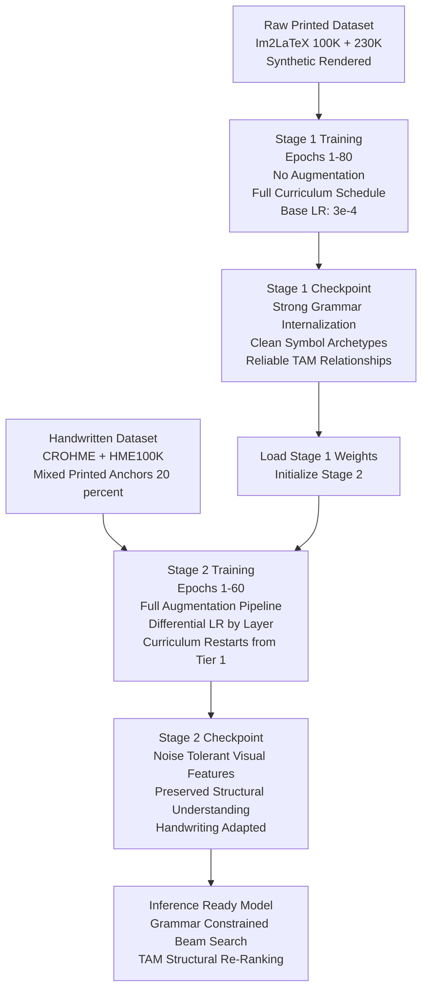

## 7.3 Two Stage Pretraining and Curriculum Learning

### The Core Problem: Learning Too Many Things at Once

Training a mathematical OCR model from scratch on handwritten data is one of the hardest optimization problems in applied deep learning. The reason is that the model must simultaneously learn an enormous number of completely different skills:

1. **Visual feature extraction:** What does a stroke look like? How do I distinguish an `x` from a `×`? What is the difference between a fraction bar and a minus sign?
2. **LaTeX grammar:** What are the syntactic rules of LaTeX? A `\frac` command always requires exactly two brace groups. A `\begin{matrix}` must always terminate with `\end{matrix}`.
3. **Mathematical structure:** What is the logical hierarchy of a formula? Where are the parent-child relationships between tokens?
4. **Noise tolerance:** How do I handle ink bleeds, trembling strokes, rotated paper, and scanning artifacts?

When you try to learn all four simultaneously from handwritten data, the gradient signals are contradictory. The noise-tolerance gradients push the visual encoder toward blurring fine details. The structure-learning gradients push the decoder to be rigid. The grammar gradients conflict with the noise-tolerance objectives. The optimization landscape is full of saddle points and the training either diverges or converges to a mediocre local minimum.

The solution TAMER uses is to decompose this enormous joint problem into a sequence of progressively harder sub-problems. This is the central philosophy behind **Two-Stage Pretraining** and **Curriculum Learning**.

---

### Stage 1: Structural Pretraining on Printed Data

#### What Is Printed Data and Why Use It First?

Stage 1 trains the model exclusively on **synthetically rendered, perfectly clean, printed LaTeX images**. The primary dataset sources for this stage are:

- **Im2LaTeX-100K:** 100,000 LaTeX expressions rendered from real academic papers. Each expression is typeset by a real LaTeX compiler, producing pixel-perfect images with zero noise, zero handwriting variation, and zero scanning artifacts.
- **Im2LaTeX-230K (extended):** An augmented version of the above with additional expressions scraped from arXiv mathematical papers.
- **Custom synthetic rendering:** TAMER generates additional printed formulas programmatically by sampling from a LaTeX grammar and rendering them using `pdflatex` + `pdf2image`. This allows unlimited synthetic data generation for rare structural patterns like deeply nested matrices.

The defining characteristic of printed data:
- Every stroke has mathematically perfect thickness.
- Every symbol has exact, canonical proportions.
- Character spacing follows the LaTeX typesetting engine's rules precisely.
- There is no background noise, no ink bleeding, no paper texture.

This is important because the model does not need to fight noise while learning structure.

#### What the Model Learns in Stage 1

**Objective:** Maximize the probability of the correct LaTeX token sequence given a clean printed image, while simultaneously training the Tree-Aware Module on the correct parent-child relationships.

$$\mathcal{L}_{Stage1} = \mathcal{L}_{seq}^{printed} + \lambda \cdot \mathcal{L}_{struct}^{printed}$$

In Stage 1, the model develops three foundational competencies:

**Competency 1: LaTeX Grammar Internalization**

The model sees millions of valid LaTeX expressions. Through gradient descent, the decoder's weight matrices converge toward a representation that implicitly encodes LaTeX grammar rules. The model learns:
- `\frac` is almost always followed by `{`.
- `\begin{matrix}` is almost always followed by a sequence terminated by `\end{matrix}`.
- `^` and `_` are almost always followed by `{`.
- `\\` appears only inside multi-line environments.

These are not hard-coded rules yet. They are statistical patterns embedded in the decoder's weight matrices. The grammar constraint module in Chapter 6.2 provides the hard rules at inference time, but the model's internal probability distribution already strongly prefers grammatically valid sequences after Stage 1.

**Competency 2: Mathematical Structure Understanding**

The Tree-Aware Module (TAM) trains simultaneously during Stage 1. Because printed data is clean and unambiguous, the TAM can reliably learn the parent-child relationships of mathematical constructs without being confused by noisy strokes.

After Stage 1, the TAM has strong internal representations for constructs like:
- Superscript relationship: the exponent is a child of the base variable.
- Fraction relationship: numerator and denominator are children of the fraction operator.
- Matrix relationship: each cell entry is a child of its row environment.

**Competency 3: Symbol Vocabulary and Visual Archetypes**

The visual encoder (Swin-v2) learns the canonical visual appearance of every mathematical symbol in the vocabulary. Because printed symbols are perfectly rendered, the encoder's feature maps develop clean, sharp responses to each symbol type. The feature vector for the printed symbol `α` becomes the learned "archetype" or "prototype" representation. In Stage 2, this prototype is adapted to match handwritten variants.

#### Stage 1 Training Configuration

| Parameter | Value | Reason |
|---|---|---|
| Learning Rate | $3 \times 10^{-4}$ | Higher LR acceptable because data is clean and loss landscape is smooth |
| Batch Size | 512 | Large batch because images are uniform and preprocessing is fast |
| Epochs | 50-80 | Until convergence on Im2LaTeX validation set |
| Label Smoothing | 0.05 | Low smoothing because printed data is unambiguous |
| TAM Weight ($\lambda$) | 0.3 | Moderate structural supervision |
| Augmentation | None | We want the model to learn perfect archetypes first |

> **Critical reminder:** Do not use any augmentation during Stage 1. The entire point is to learn clean, canonical symbol representations. If you add random rotations and noise during Stage 1, you corrupt the archetype learning process and Stage 2 fine-tuning will take far longer to converge.

---

### Stage 2: Fine-Tuning on Handwritten Data

#### The Transfer Learning Philosophy

After Stage 1, the model has a strong internal understanding of LaTeX grammar, mathematical structure, and the canonical visual appearance of symbols. Stage 2 fine-tunes this pre-trained model on handwritten data.

The key insight: **the model does not need to relearn grammar or structure from scratch.** These competencies are already encoded in the weights. Stage 2 only needs to teach the model to recognize that a wobbly, slanted, ink-bled stroke is the same mathematical concept as the clean printed archetype it learned in Stage 1.

This is the transfer learning principle: knowledge acquired in one domain (printed math) transfers to a related domain (handwritten math) because the underlying mathematical grammar is identical. Only the visual surface appearance differs.

#### Objectives of Stage 2

**Objective 1: Visual Feature Adaptation (Stroke Variation and Noise Tolerance)**

The Swin encoder's feature maps must learn to produce similar feature vectors for printed and handwritten versions of the same symbol. In formal terms, we want:

$$\text{Encoder}(x_{printed}) \approx \text{Encoder}(x_{handwritten})$$

for any symbol $x$. The encoder features should be invariant to the surface visual noise introduced by human handwriting, while remaining sensitive to the semantic differences between different symbols.

This is accomplished by:
1. Using heavy augmentation during Stage 2 that specifically simulates handwriting characteristics.
2. Using a lower learning rate so the encoder adapts gradually rather than catastrophically overwriting the Stage 1 archetype representations.
3. Applying augmentation that specifically mimics the noise distributions seen in handwriting datasets (stroke width variation, tremor, baseline drift, ink bleeds).

**Objective 2: Maintaining Structural Understanding**

A well-known failure mode of fine-tuning is **catastrophic forgetting**: the model's weights change so much during fine-tuning that the Stage 1 competencies are destroyed. After Stage 2, the model might recognize handwritten symbols accurately but completely lose the ability to correctly identify parent-child relationships.

TAMER prevents catastrophic forgetting through three mechanisms:

**Mechanism A: Learning Rate Differential**

Different components of the model are updated at different rates:

| Component | Stage 2 LR Multiplier | Reason |
|---|---|---|
| Swin Encoder (early layers) | $0.1 \times$ base LR | Early visual features are generic (edges, strokes). Barely update. |
| Swin Encoder (late layers) | $0.3 \times$ base LR | Later features are symbol-specific. Update moderately. |
| Decoder (Attention layers) | $0.5 \times$ base LR | Grammar patterns embedded here. Preserve more carefully. |
| Decoder (FFN layers) | $0.7 \times$ base LR | Higher-level reasoning. More flexibility needed. |
| Tree-Aware Module | $1.0 \times$ base LR | Structural module benefits most from handwriting-specific training. |
| Final Projection Layer | $1.0 \times$ base LR | Output mapping needs full adaptation. |

This is called **layer-wise learning rate decay (LLRD)** or **differential fine-tuning**. The intuition is that lower layers learn universal visual primitives (curves, lines, endpoints) that apply equally to printed and handwritten content. Higher layers learn task-specific representations that need more adaptation.

**Mechanism B: Continued Structural Supervision**

The TAM loss $\mathcal{L}_{struct}$ remains active during Stage 2. Even on handwritten data, where extracting clean tree annotations is harder, the structural loss continues to regularize the model's internal representations toward mathematically valid tree structures. The weight $\lambda$ may be slightly reduced to account for noisier tree labels from handwritten data.

**Mechanism C: Mixed Batch Training**

In some TAMER configurations, Stage 2 batches contain a mixture of printed and handwritten images (e.g., 20% printed, 80% handwritten). The printed images act as "anchors" that continuously remind the model of the Stage 1 representations it should not forget. As training progresses, the ratio gradually shifts toward 100% handwritten data.

#### Handwriting-Specific Augmentation Pipeline

The augmentation strategy for Stage 2 is fundamentally different from what is used in general image augmentation. It is specifically designed to simulate the physical mechanics of human handwriting:

**Elastic Deformation (Tremor Simulation):**
Applies a smoothly varying displacement field to the image. Every pixel is shifted by a small random amount that varies smoothly across the image. This simulates the natural hand tremor that causes stroke edges to be wavy rather than perfectly straight.

The displacement field $(\Delta x, \Delta y)$ is generated by:
1. Sampling two random Gaussian noise matrices of the same size as the image.
2. Smoothing them with a large Gaussian kernel (to ensure spatial coherence — nearby pixels are displaced in similar directions).
3. Scaling by an amplitude parameter $\alpha$ that controls tremor severity.

$$I_{deformed}(x + \Delta x, y + \Delta y) = I_{original}(x, y)$$

**Stroke Width Variation:**
Handwritten strokes have variable width depending on pen pressure and angle. TAMER simulates this by applying morphological dilation (thickening strokes) and erosion (thinning strokes) randomly. A random mixture of dilation and erosion per image simulates the natural pressure variation of real handwriting.

**Ink Bleed Simulation:**
When ink spreads beyond the intended stroke boundary (e.g., on porous paper), dark pixels "bleed" into neighboring white pixels. TAMER simulates this by applying a random dilation with a probabilistic mask: only some pixels near dark stroke edges are dilated, creating an irregular bleed pattern.

**Baseline Drift:**
Human writers rarely maintain a perfectly horizontal baseline. TAMER applies a very gentle horizontal shear (not rotation) to simulate the natural downward or upward drift of a writing line. The shear is applied to horizontal strips of the image with a slow sinusoidal variation to mimic natural drift rather than uniform tilt.

**Pen Lift Artifacts:**
When a pen is lifted and placed down mid-stroke, there is a visible gap or thick dot at the reconnection point. TAMER randomly introduces small circular blobs or gaps at points along existing strokes.

---

### Curriculum Learning: Progressive Difficulty Scheduling

#### The Problem With Random Sampling

Standard training picks training samples uniformly at random from the dataset. This means the model encounters, in the same batch:
- $E = mc^2$ (trivially simple, 8 tokens)
- A 5×5 matrix of integrals (extremely complex, 200+ tokens)

The loss gradient from the simple sample is a clean, clear signal that updates the weights in a well-defined direction. The loss gradient from the 5×5 matrix is noisy, large-magnitude, and points in a very different direction. When these two gradients are summed in a batch, they partially cancel each other out. The effective learning signal for each sample is weakened.

Furthermore, in early training, the model cannot handle complex samples at all. The loss on a 5×5 matrix is astronomically high, the gradients are exploding, and the weight updates from these samples are destructive. They push the weights away from the stable representations the simple samples are trying to build.

#### The Curriculum Solution: Structured Progression

Curriculum Learning (first formalized by Bengio et al., 2009) organizes training data from simple to complex. The intuition is pedagogical: a student learns algebra before calculus. Teaching calculus to a student who does not know algebra wastes time and causes confusion.

TAMER implements curriculum learning by assigning each training sample a **Complexity Score** computed during preprocessing:

$$C(x) = w_1 \cdot L + w_2 \cdot D + w_3 \cdot N_{struct} + w_4 \cdot N_{env}$$

Where:
- $L$: Token sequence length (longer = harder).
- $D$: Maximum nesting depth (how deeply brackets are nested).
- $N_{struct}$: Number of structural tokens (`\\`, `&`, `\begin`, `\end`).
- $N_{env}$: Number of distinct environments used.
- $w_1, w_2, w_3, w_4$: Empirically tuned weights (e.g., $0.3, 0.4, 0.2, 0.1$).

Samples are bucketed into complexity tiers:

| Tier | Complexity Score Range | Example Formula Types |
|---|---|---|
| Tier 1 | 0.0 - 0.25 | Single variable, simple arithmetic, $a + b$, $x^2$ |
| Tier 2 | 0.25 - 0.50 | Single fractions, simple integrals, $\frac{a}{b}$, $\int f dx$ |
| Tier 3 | 0.50 - 0.75 | Nested fractions, aligned equations, multi-line cases |
| Tier 4 | 0.75 - 1.00 | Matrices, deep nesting, multiple environments, indexed sums |

#### The Epoch Schedule

The curriculum is implemented by adjusting the sampling distribution across tiers as training progresses:

| Epoch Range | Tier 1 | Tier 2 | Tier 3 | Tier 4 |
|---|---|---|---|---|
| Epochs 1-10 | 70% | 25% | 5% | 0% |
| Epochs 11-20 | 40% | 40% | 15% | 5% |
| Epochs 21-35 | 20% | 30% | 30% | 20% |
| Epochs 36+ | 10% | 20% | 35% | 35% |

This progression ensures:

**Phase 1 (Epochs 1-10):** The model builds stable, low-loss representations for simple cases. The gradient signal is clean and consistent. The model converges to a reliable base state before encountering complex structural patterns.

**Phase 2 (Epochs 11-20):** Fractions and integrals are introduced. The model already handles variables and arithmetic perfectly, so it can focus its capacity on learning the visual-semantic mapping for the new structural patterns (`\frac`, `\int`, `\sum`).

**Phase 3 (Epochs 21-35):** Multi-line structures and nested environments. The model's grammar understanding is already solid. Now it needs to extend its attention mechanism to manage longer temporal dependencies in the decoder.

**Phase 4 (Epochs 36+):** Full complexity. The model now encounters the hardest cases regularly. Its structural representations are robust, and the TAM can accurately predict parent-child relationships even for deeply nested matrices.

#### Why This Works Mathematically

The curriculum learning can be analyzed through the lens of **loss landscape geometry**.

In the early epochs, training on easy samples means the loss surface local to the current weights is smooth and has a clear downhill direction (the gradient has low variance across samples). The optimizer makes steady, reliable progress.

If we had trained on complex samples from the start, the loss surface is rough and high-dimensional. Different complex samples pull the weights in different directions. The gradient estimate from any single batch is a noisy approximation of the true gradient direction. The optimizer makes slow, erratic progress.

Curriculum learning progressively increases the roughness of the loss surface as the model's weights move into regions where they can handle that roughness. By the time Tier 4 samples dominate, the model is in a region of weight space where the gradient signals from complex samples are informative rather than destructive.

#### Implementation Details: The Curriculum Sampler

TAMER implements curriculum learning via a custom PyTorch `Sampler`:

```python
class CurriculumSampler(Sampler):
    def __init__(self, dataset, tier_weights_schedule):
        # tier_weights_schedule is a list of [tier1_weight, tier2_weight,
        #                                      tier3_weight, tier4_weight]
        # indexed by epoch number
        self.dataset = dataset
        self.schedule = tier_weights_schedule
        self.current_epoch = 0
        
        # Pre-compute which samples belong to which tier
        self.tier_indices = {1: [], 2: [], 3: [], 4: []}
        for idx, sample in enumerate(dataset):
            tier = sample['complexity_tier']
            self.tier_indices[tier].append(idx)
    
    def set_epoch(self, epoch):
        self.current_epoch = epoch
    
    def __iter__(self):
        weights = self.schedule[min(self.current_epoch,
                                    len(self.schedule) - 1)]
        
        # Sample indices according to current tier weights
        indices = []
        total = len(self.dataset)
        for tier, weight in enumerate(weights, start=1):
            n_samples = int(total * weight)
            tier_pool = self.tier_indices[tier]
            sampled = random.choices(tier_pool, k=n_samples)
            indices.extend(sampled)
        
        random.shuffle(indices)
        return iter(indices)
```

The `set_epoch` call updates the sampling distribution at the start of each epoch. The training loop calls `sampler.set_epoch(epoch)` before constructing the DataLoader for each epoch.

> **Important reminder:** The curriculum sampler uses sampling with replacement (`random.choices` not `random.sample`). In early epochs, when Tier 1 samples are 70% of the batch, the same simple formulas will appear multiple times in the same epoch. This is intentional. The augmentation pipeline ensures each view is different even if the underlying formula is the same. The goal of oversampling easy data is to expose the model to many clean gradient signals, not to memorize specific images.

---

### The Combined Two-Stage and Curriculum Picture

The full training pipeline integrates both strategies:



Notice that in Stage 2, the curriculum **restarts from Tier 1**. Even though the model already mastered Tier 1 in Stage 1, the visual domain has completely changed. A simple formula in handwriting looks nothing like the printed version. The model must relearn Tier 1 visual patterns in the handwritten domain before tackling Tier 4 handwritten matrices. Skipping this restart and jumping straight to complex handwritten data is a common mistake that leads to poor convergence.

---

### Why This Works: Biological Analogy

The two-stage pretraining strategy is analogous to how humans learn mathematics. A child first learns arithmetic with perfectly printed numbers in textbooks (Stage 1: clean, structured data). Only after mastering the concept of addition on perfect printed symbols do they learn to read their classmates' messy handwritten homework (Stage 2: noisy, variable data). By the time they encounter a professor's chaotic chalkboard (highly noisy, variable quality), they have such a strong internal model of mathematical structure that they can fill in the gaps from context.

TAMER's architecture mirrors this learning progression computationally.

---