## 2. PyTorch DataLoaders and RAM Saturation

### The GPU Utilization Bottleneck

GPU utilization (visible in `nvidia-smi`) measures what fraction of time the GPU's compute units are actually performing calculations. A low GPU utilization (e.g., 30%) means the GPU is sitting idle 70% of the time, waiting for the CPU to load and preprocess the next batch of images.

This is the **data loading bottleneck** or **I/O bottleneck**. The GPU can process a batch in 50ms. Loading the next batch from disk and preprocessing it takes 200ms. The GPU is 75% idle.

```mermaid
gantt
    title GPU Timeline Without Optimization
    dateFormat X
    axisFormat %s
    section CPU Data Loading
    Load Batch 1 :a1, 0, 200
    Load Batch 2 :a2, 250, 450
    Load Batch 3 :a3, 500, 700
    section GPU Training
    Train Batch 1 :b1, 200, 250
    Train Batch 2 :b2, 450, 500
    Train Batch 3 :b3, 700, 750
```

The solution is to overlap CPU data loading with GPU training using background worker processes.

---

### The `num_workers` Parameter: Multiprocessing Prefetching

When `num_workers=N`, PyTorch spawns $N$ separate CPU processes (not threads — true processes to bypass Python's Global Interpreter Lock). Each process independently loads images, applies augmentation, and places completed batches into a shared queue in RAM.

Meanwhile, the main GPU training process pulls batches from the front of the queue without waiting for loading. If the queue never empties, the GPU is always immediately fed.

**TAMER's Beast Mode: `num_workers=48`**

This uses 48 CPU cores in parallel. On a workstation with 64 cores (e.g., AMD EPYC), 48 cores are dedicated to data loading and 16 are available for the training process and OS overhead.

With 48 workers, each loading images and running Albumentations augmentation, the CPU-side throughput is approximately 48× that of a single-threaded loader. For large batches (B=864), this is necessary to match the GPU's training speed.

---

### `prefetch_factor`: The Queue Depth

`prefetch_factor=4` means each worker pre-prepares 4 batches in advance. With 48 workers:

$$\text{Total batches queued in RAM} = 48 \times 4 = 192 \text{ batches}$$

At batch size 864, each batch contains 864 preprocessed images at 256×1024×3 channels, stored in RAM:

$$864 \times 256 \times 1024 \times 3 \text{ bytes} = 864 \times 786{,}432 = 679{,}477{,}248 \approx 680 \text{ MB per batch}$$

$$192 \text{ batches} \times 680 \text{ MB} = 130{,}560 \text{ MB} \approx 127 \text{ GB RAM}$$

This explains why TAMER's Beast Mode requires ~140GB of System RAM. This is not a bug or inefficiency. It is deliberately trading RAM for GPU utilization. If you do not have 140GB RAM, reduce `num_workers` and `prefetch_factor` proportionally.

---

### `pin_memory=True`: Direct Memory Access Transfers

Normal RAM memory is "pageable": the OS may move it to swap (disk) at any time. When the GPU requests pageable RAM, the CUDA driver must first copy it to a temporary "pinned" (page-locked) buffer, then DMA transfer it to the GPU. This intermediate copy wastes time.

`pin_memory=True` tells PyTorch to allocate the batch tensors directly in pinned (non-pageable) RAM. The GPU's DMA controller can then copy directly from RAM to GPU VRAM in a single step, approximately 2-3× faster.

**The trade-off:** Pinned memory cannot be swapped out by the OS. If you over-allocate, the OS runs out of pageable memory for normal operations and the system becomes unstable. TAMER's 127GB of prefetched data in pinned memory is at the extreme edge of what a 256GB RAM system can handle safely.

---

### `persistent_workers=True`: Avoiding Respawn Overhead

Without `persistent_workers`, PyTorch destroys all 48 worker processes at the end of each epoch and respawns them at the start of the next. Spawning a Python process involves:
- Forking the parent process.
- Importing all Python libraries in each child (torch, albumentations, PIL, etc.).
- Re-loading the dataset index into each worker.

This takes approximately 10-30 seconds for 48 workers. Over 100 training epochs, that is 1,000-3,000 seconds (16-50 minutes) wasted on process management.

`persistent_workers=True` keeps the workers alive between epochs. They simply wait at the queue, immediately ready to load the next epoch's data.

---