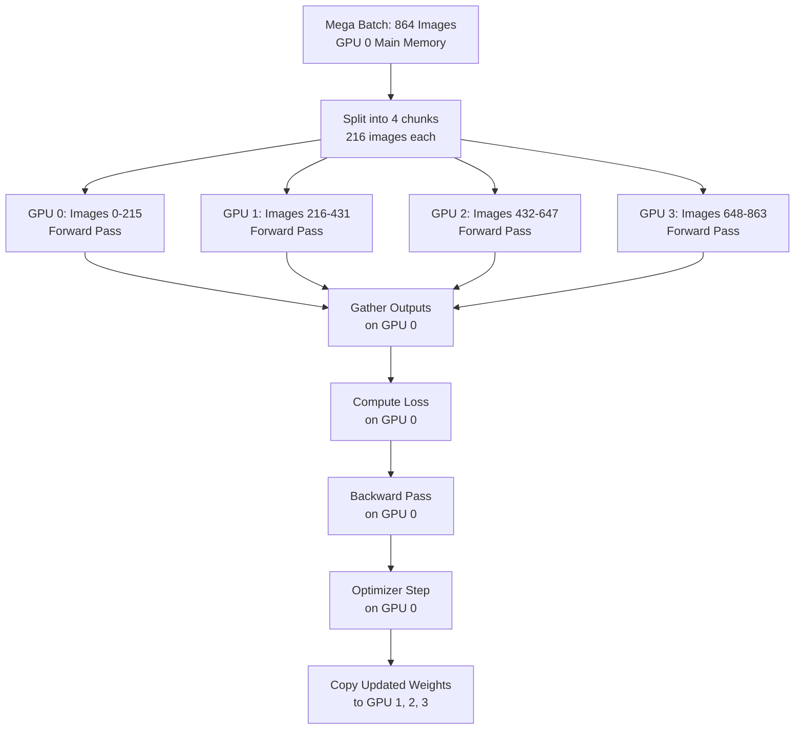

## 3. Multi-GPU Training (DataParallel)

### The Parallelism Strategy

`torch.nn.DataParallel` implements **Data Parallelism**: the same model is replicated on multiple GPUs, and different mini-batches of data are processed simultaneously on each GPU.

**Step-by-step operation for 4 GPUs:**

1. **Scatter:** The mega-batch of size $B_{total} = 864$ is split into 4 chunks of $B_{chunk} = 216$. Each chunk is sent to one GPU.

2. **Replicate:** The model weights (which live on GPU 0) are copied to GPUs 1, 2, 3 at the start of every forward pass.

3. **Forward:** Each GPU runs its forward pass independently with its chunk. GPU 0 processes images 0-215, GPU 1 processes 216-431, etc.

4. **Gather:** The outputs from all GPUs are gathered back to GPU 0.

5. **Loss:** The combined loss is computed on GPU 0.

6. **Backward:** Gradients are computed on GPU 0 (for the gathered batch) and then scattered back to GPUs 1, 2, 3 to allow parallel gradient computation... but in `DataParallel`, the backward pass actually happens entirely on GPU 0 after gathering. This is a known inefficiency.

7. **Update:** The optimizer step updates weights on GPU 0. On the next iteration, these updated weights are recopied to all GPUs.

> **Important reminder:** `DataParallel` has a known inefficiency: GPU 0 is the bottleneck. It gathers all outputs, computes loss, and runs the full backward pass. GPU 0 always has higher memory usage than GPUs 1-3. The effective batch size per GPU is $B_{total} / N_{GPUs}$, but GPU 0's VRAM must hold the full gathered tensor. The production solution for extreme multi-GPU training is `DistributedDataParallel` (DDP), which does not have this bottleneck. Each GPU computes its own loss and gradients, and gradients are all-reduced (averaged) across GPUs using NCCL. DDP is strictly superior but requires more complex setup. TAMER uses `DataParallel` as a simpler baseline and switches to DDP for training runs with 4+ GPUs.

---

### Effective Batch Size and Learning Rate Scaling

When using $N$ GPUs with batch size $B$ per GPU, the effective batch size is $N \times B$. The model sees $N$ times more data per optimizer step.

This changes the optimal learning rate. The **Linear Scaling Rule** (from the Facebook Research paper on large-batch training) states: if the batch size is multiplied by $k$, the learning rate should also be multiplied by $k$.

**Intuition:** With a larger batch, the gradient estimate is more accurate (lower variance). You can take a larger step in the direction of the true gradient without overshooting. A learning rate optimal for batch size 64 will cause overshooting instability at batch size 864.

**TAMER's Warmup Strategy:**
Even with the linear scaling rule, starting at the full large-batch learning rate causes instability in early training (the model weights are random, gradient magnitudes are unpredictable). TAMER uses a **warmup schedule**:

- Epochs 1-10: Linearly increase from $\text{LR}_{min} = 10^{-6}$ to $\text{LR}_{max} = k \times \text{LR}_{base}$.
- Epochs 10-100: Cosine anneal from $\text{LR}_{max}$ back to $\text{LR}_{min}$.

$$\text{LR}(t) = \text{LR}_{min} + \frac{1}{2}(\text{LR}_{max} - \text{LR}_{min})\left(1 + \cos\left(\frac{\pi t}{T_{total}}\right)\right)$$

This prevents gradient explosion in early training and allows fine-grained convergence in late training.

---

*End of TAMER Math OCR - Deep Learning Theory & Architecture Vault*