## 9.1 The Master TAMER Architecture Diagram

The diagram below is the definitive architectural map of TAMER as implemented in your specific codebase. Every box corresponds to a real class, method, or operation in your code. Every arrow represents a tensor transformation. Read this diagram before reading the detailed notes, so you have the full picture before zooming into individual components.

```mermaid
flowchart TD
    subgraph INPUT ["Input Pipeline"]
        IMG["Raw Image Tensor\nShape: B × 3 × 256 × 1024\ndtype: float32, normalized\nMean: 0.485 0.456 0.406\nStd: 0.229 0.224 0.225"]
        TOK["Target Token Sequence\nShape: B × T\ndtype: int64\nRange: 0 to vocab_size-1"]
    end

    subgraph ENCODER ["Phase 1: Swin-v2 Vision Encoder"]
        PATCH["Patch Partition\n4×4 pixel patches\nLinear embedding to C channels"]
        SWIN["Swin-v2 Transformer Blocks\nStage 1: W-MSA\nStage 2: SW-MSA\nStage 3: W-MSA\nStage 4: SW-MSA\nPatch Merging between stages"]
        RAW["Raw Feature Map\nShape: B × 8 × 32 × 1024\nPermuted from B × 1024 × 8 × 32"]
    end

    subgraph BRIDGE ["Phase 2: Spatial Bridge and Boundary Injection"]
        PROJ["Linear Projection\n1024 → 768 dimensions\nReduces channel depth"]
        NORM1["LayerNorm\nStabilizes feature scale"]
        POS2D["Learned 2D Positional Encoding\nRow Embed: 64 × 384\nCol Embed: 256 × 384\nConcat → 768 per patch"]
        GRID["2D Spatial Feature Grid\nShape: B × 8 × 32 × 768\nEvery patch knows its XY coordinate"]
        ROWMEAN["Row Mean Computation\nAverage across Width dimension\nShape: B × 8 × 768"]
        BOUNDPROJ["Boundary Projection MLP\nLinear → GELU → LayerNorm\nCreates learned newline embeddings\nShape: B × 8 × 768"]
        INTERLEAVE["Interleave Boundary Markers\nInsert boundary after each visual row\nVisRow0 Boundary0 VisRow1 Boundary1\nShape: B × S × 768\nS = 8×32 + 8 = 264 tokens"]
        MEM["Encoder Memory Matrix\nShape: B × 264 × 768\nFinal memory fed to all decoder layers"]
    end

    subgraph DECODER ["Phase 3: Transformer Decoder - 10 Layers"]
        TEMB["Token Embedding\nVocab Size 522 → 768\nLearned lookup table"]
        PE1D["1D Sinusoidal Positional Encoding\nFixed sin/cos waves\nShape: T × 768"]
        CMASK["Causal Mask\nT × T upper-triangular -inf matrix\nBlocks future token attention"]
        PMASK["Padding Mask\nB × T boolean\nBlocks attention to pad tokens"]
        SELFATTN["Masked Self-Attention\n8 heads × 96 dims = 768\nText attending to past text"]
        CROSSATTN["Cross-Attention\n8 heads × 96 dims = 768\nQ from text K V from memory\nText attending to visual features"]
        FFN["Feed-Forward Network\n768 → 3072 → 768\nGELU activation\nApplied per position"]
        DECSTATE["Deep Decoder Hidden State\nShape: B × T × 768\nAfter 10 stacked decoder layers"]
    end

    subgraph OUTPUT ["Phase 4: Output Projection and Inference"]
        OUTPROJ["Output Linear Projection\n768 → 522 vocab size"]
        LOGITS["Raw Logits\nShape: B × T × 522\nUnnormalized scores"]
        GRAMMAR["Grammar Constraint Mask\nInference only\nSets invalid tokens to -inf\nState machine tracks brace depth"]
        SOFTMAX["Softmax + Temperature Scaling"]
        BEAM["Beam Search Width K=5\nLength Penalty α=0.6\nMaintains top K sequences"]
        FINAL["Final LaTeX String\nDetokenized output"]
    end

    IMG --> PATCH
    PATCH --> SWIN
    SWIN --> RAW
    RAW --> PROJ
    PROJ --> NORM1
    NORM1 --> POS2D
    POS2D --> GRID
    GRID --> ROWMEAN
    ROWMEAN --> BOUNDPROJ
    GRID --> INTERLEAVE
    BOUNDPROJ --> INTERLEAVE
    INTERLEAVE --> MEM
    TOK --> TEMB
    TEMB --> PE1D
    PE1D --> CMASK
    CMASK --> SELFATTN
    SELFATTN --> CROSSATTN
    MEM -.->|"Key and Value\nfor all 10 decoder layers"| CROSSATTN
    CROSSATTN --> FFN
    FFN --> DECSTATE
    DECSTATE --> OUTPROJ
    OUTPROJ --> LOGITS
    LOGITS --> GRAMMAR
    GRAMMAR --> SOFTMAX
    SOFTMAX --> BEAM
    BEAM --> FINAL
```

---