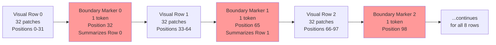

## 9.3 The Row Boundary Marker: Deep Dive

This is the architectural innovation that replaces the Tree-Aware Module in your specific implementation. Understanding it completely is essential.

### The Problem It Solves

Consider a $3 \times 3$ matrix in LaTeX:

```latex
\begin{pmatrix}
a_{11} & a_{12} & a_{13} \\
a_{21} & a_{22} & a_{23} \\
a_{31} & a_{32} & a_{33}
\end{pmatrix}
```

When the decoder generates this sequence, it must know when to transition from generating row 1 content to generating row 2 content. This transition is marked by the `\\` token in the LaTeX sequence. But the decoder must learn to predict `\\` at exactly the right moment — when it has finished generating all three entries of one row and needs to move to the next.

A standard sequence model infers this solely from the sequential text context: "I have generated `&` twice since the last `\\`, so I should probably output `\\` soon." This works for simple cases but breaks down for complex matrices where the decoder must simultaneously track how many columns it has generated AND what visual content is in the next row.

The Row Boundary Marker solves this by injecting explicit structural information directly into the visual memory. Instead of making the decoder infer row transitions entirely from text context, the encoder literally marks where each visual row ends in the spatial memory.

### Step-by-Step Computation

#### Step 1: Compute Row Summary Vectors

The 2D spatial feature grid has shape `[B, 8, 32, 768]`. We want to summarize each horizontal row of the image into a single vector.

$$\text{row\_means}[b, r] = \frac{1}{32} \sum_{c=0}^{31} X_{pos}[b, r, c, :]$$

This averages across the width dimension (32 columns), producing one 768-dimensional vector per visual row per batch item.

**Shape:** `[B, 8, 32, 768]` → mean(dim=2) → `[B, 8, 768]`

**What this vector represents:** The average visual content of an entire horizontal strip of the image. For a formula like:

$$\begin{pmatrix} a & b \\ c & d \end{pmatrix}$$

The row mean for the top half of the image captures a combination of all the visual features in row 1 (the `a`, `&`, `b` entries and the inter-cell whitespace). It is a holistic summary of "what visually characterizes this row of the formula."

#### Step 2: Project to Boundary Embeddings

The row means are passed through a small Multi-Layer Perceptron (MLP) to create learned boundary embeddings:

$$\text{boundary}[b, r] = \text{LayerNorm}(\text{GELU}(W_{bp} \cdot \text{row\_means}[b, r] + b_{bp}))$$

Where:
- $W_{bp} \in \mathbb{R}^{768 \times 768}$: Boundary projection weight matrix.
- $\text{GELU}$: Gaussian Error Linear Unit activation (smoother than ReLU, preferred in Transformers).
- LayerNorm: Normalizes the output.

The learnable parameter `row_boundary_base` is a single 768-dimensional vector that is added to every boundary embedding:

$$\text{boundary}[b, r] = \text{boundary}[b, r] + \text{row\_boundary\_base}$$

**What `row_boundary_base` does:** It provides a universal learned "this is a boundary marker" signature. All boundary tokens share this base vector, which distinguishes them from regular visual patch tokens. The decoder's cross-attention learns to recognize this signature and use boundary tokens as structural landmarks.

**Shape:** `[B, 8, 768]` → MLP + base → `[B, 8, 768]`

#### Step 3: Interleaving — The Critical Operation

The interleaving operation restructures the memory to alternate between visual rows and boundary markers.

Before interleaving:
- Visual grid: `[B, 8, 32, 768]` — 8 rows of 32 patches each.
- Boundary embeddings: `[B, 8, 768]` — 8 boundary vectors.

After interleaving, the sequence is structured as:

```
[Visual Row 0 Patches × 32] [Boundary Marker 0] [Visual Row 1 Patches × 32] [Boundary Marker 1] ... [Visual Row 7 Patches × 32] [Boundary Marker 7]
```

Total sequence length: $8 \times 32 + 8 = 256 + 8 = 264$ tokens.

**The PyTorch implementation of interleaving:**

```python
# visual_rows shape: [B, 8, 32, 768]
# boundaries shape: [B, 8, 1, 768] (unsqueezed for concat)

# Reshape visual_rows to sequence of rows
# boundaries is expanded to match
segments = []
for r in range(num_rows):
    segments.append(visual_rows[:, r, :, :])  # [B, 32, 768]
    segments.append(boundaries[:, r:r+1, :])  # [B, 1, 768]

memory = torch.cat(segments, dim=1)  # [B, 264, 768]
```

**Shape:** `[B, 264, 768]` — this is the final Encoder Memory Matrix.

### Why the Decoder Can Use This

When the decoder performs Cross-Attention over the 264-token memory:

$$\text{CrossAttn}(Q_{dec}, K_{enc}, V_{enc})$$

The Key matrix $K_{enc}$ contains representations of all 264 memory tokens, including the 8 boundary markers at positions 32, 65, 98, 131, 164, 197, 230, and 263 (every 33rd position, specifically every 33rd = 32 visual patches + 1 boundary).

When the decoder is generating the `\\` token (the row separator), its Query vector is in a state corresponding to "I have finished writing a row of entries, I need to transition to the next row." Through Cross-Attention, this Query vector will naturally attend heavily to the boundary marker tokens, because those markers have been trained to encode exactly the visual summary of what each row contains.

The model learns: "When my Query matches the signature of a boundary marker (containing `row_boundary_base`), I am at a row boundary and should predict `\\`."

This is the critical insight: **you replaced an explicit Tree module with a structural signal embedded directly in the visual memory.** The tree-awareness is implicit but physically present in the memory sequence.



---