## 9.6 The Training Loop vs Inference Loop: Side by Side

Understanding the differences between training and inference is critical. Many subtle bugs come from accidentally mixing training-time operations into inference or vice versa.

### Training Loop (One Batch)

```mermaid
flowchart TD
    A["Load Batch from DataLoader\nimages: B × 3 × 256 × 1024\ntgt_ids: B × T_max\nPadding applied to uniform length"] --> B["Move to GPU\ntorch.cuda.amp.autocast\ndtype: bfloat16 for forward pass"]
    B --> C["Encoder Forward Pass\nSwin Backbone\nSpatial Bridge\nBoundary Injection\nOutput: memory B × 264 × 768"]
    C --> D["Prepare Teacher Forcing Inputs\nDecoder input: tgt_ids shift right\nAppend SOS at position 0\nDecoder target: tgt_ids shift left\nAppend EOS at position T-1"]
    D --> E["Build Masks\nCausal mask: T × T upper-tri -inf\nPadding mask: B × T bool"]
    E --> F["Decoder Forward Pass\nAll T positions in parallel\nOutput: logits B × T × 522"]
    F --> G["Compute Structure-Aware Loss\nFor each position t:\nbase_loss = LabelSmoothedCE\nIf target is structural token: weight × 3.0\nIgnore pad positions weight = 0\nFinal loss = weighted mean"]
    G --> H["Backward Pass\nloss.backward\nGradients computed for all parameters"]
    H --> I["Gradient Clipping\nclip_grad_norm max 1.0\nPrevents gradient explosion"]
    I --> J["Optimizer Step\nAdam updates all weights\nScaler handles bfloat16 precision"]
    J --> K["LR Scheduler Step\nCosine annealing update"]
    K --> L["Log Metrics\nLoss, LR, GPU memory\nCheckpoint if interval reached"]
```

### Inference Loop (One Image)

```mermaid
flowchart TD
    A["Single Image\nPreprocessed and normalized\nNo augmentation"] --> B["Encoder Forward Pass\nIdentical to training\nOutput: memory 1 × 264 × 768"]
    B --> C["Initialize Beam Search\nK=5 beams\nEach beam starts with SOS token\nInitial scores all 0.0"]
    C --> D["Decoder Step t\nInput: all tokens generated so far\nFor each of K beams independently\nOutput: logits 1 × t × 522\nUse only logits at final position t"]
    D --> E["Apply Grammar Constraint Mask\nCheck state machine\nSet invalid token logits to -inf\nExamples brace depth checks arg counts"]
    E --> F["Apply Temperature Scaling\nlogits = logits / temperature\nDefault temperature 1.0"]
    F --> G["Softmax\nConvert to probabilities\n1 × 522 per beam"]
    G --> H["Compute Log Probabilities\nlog_prob = log softmax logits\nAdd to cumulative beam score"]
    H --> I["Expand Beams\nEach of K beams expands to K×522\nTotal K×522 candidate sequences"]
    I --> J["Select Top K\nSort all K×522 candidates by score\nKeep top K sequences\nPrune the rest"]
    J --> K{"Any Beam\nPredicted EOS?"}
    K -->|"No and t < max_len"| D
    K -->|"Yes"| L["Move completed beam\nto finished list\nContinue with remaining beams"]
    L --> M{"All K Beams\nFinished?"}
    M -->|"No"| D
    M -->|"Yes"| N["Apply Length Penalty\nFor each finished beam:\nscore = cumulative_log_prob / length^0.6"]
    N --> O["Select Best Beam\nHighest score after length penalty"]
    O --> P["Detokenize\nConvert token indices to LaTeX string\nStrip SOS and EOS tokens\nReturn final LaTeX"]
```

### Key Differences: Training vs Inference

| Aspect | Training | Inference |
|---|---|---|
| Batch size | Up to 864 | Typically 1-32 |
| Decoder input source | Ground truth (Teacher Forcing) | Model's own predictions |
| Mask type | Causal + Padding masks | Causal mask only |
| Parallelism | All T positions at once | Sequential, step by step |
| Grammar masks | NOT applied | Applied at every step |
| Augmentation | Applied | NOT applied |
| `model.train()` | Active (dropout on) | Must call `model.eval()` (dropout off) |
| `torch.no_grad()` | Not used | Must wrap in `torch.no_grad()` |
| Gradient computation | Required | Must be disabled |
| BFloat16 autocast | Applied via `autocast` | Can use for speed, optional |

> **Critical reminder about `model.eval()`:** When you call `model.eval()`, it does two things. First, it disables Dropout layers (which randomly zero out neurons during training for regularization). At inference, you want all neurons active for maximum prediction quality. Second, it changes BatchNorm behavior (though TAMER uses LayerNorm, not BatchNorm, so this is less relevant here). If you forget to call `model.eval()`, every inference run produces different random results due to active dropout. This is a non-deterministic bug that is very hard to diagnose.

---