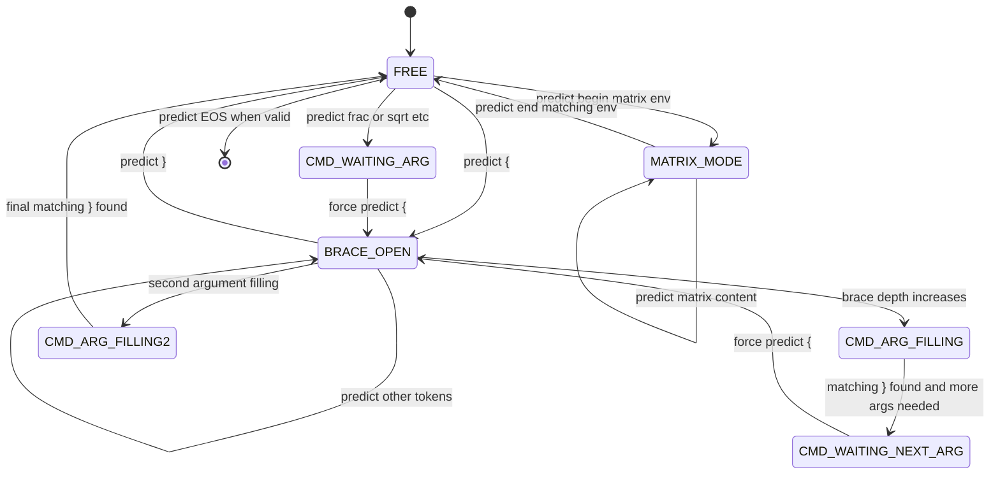

## 9.7 The Grammar State Machine: Full Specification

The Grammar Constraint Mask is a Python state machine that runs in parallel with the beam search. At every beam search step, before the softmax is applied, the state machine inspects the current token history of each beam and determines which tokens are grammatically valid next tokens.

### State Variables

The state machine tracks the following variables for each beam independently:

| Variable | Type | Initial Value | Meaning |
|---|---|---|---|
| `brace_depth` | int | 0 | Number of `{` seen minus number of `}` seen |
| `paren_depth` | int | 0 | Number of `(` or `\left(` minus closing parens |
| `env_stack` | list of str | [] | Stack of currently open LaTeX environments |
| `last_token` | str | `<sos>` | The most recently generated token |
| `tokens_since_arg_start` | int | 0 | For tracking argument count of multi-arg commands |
| `arg_stack` | list of int | [] | Stack of required argument counts for pending commands |
| `in_matrix` | bool | False | Whether inside a matrix-like environment |
| `col_count` | int | 0 | Number of `&` separators seen in current row |

### The Core State Transition Rules

#### Rule 1: Brace Balance

After every token:
- If token is `{`: increment `brace_depth`.
- If token is `}`: decrement `brace_depth`.

At every prediction step:
- If `brace_depth == 0`: set logit of `}` to $-\infty$.
- If `brace_depth > 0` AND the `arg_stack` requires closing (top of stack = 0): set logits of all tokens except `}` to $-\infty$.

This ensures braces are always properly matched.

#### Rule 2: Post-Command Argument Forcing

Certain LaTeX commands require exactly one or two brace-group arguments immediately following them. The state machine tracks this with `arg_stack`.

When the state machine sees one of these commands:

| Command | Required Arguments |
|---|---|
| `\frac` | 2 (numerator, denominator) |
| `\sqrt` | 1 (content, optional bracket first) |
| `\hat`, `\bar`, `\tilde`, etc. | 1 |
| `\overset`, `\underset` | 2 |
| `\binom` | 2 |

Upon seeing `\frac`:
1. Push `2` onto `arg_stack`.
2. At next step: force `{` (arg_stack top is 2, waiting for first arg).
3. Track brace depth inside the argument.
4. When the matching `}` is seen: decrement arg_stack top by 1.
5. If arg_stack top is 1: force `{` again (second argument).
6. When second `}` is seen: pop arg_stack (command is satisfied).

#### Rule 3: Environment Matching

When `\begin{envname}` is predicted:
- Push `envname` onto `env_stack`.
- If `envname` is a matrix-like environment: set `in_matrix = True`, `col_count = 0`.

When `\end{envname}` is predicted:
- If `env_stack` is empty: this is illegal. Set logit of all `\end{...}` tokens to $-\infty$.
- If `envname` does not match top of `env_stack`: set logit of this specific `\end{envname}` to $-\infty$.
- If `envname` matches top of `env_stack`: pop `env_stack`. If stack is now empty or top is non-matrix: set `in_matrix = False`.

#### Rule 4: Matrix Structural Constraints

If `in_matrix == True`:
- `\\` (row separator) is only valid if `col_count >= expected_cols - 1`. This prevents early row termination with incomplete columns.
- After `\\`: reset `col_count = 0`.
- After `&`: increment `col_count`.
- `\end{...}` matching the current matrix environment is only valid if `col_count == expected_cols - 1` (all columns of the last row have been filled).

#### Rule 5: EOS Suppression

The End-of-Sequence token `<eos>` is suppressed (set to $-\infty$) if:
- `brace_depth > 0` (unclosed brace group).
- `env_stack` is non-empty (unclosed environment).
- `arg_stack` is non-empty (unsatisfied command argument).
- The sequence is shorter than a minimum length threshold (prevents immediate EOS prediction on very short sequences that would be semantically empty).

### The State Machine's Relationship to Beam Search

Each of the $K = 5$ beams in the beam search has its own independent state machine instance. When a beam is created (by extending another beam with a predicted token), the new beam clones the parent beam's state machine state and updates it with the new token.

When a beam is pruned (removed from the top-K), its state machine is also discarded.

This means the grammar constraint is applied per-beam, not globally. Different beams can be in different grammatical states simultaneously. One beam might have `brace_depth = 2` (inside two nested brace groups) while another has `brace_depth = 0`. The grammar constraint correctly applies different masks to each beam based on its specific state.

> **Final critical reminder for the complete architecture:** Every component described in this blueprint is a module with learned parameters that are updated together during training. The Swin backbone, the projection layer, the 2D positional embeddings, the row boundary MLP, the boundary base vector, the token embeddings, the 10 decoder layers, and the output projection are all jointly optimized by the same Adam optimizer against the same structure-aware loss. They are not separately pre-trained (except for the Swin backbone's ImageNet pretraining). The gradient flows from the final loss backward through the output projection, through all 10 decoder layers, through the cross-attention into the encoder memory, and all the way back through the spatial bridge and the Swin backbone. Everything is connected in one computational graph and everything learns together.

---

*End of Chapter 9: The Complete Architecture Blueprint*