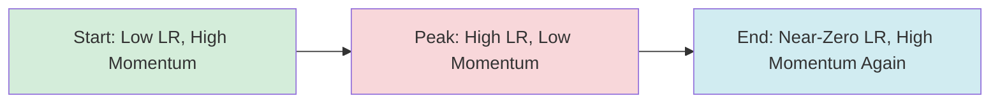
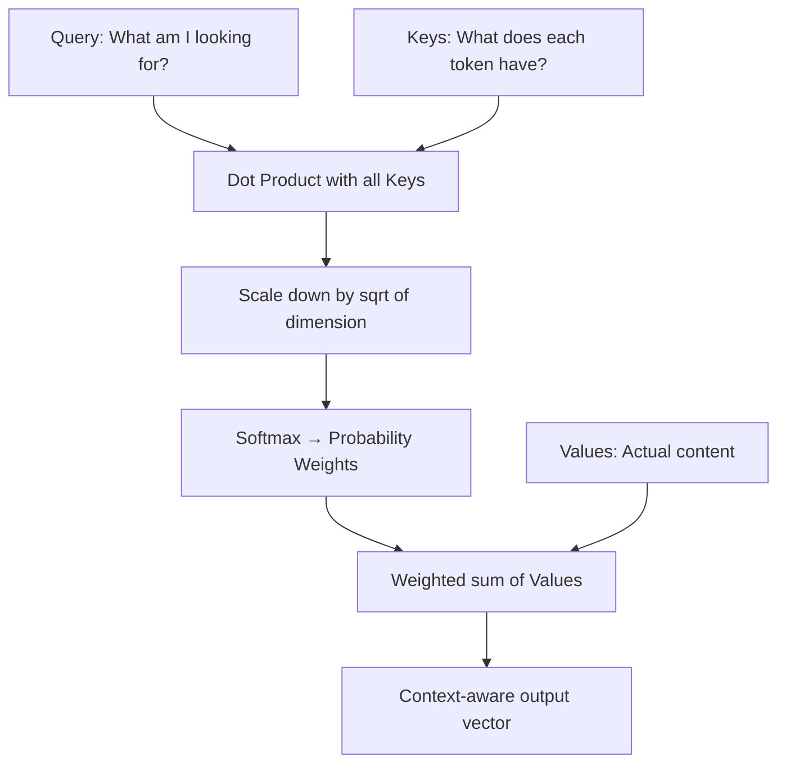
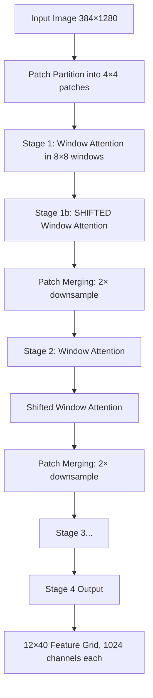
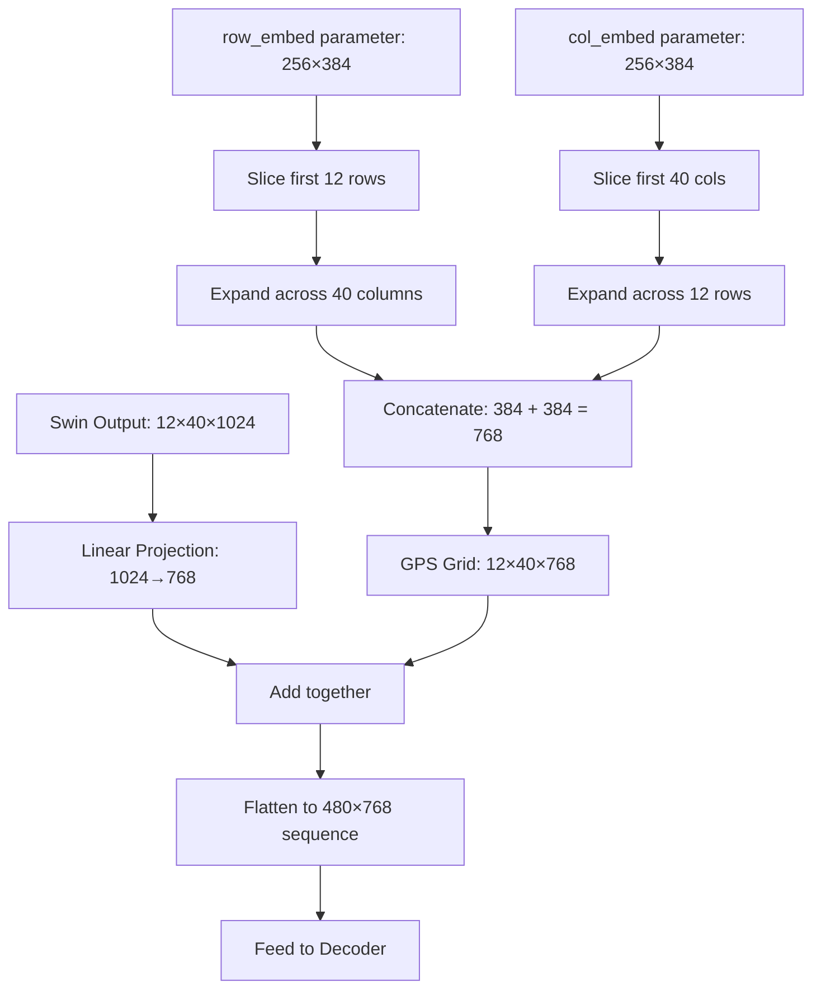
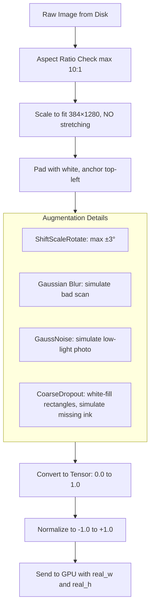
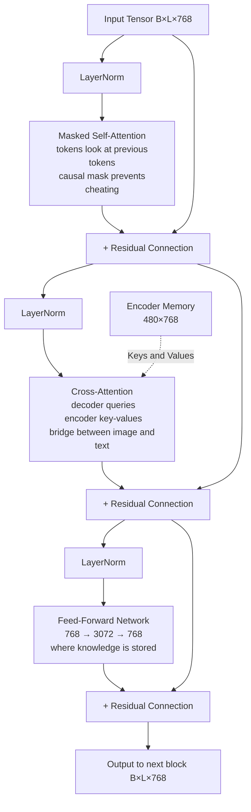
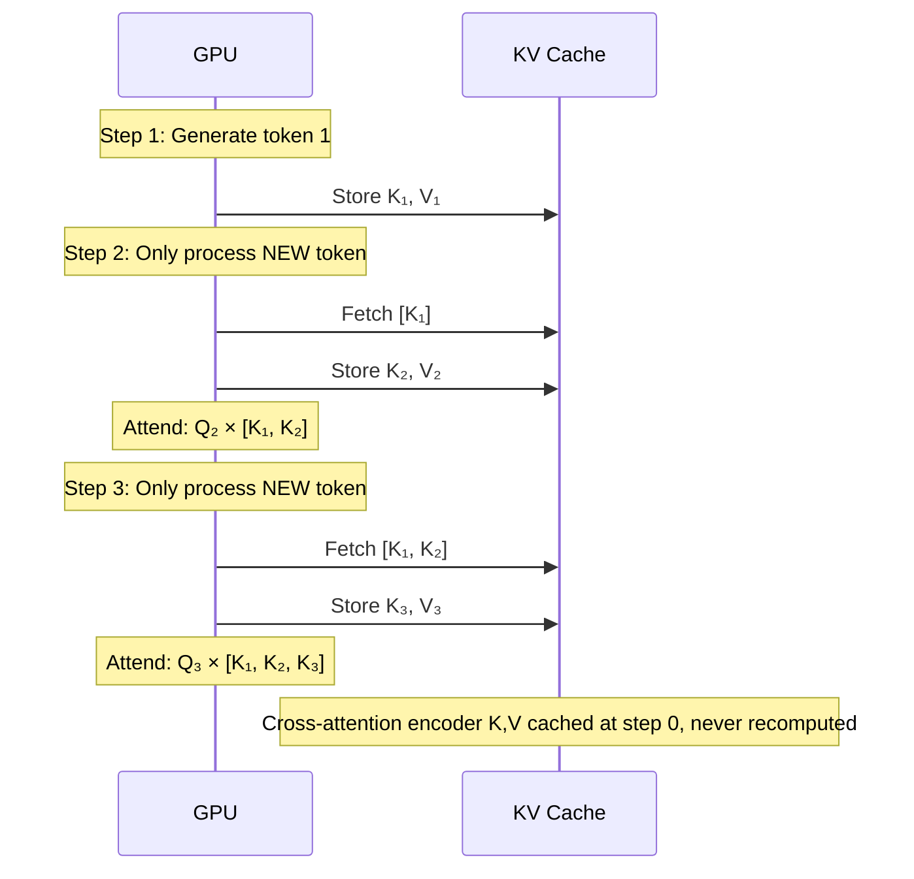
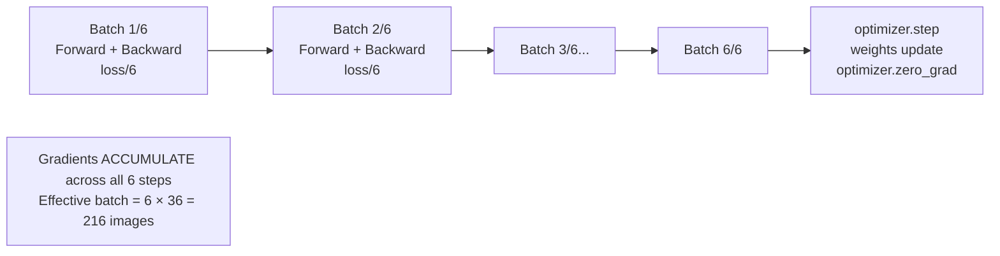
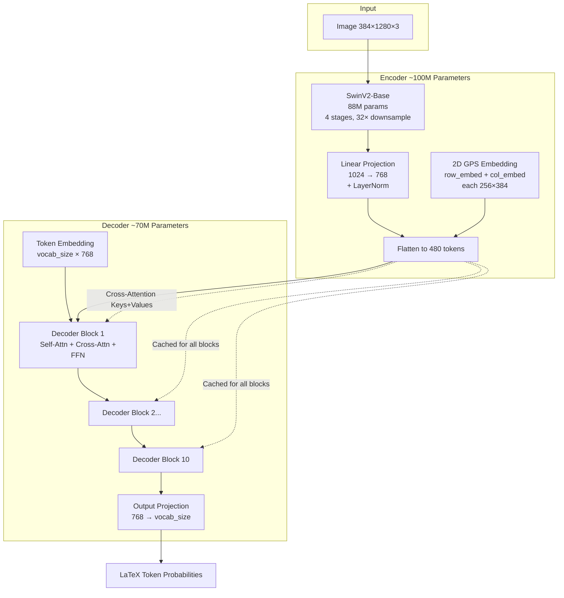

# TAMER v2.4: A Math OCR System Built on SwinV2 and Transformer Decoding

## Academic Project Report

---

# Chapter 1: How the Thing Actually Learns

## 1.1 Neural Networks and the Basics of Training

Okay so before getting into the specifics of what we built, it helps to understand how any of this learning stuff works in the first place.

A neural network is basically a huge mathematical function. You feed it an image (which is just a bunch of numbers representing pixel brightness), it does a ton of matrix multiplications, and spits out some prediction. The "weights" are the millions of little numbers that control how all those multiplications work.

Training is just the process of figuring out the right weights. You do this by measuring how wrong the prediction was (the **loss**), and then using calculus (specifically the chain rule, called **backpropagation**) to figure out which direction to nudge each weight to make the next prediction a bit less wrong.

We used the **AdamW** optimizer, which is a smarter version of just "go downhill." Instead of moving every weight by the same amount, Adam keeps track of the recent *average* gradient (first moment) and the recent *average squared* gradient (second moment) for every single parameter individually. This means parameters that have been getting big gradients recently will take smaller steps (they're clearly sensitive), and parameters that haven't been doing much will take bigger steps to catch up.

The "W" part means it also does **weight decay** — every step, it multiplies the weights by something like 0.9999. This prevents any single weight from getting astronomically large, which is basically a form of regularization.

```
The Update Rule (simplified):

m_t = β₁ * m_(t-1) + (1 - β₁) * gradient
v_t = β₂ * v_(t-1) + (1 - β₂) * gradient²

weight_new = weight_old - lr * (m_t / sqrt(v_t)) - weight_decay * weight_old
```

We also did something called **differential learning rates**: the encoder (SwinV2, which was pre-trained on ImageNet) got a tiny learning rate of `5e-6`, while the decoder got a much larger `3e-4`. The reason is pretty intuitive — the encoder already knows how to look at images, so if you slam it with a huge learning rate you'll just destroy all that knowledge. The decoder is randomly initialized so it needs bigger steps to actually learn anything.

### The OneCycleLR Schedule

A fixed learning rate is suboptimal. We used **OneCycleLR**, which:
1. Starts low (warmup phase — prevents giant chaotic gradients at the start)
2. Ramps up to the peak
3. Decays back down following a cosine curve

The interesting part is the **momentum inversion** — as the LR goes up, the momentum coefficient (β₁) goes *down* from 0.95 to 0.85. This makes sense: at peak LR, you want the optimizer to be highly responsive to the current batch and not be dragged around by old gradient directions. Then as LR drops at the end, momentum goes back up so tiny steps get a boost from accumulated history to push through shallow flat regions.



---

## 1.2 The Attention Mechanism

This is probably the most important concept in the whole project so it's worth spending some time on.

Old sequence models (RNNs, LSTMs) processed things one step at a time. Token 1, then token 2, then token 3. The problem is information has to travel through a bottleneck — by the time the model gets to step 100, it has basically forgotten what happened at step 1.

**Attention** throws that out entirely. Instead of sequential processing, every element looks at every other element simultaneously and decides how much to "pay attention" to each one.

The math works like this: every token gets three vectors — a Query, a Key, and a Value. Think of it like a library:
- **Query**: what you're searching for
- **Key**: what each book claims to be about
- **Value**: the actual content of the book

You match your Query against all the Keys, and you get back a weighted combination of Values where the weights correspond to how well the Query matched each Key.

$$\text{Attention}(Q, K, V) = \text{softmax}\left(\frac{QK^T}{\sqrt{d_k}}\right)V$$

The $\sqrt{d_k}$ scaling is necessary because as vectors get longer, dot products get bigger just from having more terms, which pushes the softmax into near-zero gradient territory. Dividing by the square root keeps things in a reasonable range.



**Multi-head attention** just runs this process multiple times in parallel with different learned projections. In our decoder we use 12 heads. The idea is different heads can specialize — one might learn to track brackets, another might look for the next numeral, another might look for spatial relationships.

---

# Chapter 2: The Encoder — Teaching the Machine to See Math

## 2.1 Why Not Just Use a CNN?

CNNs were the standard for image tasks for years. They use sliding convolutional kernels that look at small local patches of an image. The problem is **receptive field** — a 3×3 kernel only sees 9 pixels. To connect a `\left(` on the far left of an image to a `\right)` on the far right, you need many layers of downsampling, and by then the spatial resolution is so coarse that tiny superscripts are just... gone.

You could use a regular Vision Transformer (ViT), which chops the image into patches and runs attention between all of them. Global context immediately. But here's the problem — math equations need *high resolution* (we use 384×1280 pixels) to keep small fractions readable. With 16×16 patches, that's $\frac{384}{16} \times \frac{1280}{16} = 24 \times 80 = 1920$ patches. Standard attention is $O(N^2)$, so that's $1920^2 \approx 3.7$ million operations per head per layer. On a single GPU, this causes an immediate out-of-memory crash.

## 2.2 The Swin Transformer — Best of Both Worlds

Swin solves the quadratic complexity problem by doing attention inside local windows instead of globally.



The **shifted window** trick is crucial. If you only ever do attention within fixed windows, features at the edge of a window can never communicate with features just over the border. By shifting the windows by half their size in alternating layers, information bleeds across all boundaries over a few layers.

**Patch Merging** is like CNN pooling — every two layers, neighboring 2×2 patches are merged into one, halving the spatial dimensions while doubling the channel depth. This hierarchical structure means early layers see small character shapes (the curve of an integral sign) while later layers see larger semantic structures (the horizontal bar of a fraction with something above and below it).

## 2.3 Why SwinV2 Specifically?

SwinV1 has two practical problems at our image resolution:

**Problem 1 — Attention Explosion:** At high resolutions, dot-product attention values can get huge, saturating the softmax and killing gradients. SwinV2 fixes this with **Scaled Cosine Attention**:

$$\text{Attention}_{SCA}(Q, K) = \frac{\cos(\theta_{Q,K})}{\tau}$$

Cosine similarity is mathematically bounded between -1 and 1, so it literally cannot explode. This gave us the training stability we needed at 384×1280.

**Problem 2 — Position Bias Extrapolation:** SwinV1 uses a fixed lookup table for relative position biases. If you train on 256×256 images and then try to run on 384×1280, positions outside the table break. SwinV2 uses a small MLP with **log-spaced coordinates** to *generate* position biases on the fly. Log spacing means the model perceives the difference between positions 1 and 2 similarly to the difference between positions 100 and 200 — a compressed, scale-invariant notion of distance that generalizes much better.

## 2.4 The 2D GPS Problem — Fixing Spatial Encoding

This was one of the biggest conceptual breakthroughs in the project.

Standard transformers have no concept of position unless you tell them. In text, you add 1D sine waves. But our Swin encoder outputs a **2D grid** of features (12 rows × 40 columns). The naive thing would be to flatten this into a sequence of 480 tokens and add 1D position encodings.

**This is wrong.** Consider a fraction $\frac{a}{b}$. The numerator `a` is directly above the denominator `b`. In the 2D grid, they might be at positions (Row 3, Col 5) and (Row 4, Col 5) — adjacent vertically. But after flattening into a 1D sequence, Row 3 Col 5 is token index $3 \times 40 + 5 = 125$ and Row 4 Col 5 is token index $4 \times 40 + 5 = 165$. Now they're 40 positions apart in the sequence. The model has to somehow figure out that token 125 and token 165 have a vertical relationship, which is extremely difficult with just 1D positional encodings.

The fix: we inject **2D coordinates before flattening**.



Every token now carries an absolute "address." Token at grid position (Row 2, Col 5) has a different GPS embedding than token at (Row 3, Col 5). When these get flattened to positions 85 and 125 in the 1D sequence, they still carry the information that one was directly below the other in the original 2D grid.

## 2.5 Image Preprocessing Pipeline

Math is extremely sensitive to how images get preprocessed. Getting this wrong destroys training.

The biggest issue is **padding and positional consistency**. If we resize a small equation and center-pad it, the equation might start at pixel (192, 640) in one image and pixel (150, 600) in another. Since we're using absolute 2D positional encodings, the same grid coordinate means "start of equation" in one batch and "middle of equation" in another. The model's GPS system gets scrambled.

**Solution: Top-Left Anchoring.** All images are padded so content always starts at (0,0). The rest of the canvas is filled with white.



One specific thing worth noting about the augmentation: **CoarseDropout fills with white (255), not black (0)**. Standard image dropout fills with black, which would look like massive ink blobs to the model. Since our background is white, we need the dropout regions to also be white — simulating faded ink or missing parts of a scan, not adding fake ink.

Also, rotations are capped at ±3 degrees because math is not rotation-invariant. A `+` rotated 45 degrees looks like `×`. A `\leq` flipped vertically becomes `\geq`.

---

# Chapter 3: The Decoder — Translating Pixels to LaTeX

## 3.1 How Autoregressive Generation Works

The decoder generates LaTeX one token at a time. Each token is conditioned on all previous tokens and on the image features from the encoder:

$$P(y_t \mid y_1, y_2, \ldots, y_{t-1}, \text{image})$$

During **training**, we use **teacher forcing** — instead of feeding the model its own (potentially wrong) predictions as context, we feed it the actual ground truth. This massively speeds up training because every position gets a gradient simultaneously.

To prevent the model from "cheating" by looking at future tokens, we apply a **causal mask** — an upper triangular matrix of $-\infty$ values that zeroes out attention to future positions after softmax.

```
Input:  [SOS, \frac, {, a, }]
Target: [\frac, {, a, }, {]

The model sees the SOS token and must predict \frac.
It sees SOS and \frac, and must predict {.
And so on. Each position is trained in parallel.
```

During **inference**, there's no ground truth available, so we generate autoregressively: predict token 1, feed it back in, predict token 2, and so on.

## 3.2 Inside a Decoder Block

We have 10 identical decoder blocks. Each one has four parts:



The **Pre-Norm** architecture (LayerNorm before the sublayer, not after) is a deliberate choice. In original transformers, normalization came after the residual addition. This makes the gradient path go through the normalization operation, which can destabilize training. Pre-Norm keeps the residual stream completely clean — the attention and FFN layers just compute *updates* and add them, they don't touch the main trunk. Gradients flow directly from the loss to the first layer without obstruction.

## 3.3 Dimensional Choices

The key numbers aren't arbitrary:

- **d_model = 768**: Divisible by 12 heads perfectly (768/12 = 64 per head). 64 is aligned with GPU warp sizes and CUDA memory coalescing patterns. Also matches the BERT-base standard that the ecosystem is optimized for.
- **FFN dim = 3072**: Standard 4× expansion ratio (768 × 4). Attention layers find relationships; FFN layers store knowledge. The 4× expansion projects features into a higher-dimensional space where they're more linearly separable.
- **10 layers**: Encoder is massive (88M params). A shallow 3-layer decoder creates a bottleneck — it lacks capacity to translate rich hierarchical visual features into complex nested LaTeX.

## 3.4 The KV Cache — Making Inference Fast

During inference, naively recomputing attention for all tokens at every step is $O(N^3)$. The **KV cache** fixes this.

The key insight: past tokens don't change. Their K and V projections are computed once and cached.



For cross-attention specifically, the encoder output never changes during inference (we're not updating weights). So the encoder's Keys and Values are computed exactly once at step 0 and reused forever.

## 3.5 Padding Masks — Don't Attend to Empty Space

Images are padded to 384×1280. A small equation might only occupy 200×400 pixels; the rest is blank white. After Swin encoding, this gives us a 12×40 feature grid where maybe 300 of the 480 tokens represent blank padding.

Without a mask, cross-attention distributes probability mass across all 480 tokens. 300 tokens representing nothing but white noise dilute the attention signal and confuse the decoder.

**Fix:** We track `real_w` and `real_h` (the pre-padding dimensions). We construct a boolean mask — any token outside the actual content bounding box gets marked as `True` (ignore). In cross-attention, these get set to $-\infty$ before softmax, so they contribute exactly zero attention weight.

---

# Chapter 4: Text Processing and Loss Functions

## 4.1 LaTeX Tokenization

Standard BPE tokenization would chop `\frac` into something like `\fr`, `ac`, which is meaningless. We need a math-aware tokenizer.

The strategy:
- **Full commands are atomic**: `\frac`, `\sqrt`, `\alpha`, `\begin{pmatrix}`, `\end{pmatrix}` are each single tokens. This prevents the model from generating `\begin{bmatrix}` and closing it with `\end{pmatrix}`.
- **Row separators `\\` are single tokens**: A previous bug where this got parsed as two backslash characters broke matrix formatting completely.
- **Digits and letters are character-level**: `1`, `2`, `x`, `y` are individual tokens. This means the model can handle any number it hasn't explicitly seen — to output `1234` it just generates `1`, `2`, `3`, `4`.

## 4.2 Structure-Aware Loss

Standard cross-entropy loss has a subtle problem. A 1-token error in a 5-token equation contributes $\frac{1}{5} = 0.2$ to the batch loss. A 1-token error in a 50-token matrix contributes $\frac{1}{50} = 0.02$. The model learns that screwing up complex matrices barely hurts its score.

**Fix 1 — Global Token Averaging:** Instead of averaging loss per sequence then averaging sequences, we flatten everything and divide by total valid tokens in the batch. Every token contributes equally regardless of which equation it's in.

**Fix 2 — Structural Weight Multiplier:** Structural tokens (`\\`, `&`, `\begin{...}`, `\end{...}`) get a **3.0× multiplier**. Getting a `+` wrong shifts one character. Getting a `\\` wrong destroys an entire matrix row. The 3× weight makes the optimizer treat structural mistakes as steep cliffs in the loss landscape, prioritizing them during training.

If the model assigns 30% probability to the correct `\\`:

$$\text{Normal loss} = -\log(0.3) \approx 1.20$$
$$\text{Structural loss} = 1.20 \times 3.0 = 3.60$$

This gets backpropagated, scaling the gradient vector by 3.0 for that token. AdamW perceives this as a much steeper slope and takes a proportionally larger correction step.

## 4.3 Curriculum Learning and Temperature Sampling

We categorized all training equations by complexity:

A `get_complexity()` function scores each LaTeX string:
- +1 point per 25 characters
- +1 per superscript (`^`) or subscript (`_`)
- +2 per `\frac`, `\sqrt`, `\int`, `\sum`
- +0.5 per opening brace `{`
- Instant `complex` classification for anything with `\\`, `&`, or `\begin{matrix}`

Training then proceeds in stages: simple only → introduce medium → everything including messy handwritten matrices.

**Temperature Sampling** handles dataset imbalance across our four datasets (Im2LaTeX 100k, MathWriting 50k, HME100K 100k, CROHME 10k):

$$P(\text{dataset}_i) = \frac{n_i^T}{\sum_j n_j^T}$$

At $T=1.0$ this is proportional (big datasets dominate). At $T=0.0$ it's uniform (equal probability). We start at $T=0.8$ and decay to $T=0.4$ — early training efficiently processes large datasets, late training oversamples CROHME to squeeze out hard-dataset performance.

Also, every batch contains images from **only one dataset**. Mixing printed Im2LaTeX with messy CROHME handwriting in the same batch produces contradictory gradients and scrambles normalization statistics.

---

# Chapter 5: Training Infrastructure

## 5.1 Mixed Precision Training

Training in full FP32 (32-bit floats, 4 bytes each) is slow and VRAM-hungry. FP16 (16-bit) halves memory usage but has a tiny numeric range — attention scores in deep transformers can easily overflow FP16's maximum value of ~65,000, causing NaN explosions.

**BFloat16** keeps FP32's exponent range (preventing overflow) while halving precision in the mantissa (which barely matters for training). This is why we use `torch.autocast(dtype=torch.bfloat16)`.

However: the loss calculation is done in FP32. We cast logits back with `logits = logits.float()` before computing cross-entropy because gradient magnitudes during backprop can be tiny, and BF16's reduced mantissa precision causes them to round to zero (underflow). We need the full precision there.

## 5.2 Gradient Accumulation and Clipping

96GB VRAM sounds like a lot but a batch of 36 images at 384×1280 through SwinV2 plus a 10-layer decoder gets expensive fast. We want an effective batch size of 216 for gradient stability.

**Gradient Accumulation** simulates this without the memory:



The `loss / 6` division is critical. Without it, gradients would sum to 6× their intended magnitude, acting like a 6× learning rate multiplier.

**Gradient Clipping** (`max_norm=1.0`) prevents the occasional catastrophic batch from destroying the model. Before every optimizer step, we compute the global L2 norm of all gradients. If it exceeds 1.0, we scale the entire gradient tensor down. The **direction** is preserved exactly — we're not changing where we're going, just ensuring we don't take a step off a cliff.

## 5.3 System Reliability

**Atomic Checkpoint Writes:** A standard `torch.save()` can be corrupted if the kernel dies mid-write. Our solution:
1. Write to `epoch_N.pt.tmp`
2. `os.fsync()` — flush OS write buffers to physical disk
3. `os.replace(tmp, final)` — atomic pointer swap at filesystem level. Any reader sees either the complete old file or the complete new file, never a partial write.

**O(1) Image Indexing:** Kaggle's input directory is a Network File System. Checking `os.path.exists()` for 300,000 images means 300,000 network requests, which freezes the kernel before training starts. We do a single `os.walk()` traversal, build a Python dictionary mapping filenames to paths, and all subsequent lookups are in-RAM dictionary reads (zero NFS traffic).

**DataLoader Optimizations:**
- `pin_memory=True` — locks tensors in RAM so the GPU can DMA directly via PCIe without CPU involvement
- `persistent_workers=True` — workers stay alive between epochs (spawning processes takes minutes)
- `prefetch_factor=2` — while GPU trains on batch N, CPU loads batches N+1 and N+2

---

# Chapter 6: Inference and Evaluation

## 6.1 Beam Search vs Greedy Decoding

**Greedy decoding** always picks the highest-probability token. It's fast but falls into local traps.

Imagine the image has an ambiguous symbol that looks 51% like `\times` and 49% like `x`. Greedy picks `\times`. But `\times 2` makes no mathematical sense, so the next token has low probability no matter what. The model is stuck in a bad path it can't escape.

**Beam search** keeps the top B paths alive simultaneously:

```mermaid
graph TD
    Start[SOS] --> T1a[\times: prob 0.51]
    Start --> T1b[x: prob 0.49]
    Start --> T1c[other paths...]

    T1a --> T2a[\times 2\n cumulative: 0.51×0.01=0.0051\n nonsensical continuation]
    T1b --> T2b[x =\n cumulative: 0.49×0.99=0.4851\n valid math!]

    T2b --> Win[x = WINS\n local trap avoided]
    T2a --> Lose[Pruned from beam]

    style T2b fill:#d4edda
    style T2a fill:#f8d7da
    style Win fill:#c3e6cb
    style Lose fill:#f5c6cb
```

**Length Penalty** prevents beam search from biasing toward short outputs. Log-probabilities are always negative, so sequences accumulate negative scores — a sequence of 10 tokens always scores worse than 2 tokens just from having more terms. We divide the cumulative score by $L^\alpha$ (where $\alpha \approx 0.6$) to compensate.

## 6.2 Evaluation Metrics

We use four metrics, each capturing a different aspect of quality:

| Metric | What It Measures | Formula |
|--------|-----------------|---------|
| **ExpRate** | Perfect predictions | `prediction == ground_truth` (ignoring spaces) |
| **Edit Distance** | How many token-level changes needed | Levenshtein on token arrays |
| **SER** | Error rate normalized by length | `edit_distance / len(ground_truth)` |
| **Leq1** | "Fixable with one keystroke" rate | `P(edit_distance ≤ 1)` |

ExpRate is harsh — `\mathbf{x}` and `\boldsymbol{x}` look identical when rendered but ExpRate gives zero. That's why we need the other metrics too. Edit distance on token arrays (not characters) is more meaningful — if the model outputs `\frac{a}{c}` instead of `\frac{a}{b}`, the token edit distance is 1. Character-level distance would give a different (arbitrary) answer.

---

# Chapter 7: How This Compares to Existing Work

## 7.1 The State of the Art

The main benchmarks in mathematical OCR are **CROHME** (messy handwritten, extremely hard), **HME100K** (handwritten, large scale), and **Im2LaTeX** (printed, relatively easy now).

The main players:
- **Mathpix**: Commercial API, undisclosed architecture, massive proprietary training data. The industry standard but inaccessible for research.
- **Nougat (Meta)**: Donut-based transformer for parsing entire academic PDFs. Excellent on printed text, struggles with isolated messy handwriting.
- **Original TAMER (Tencent)**: The paper this project is based on. SOTA on CROHME and HME100K using a Swin+Transformer hybrid, proving CNN-based approaches were obsolete.

## 7.2 What We Changed from the TAMER Paper

The original TAMER paper proposed a "Training-Aware Module" (TAM) as a bridge between encoder and decoder. We dropped it entirely and replaced it with direct 2D GPS injection.

Why? Transition layers that reshape and project features introduce spatial ambiguity — if the stride doesn't perfectly align with the image aspect ratio, the spatial grid gets scrambled in ways that are hard to debug. Instead, we mathematically reconstruct the exact output grid from Swin's known downsampling factor ($H_{out} = H_{in}/32$, $W_{out} = W_{in}/32$), inject 2D coordinates directly, and flatten. The spatial integrity is guaranteed by construction rather than learned.

We also added things the paper didn't discuss:
- Top-left anchoring (paper used center padding)
- MultiDatasetBatchSampler (guarantees within-batch dataset purity)
- Atomic checkpoint writes
- Hardware flight recorder for kernel crash diagnosis

## 7.3 System Overview



**Total: ~170 Million Parameters**

The flow: 384×1280 image → SwinV2 crushes it to 12×40 = 480 patches of depth 1024 → Project to 768 → Add 2D GPS coordinates → Feed as static memory to decoder → Decoder generates LaTeX tokens one at a time, each token attending to the image memory and to its own history → Output projection maps 768 dimensions to vocabulary probabilities → Argmax or beam search selects tokens until `<eos>`.

---

*This project represents an attempt to bring together hierarchical visual encoding, 2D spatial reasoning, curriculum-aware training, and hardware-level optimization into a coherent system for mathematical OCR. The core innovation — replacing the opaque TAM module with explicit 2D GPS injection — provides a principled spatial grounding that the model can build on rather than having to learn geometry from scratch.*     


