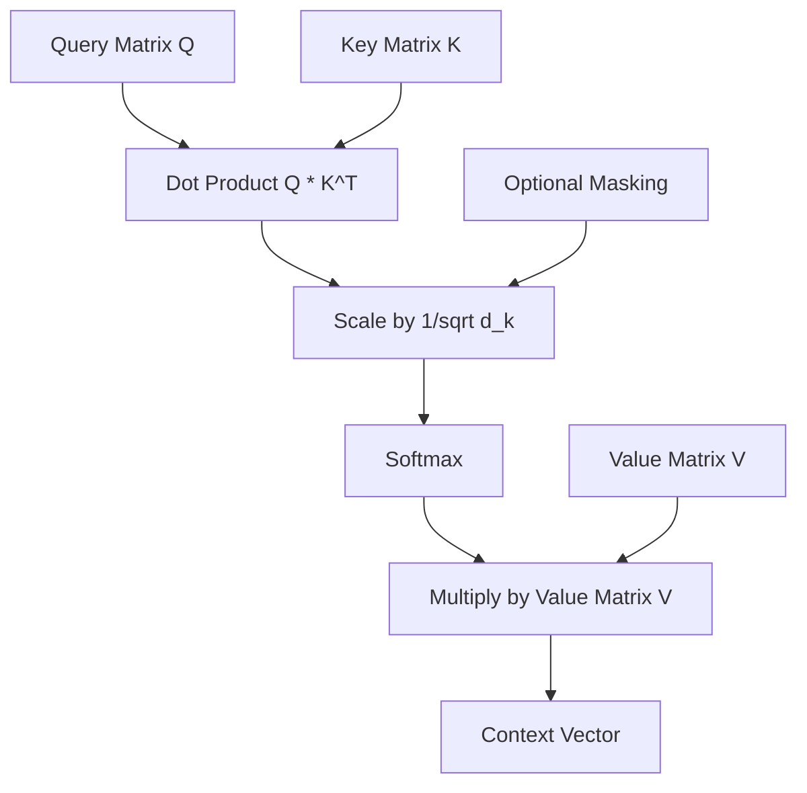

# Chapter 1: Deep Learning and Transformer Foundations

## 1. Neural Networks and Optimization

**Background Knowledge:**
Before understanding how an AI reads mathematical equations, we must understand how it learns. Neural networks are essentially massive mathematical functions parameterized by weights and biases. Training is the process of finding the optimal set of weights to minimize a "Loss Function" (the error rate).

**The Theory:**
In your project, you use the **AdamW** optimizer alongside a **OneCycleLR** learning rate scheduler. 

1.  **Gradients and Backpropagation**: When your model makes a prediction, the loss function calculates how wrong it is. Backpropagation uses the chain rule of calculus to compute the *gradient*—the direction and magnitude each weight should change to reduce the error.
2.  **AdamW (Adaptive Moment Estimation with Weight Decay)**: Traditional Stochastic Gradient Descent (SGD) applies the same learning rate to all weights. Adam computes individual learning rates for different parameters using the first and second moments of the gradients (mean and uncentered variance). The "W" stands for decoupled Weight Decay, which shrinks weights slightly on every step to prevent overfitting, acting as an L2 regularization technique.
3.  **Learning Rate Scheduling (OneCycleLR)**: A static learning rate is inefficient. The OneCycle policy starts with a low learning rate, warms up to a high peak, and then gradually anneals (decays) down to near-zero following a cosine curve.
    *   *Why?* The initial warmup prevents early catastrophic gradients (especially in Transformers). The high learning rate acts as regularization, bouncing the model out of local minima. The final decay allows the model to settle into the absolute bottom of the loss landscape.

**Tip for Students:**
You configured separate learning rates for the encoder (`5e-6`) and decoder (`3e-4`). Why? Because your Swin Encoder is *pre-trained* on ImageNet, while your Decoder is randomly initialized. A high learning rate would destroy the valuable pre-trained weights in the encoder. This is called **Differential Learning Rates**.

## 2. The Attention Mechanism

**Background Knowledge:**
Historically, sequence models (like RNNs and LSTMs) processed data step-by-step, forming a bottleneck. The **Attention Mechanism** allows a model to look at an entire sequence simultaneously and mathematically determine which parts are most relevant to the current task.

**The Math and Logic:**
Attention is essentially a differentiable database retrieval system using three vectors: **Queries (Q)**, **Keys (K)**, and **Values (V)**.
*   **Query**: What the current token is looking for.
*   **Key**: What other tokens possess.
*   **Value**: The actual information the token contains.

**Scaled Dot-Product Attention:**
$$ \text{Attention}(Q, K, V) = \text{softmax}\left(\frac{QK^T}{\sqrt{d_k}}\right)V $$

1.  **$QK^T$ (Dot Product)**: We multiply the Query of the current token with the Keys of all other tokens. A high dot product means the vectors are aligned (highly relevant).
2.  **$\frac{1}{\sqrt{d_k}}$ (Scaling)**: As vector dimensions grow, dot products explode in magnitude, pushing the softmax function into regions with near-zero gradients (vanishing gradients). We scale down by the square root of the dimension to stabilize training.
3.  **Softmax**: Converts the raw scores into a probability distribution summing to 1.0.
4.  **$\times V$**: We multiply these probabilities by the Values to get a weighted sum of information.

## 3. The Transformer Architecture

**The Theory:**
The Transformer (introduced in "Attention Is All You Need") relies entirely on the Attention mechanism, dropping recurrence completely.

In your project, you use a **Multi-Head Attention** approach. Instead of calculating one attention matrix, the model projects Q, K, and V into $H$ different smaller sub-spaces (in your case, 12 heads). 
*   *Why?* One head might learn to attend to structural syntax (like `\frac`), another might attend to numerical relationships, and another to spatial proximity in the image.

**Pre-Norm vs Post-Norm:**
In your `DecoderBlock`, you apply Layer Normalization *before* the attention and feed-forward layers (`x = x + Attention(LayerNorm(x))`).
*   *Why?* Original transformers used Post-Norm, which is notoriously difficult to train and requires long warmup periods. Pre-Norm creates a clean, direct residual path from the very first layer to the last, making gradient flow significantly more stable.