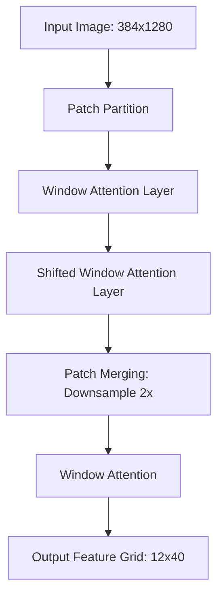

# Chapter 2: Computer Vision and The Encoder

## 1. Vision Transformers vs CNNs

**Background Knowledge:**
Convolutional Neural Networks (CNNs) were the standard for vision. They use sliding windows (kernels) to extract local features. However, they lack global context—a pixel in the top-left cannot easily "communicate" with a pixel in the bottom-right without many layers of downsampling.

**The Theory:**
The Vision Transformer (ViT) treats an image like a sentence. It chops the image into 16x16 patches, flattens them, and feeds them into a standard Transformer. Now, patch 1 can attend to patch 500 instantly. For Mathematical OCR, global context is vital. A closing bracket `\right]` on the far right is mathematically dependent on the `\left[` on the far left.

## 2. The Swin Transformer Architecture

**The Problem with Standard ViTs:**
Standard attention is $O(N^2)$ in sequence length. If you have a high-resolution image (like your 384x1280 canvas), the number of patches is enormous. Computing attention between *all* patches becomes computationally impossible.

**The Swin Logic (Shifted Window):**
The Swin Transformer solves this by combining the local inductive bias of CNNs with the global power of Transformers.
1.  **Windowed Attention**: Instead of attending to the whole image, attention is only computed within localized 7x7 or 8x8 "windows". This drops complexity from $O(N^2)$ to linear $O(N)$.
2.  **Shifted Windows**: If windows never overlap, patches on the border of a window can't communicate with their neighbors. Swin shifts the windows by half a window size in the next layer, allowing information to bleed across boundaries.
3.  **Patch Merging**: Like a CNN, Swin hierarchically downsamples the image. Every few layers, it merges 2x2 neighboring patches into one, reducing the sequence length while increasing the channel dimension. In your model, Swin reduces the spatial resolution by a factor of 32x.

## 3. Spatial Awareness and 2D Positional Encoding

**The Trap of 1D Sequences:**
Transformers are fundamentally set-invariant; they have no concept of order unless you explicitly tell them. In text, we add 1D positional sine waves. 
In your previous codebase, the grid was flattened into a 1D "snake", and row markers were added. *This destroyed the model's spatial awareness.* A numerator sitting directly above a denominator became thousands of steps apart in a 1D sequence.

**The Fix (2D Positional Parameters):**
To fix this, you baked **2D GPS Coordinates** into the features *before* flattening them.
1.  You created two learnable parameter matrices: `row_embed` and `col_embed`.
2.  You expand `row_embed` horizontally and `col_embed` vertically to form a grid.
3.  You add these coordinates to the `(H, W)` Swin output. 
Now, when the grid is flattened into a 1D sequence, the token at index 50 mathematically "knows" it resides at Row 2, Column 10. The vertical relationship between a numerator and denominator is preserved.

## 4. Image Preprocessing and Top Left Anchoring

**The Concept:**
Images must be resized to a fixed tensor shape (e.g., 384x1280) to form a batch. 
If an equation is small (e.g., $x=1$), traditional padding places it directly in the center of the canvas. 

**The Mathematical Flaw:**
If $x=1$ is center-padded, the physical ink starts at pixel (192, 640). If the next image is slightly taller, its ink might start at (150, 600). 
Because you are using absolute 2D positional encodings, the model learns that the coordinate (192, 640) means "start of equation" in one batch, but "middle of equation" in another. This scrambles the positional learning.

**The Solution:**
You implemented **Top-Left Anchoring** (`centering=(0,0)` in PIL). The math strokes *always* start exactly at pixel (0,0). The absolute positional encodings now have a stable, fixed reference point.