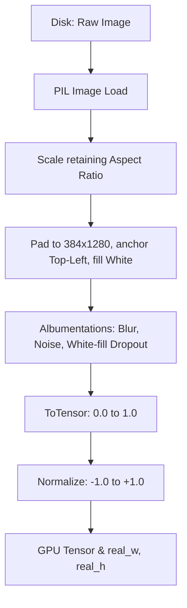

# Chapter 2: Computer Vision and The Encoder

## 5. Why SwinV2 over Regular ViTs and CNNs

**The CNN Bottleneck:**
Traditional Convolutional Neural Networks (CNNs) like ResNet were the standard for OCR. However, CNNs have a limited "receptive field." A convolution kernel only looks at a 3x3 pixel area. To connect a left parenthesis `\left(` on the far left of an image with a right parenthesis `\right)` on the far right, the image must pass through dozens of pooling layers. By the time the CNN sees the whole picture, the spatial resolution is so degraded that fine mathematical symbols (like a tiny superscript) are completely lost.

**The Regular ViT Bottleneck:**
A regular Vision Transformer (ViT) solves the global context problem by comparing every image patch to every other patch simultaneously. But Math OCR requires massive resolutions (e.g., 384x1280) to preserve the readability of small fractions and subscripts. 
If we feed a 384x1280 image into a standard ViT with 16x16 patches, we get 1,920 patches. Standard attention complexity is $O(N^2)$. The attention matrix alone would require $1,920 \times 1,920 \approx 3.6$ million operations *per head, per layer*. This would instantly cause an Out-Of-Memory (OOM) crash on almost any GPU.

**The SwinV2 Solution:**
Swin computes attention locally within windows (dropping complexity to $O(N)$) and shifts the windows to pass information globally. But why **SwinV2** specifically, rather than V1?
1.  **Scaled Cosine Attention:** SwinV1 used standard dot-product attention. At high resolutions, dot-products can explode, leading to NaN (Not a Number) gradients. SwinV2 replaces the dot product with a scaled cosine similarity function, mathematically capping the attention values between -1 and 1.
2.  **Log-Spaced Continuous Position Bias (CPB):** SwinV1 used a parameterized relative position bias table. If you trained on 256x256 images and fine-tuned on 384x1280, the position table broke. SwinV2 uses a small meta-network to generate positional biases on the fly using log-spaced coordinates, allowing seamless extrapolation to massive image sizes without scrambling spatial relationships.

## 6. Departure from the Paper: Dropping the Training-Aware Module

**The Original Paper's Approach:**
In the original TAMER paper, the authors proposed a complex "Training-Aware Module" (TAM). This involved creating separate transition layers and specialized routing mechanisms to bridge the pre-trained encoder to the decoder.

**Why We Discarded It:**
In this codebase, we intentionally dropped the TAM and connected the SwinV2 backbone directly to the Transformer decoder. Why?
1.  **Opaque Spatial Scrambling:** Transition layers that reshape and project features often introduce "black box" spatial scrambling. If the transition layer's mathematical stride does not perfectly align with the image's aspect ratio, the spatial grid collapses. 
2.  **Explicit Mathematical Reconstruction:** Instead of relying on a learned transition module, we implemented *exact mathematical grid reconstruction* in `encoder.py`. We calculate the exact backbone stride (`stride_sq = (H_in * W_in) / L`) and reshape the sequence back into a pristine `(B, H, W, C)` grid. 
3.  **Direct GPS Injection:** Because we mathematically proved the grid's integrity, we can inject our explicit 2D Positional Embeddings directly into the raw Swin features. This completely eliminates the need for an intermediate transition module, resulting in a leaner, faster, and more stable model.

## 7. The Complete Image Manipulation Pipeline

Understanding the exact journey of an image from disk to tensor is critical. Math is highly sensitive to aspect ratios; stretching an image turns a circle ($O$) into a zero ($0$). 

**Step-by-Step Image Pipeline:**
1.  **Read and Check:** The PIL library reads the image. If the aspect ratio exceeds our configured `max_aspect_ratio` (10.0), it is discarded. A 1:15 aspect ratio is usually a dataset error (e.g., a cropped line of text instead of an equation).
2.  **Scale (No Stretching):** We calculate a single scaling factor to fit the image within the 384x1280 canvas. We record the resulting `real_w` and `real_h`. This prevents distortion.
3.  **Pad with Top-Left Anchoring:** We use `ImageOps.pad` with `centering=(0,0)`. The image is pushed to the absolute top-left corner, and the rest of the canvas is filled with pure white `(255, 255, 255)`.
4.  **Augmentation (Albumentations):**
    *   *CoarseDropout:* We cut out small random rectangles to simulate missing ink or bad scans. *Crucially*, we set `fill_value=255` (white). Standard dropout fills with black (0), which would look like massive black blocks of ink to the model.
    *   *ShiftScaleRotate:* We apply very gentle affine transforms (max 3 degrees rotation). Heavy rotation destroys math structure (an `+` becomes an `x`).
5.  **Normalization:** The tensor is normalized to a mean and standard deviation of `0.5`. This remaps the pixel values from `[0.0, 1.0]` to `[-1.0, 1.0]`, forcing high contrast between the white background (-1.0) and the black ink (+1.0).

