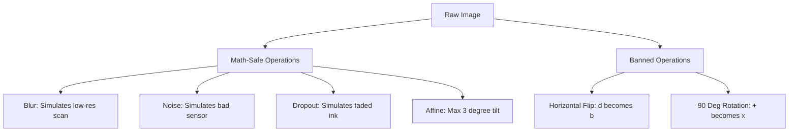

# Chapter 2: Computer Vision and The Encoder

## 8. Albumentations and Math Safe Augmentations

**The Danger of Standard Augmentation:**
In standard computer vision (like identifying dogs vs. cats), flipping an image horizontally or rotating it 90 degrees is perfectly safe—a dog upside down is still a dog. 
In Mathematical OCR, the spatial orientation defines the semantic meaning. 
*   If you flip a `p` horizontally, it becomes a `q`. 
*   If you rotate a `+` by 45 degrees, it becomes a `	imes`.
*   If you flip a `\leq` vertically, it becomes `\geq`.

**Math-Safe Pipeline:**
In `augmentation.py`, the training transformations are strictly bounded to prevent the destruction of mathematical logic:
1.  **ShiftScaleRotate (Subtle Geometry):** Rotation is strictly capped at ±3 degrees. Translation (shifting) is capped at ±2%, and scaling at ±5%. This simulates a slightly crooked scan or uneven handwriting without breaking the structural integrity of the equation.
2.  **Gaussian and Median Blur:** Randomly applied to simulate out-of-focus camera shots or low-DPI flatbed scans.
3.  **GaussNoise:** Simulates the digital sensor noise common in low-light smartphone photos of homework.
4.  **CoarseDropout (The Ink-Eraser):** As previously mentioned, we drop out small rectangular chunks. By setting `max_holes=4` and capping the height/width of the holes, we simulate faded ink, chalk gaps on a blackboard, or dry erase marker skipping.

