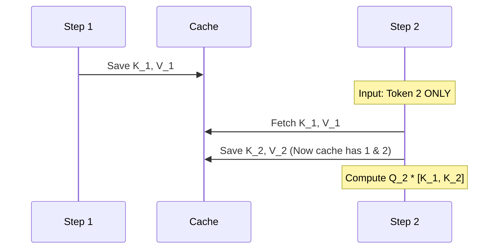

# Chapter 3: Sequence Modeling and The Decoder

## 1. Autoregressive Generation and Teacher Forcing

**The Theory:**
The Decoder is autoregressive, meaning it predicts the sequence one token at a time, conditioning its next prediction on its past predictions.
$P(y_t | y_{<t}, X)$

**Teacher Forcing (Training):**
During training, we don't wait for the model to predict token 1 to feed it into token 2. That would be too slow. Instead, we feed the entire Ground Truth sequence shifted by one position.
*   **Input to model**: `[SOS, x, =, 1]`
*   **Target to predict**: `[x, =, 1, EOS]`
To prevent the model from "looking ahead" at the answer, we apply a **Causal Mask**—an upper-triangular matrix of `-infinity` that blocks token $t$ from attending to token $t+1$.

## 2. The KV Cache Optimization

**The Inference Bottleneck:**
During inference, we cannot use Teacher Forcing because we don't know the answer. We must generate tokens one by one. 
Normally, at step $T$, the transformer recomputes attention for all $T$ tokens from scratch. This makes generation $O(N^3)$, which is painfully slow.

**The Logic of KV Caching:**
The past tokens do not change. Therefore, their Key (K) and Value (V) projections do not change.
In your `TransformerDecoder`, you implemented a KV Cache:
1.  **Self-Attention**: At step $T$, you only pass the *newest* token through the network. You compute its Query, Key, and Value. You append this new Key and Value to the cached Keys and Values of all previous tokens. Then, you calculate attention between the single new Query and the cached K/V history. (Reduces complexity to $O(N^2)$).
2.  **Cross-Attention**: The encoder memory (the image features) is completely static. Therefore, the Keys and Values for the image never change. You compute the Cross-Attention K and V *exactly once* at step 0, cache them, and reuse them for every decoding step.

## 3. Encoder Padding Masks

**The Danger of Padding:**
As discussed, images are padded with white pixels to reach 384x1280. The Swin encoder transforms this into a 12x40 feature grid (480 tokens). If an equation is small, 400 of those tokens might represent blank white space.

**Attention Collapse:**
In Cross-Attention, the softmax function distributes 100% of the attention probability across the 480 tokens. If there is no mask, the model wastes massive amounts of probability mass on empty white pixels, adding noise and diluting the focus on the actual math strokes.

**The Solution:**
Your `MathDataset` tracks the exact pre-padded width and height (`real_w`, `real_h`).
You dynamically construct a **Boolean Memory Mask**. Any token residing outside the bounding box of `real_w` and `real_h` is marked as `True` (ignore).
In the cross-attention layer, this boolean mask is converted into `-infinity` before the softmax. Softmax of `-infinity` is 0. The model now dedicates 100% of its attention strictly to the ink strokes.