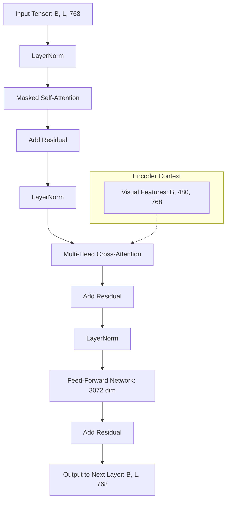

# Chapter 3: Sequence Modeling and The Decoder

## 7. Layer-by-Layer Anatomy of the Decoder Block

Each of the 10 layers in your decoder is a sophisticated "Feature Refiner." When a tensor enters a block, it undergoes a four-stage transformation.

**Layer 1: The Masked Self-Attention (The "Syntax" Layer)**
*   **Input:** $(B, L, 768)$
*   **Operation:** The decoder tokens look at each other.
*   **The Mask:** Because of the **Causal Mask**, token $t$ can only see tokens $0$ through $t-1$. 
*   **Purpose:** This layer is responsible for **LaTeX Grammatical Integrity**. It doesn't look at the image here; it only looks at the text it has written so far. It learns that if it has already written `\begin{`, the most likely next tokens are `matrix` or `cases`.

**Layer 2: The Multi-Head Cross-Attention (The "Vision" Layer)**
*   **Input:** Output of Self-Attention $(B, L, 768)$ + Encoder Memory $(B, 480, 768)$.
*   **Operation:** The current text tokens act as Queries to "interrogate" the 480 visual patches.
*   **Purpose:** This is the most important layer. It aligns the text to the pixels. If the model is at step 5 and needs to know what is after $x =$, it uses this layer to find the spatial location in the image where the next "ink" is located. 

**Layer 3: The Position-Wise Feed-Forward Network (The "Knowledge" Layer)**
*   **Input:** $(B, L, 768)$
*   **Operation:** Two linear layers: $768 \rightarrow 3072 \rightarrow 768$.
*   **Purpose:** Attention layers only move data around; they don't transform it much. The FFN is where the "reasoning" happens. It uses the 3072-dimensional space to process the visual and textual data together to form a solid internal representation of the next mathematical symbol.

**Layer 4: Residual Connections and LayerNorm (The "Stability" Layer)**
*   **Operation:** After every major operation, the result is added back to the original input (`x = x + sublayer(x)`).
*   **Purpose:** This ensures that if a layer doesn't find anything useful, it can simply pass the previous information forward without degrading the signal.

