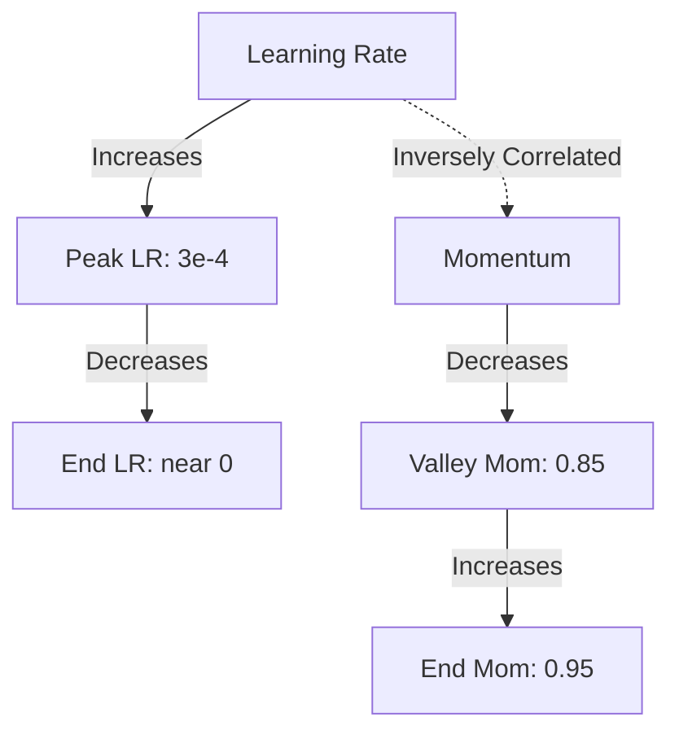

# Chapter 5: Advanced Training Strategies and Loss Functions

## 5. The Loss Landscape: Dynamics of Structure-Aware Loss

We established earlier that our `StructureAwareLoss` assigns a 3.0x multiplier to structural tokens (`\\`, `&`, `\begin`). But what does this actually do mathematically to the optimization landscape?

When computing Cross-Entropy, the loss is the negative log probability of the correct token: $- \log(P_{correct})$.
If the model is unsure about a row separator `\\` and assigns it a 30% probability, the normal loss is $-\log(0.3) \approx 1.20$. 
With the structural weight, the loss becomes $1.20 \times 3.0 = 3.60$.

During backpropagation, this explicitly scales the gradient vector by 3.0. In the high-dimensional loss landscape, the optimizer perceives errors on structural tokens as steep, dangerous cliffs. The AdamW optimizer reacts by taking massive steps to correct structural misunderstandings immediately, while treating a mistake on a basic number as a gentle slope. This forces the model to learn the 2D layout of equations *before* it learns the specific characters inside them.

## 6. Mixed Precision (AMP) and Hardware Optimization

Training a model this large requires hardware optimization, specifically **Automatic Mixed Precision (AMP)** using **BFloat16**.

**FP32 vs FP16 vs BF16:**
*   **FP32 (Standard):** Highly precise, but uses 4 bytes per number. Too slow, consumes too much VRAM.
*   **FP16:** Uses 2 bytes. However, it sacrifices "range" (the exponent). In deep transformers, attention scores can easily exceed the maximum limit of FP16 (65,504), causing silent `NaN` (Not a Number) explosions that destroy the model.
*   **BF16 (Brain Float 16):** Developed by Google, BF16 uses 2 bytes but keeps the exact same exponent range as FP32, sacrificing only the decimal precision (mantissa). For deep learning, decimal precision hardly matters, but preventing overflow is critical. 

**Implementation in the Engine:**
In `engine.py`, the forward pass is wrapped in `torch.autocast(dtype=torch.bfloat16)`. The GPU performs the massive matrix multiplications in high-speed BF16 using hardware Tensor Cores. 
However, before computing the Loss, we explicitly cast the logits back to FP32: `logits = logits.float()`. Loss calculation requires high precision to calculate microscopic gradients; doing it in BF16 causes *underflow* (gradients rounding to zero).

## 7. Deep Dive: OneCycleLR and Momentum Inversion

You implemented `OneCycleLR`. The standard logic is: start low, go high, end low. But the true magic of OneCycle is how it handles **Momentum**.

In AdamW, momentum ($\beta_1$) dictates how much of the *previous* gradient direction we keep. 
OneCycle performs **Momentum Inversion**:
*   **Phase 1 (Warmup):** As the Learning Rate goes *up*, the Momentum goes *down* (from 0.95 to 0.85). Because the LR is extremely high at the peak, we don't want high momentum throwing the optimizer out of bounds. We want it to be highly responsive to the immediate batch.
*   **Phase 2 (Annealing):** As the Learning Rate drops towards zero, Momentum goes back *up* to 0.95. At the end of training, the steps are so tiny that the optimizer needs the momentum of past batches to push it through shallow flat areas to reach the absolute local minimum.

## 8. Preventing Overfitting in Math OCR

Overfitting is when the model memorizes the training data (e.g., it memorizes that `2+2=4` rather than learning how to read numbers). We implemented a multi-layered defense:

1.  **Weight Decay (1e-4):** Mathematically penalizes large weights. Forces the network to use all its parameters slightly, rather than relying on a few massive connections.
2.  **Label Smoothing (0.1):** Prevents the model from being 100% confident. If it can never be 100% confident, it never stops learning and refining its features.
3.  **Dropout (0.15):** Randomly zeroes out 15% of the neurons in the decoder during every forward pass. The network cannot rely on any single neuron pathway to pass information.
4.  **CoarseDropout (Images):** The white-box cutouts in Albumentations force the Swin encoder to guess the structure of an equation even if part of a line is missing, forcing it to learn context rather than raw pixel memorization.

## 9. Deep Dive: The Multi-Dataset Batch Sampler

When combining datasets (Im2LaTeX, CROHME, etc.), a naive approach mixes samples from different datasets into the same batch. **This is detrimental.**

**The Problem with Mixed Batches:**
Im2LaTeX is printed, clean, and uses specific LaTeX macros. HME100K is messy, handwritten ink. If you put both in the same batch, the gradients point in completely opposite directions, and the BatchNorm/LayerNorm statistics become a meaningless average of two completely different visual distributions.

**The MultiDatasetBatchSampler Logic:**
Your custom sampler guarantees that **every batch contains images from only ONE dataset**.
1.  It calculates the temperature-scaled probabilities.
2.  It selects a dataset (e.g., `crohme`).
3.  It yields 36 indices strictly from the `crohme` pool.
This ensures that the gradient step for that iteration is highly coherent. The model takes one step to learn handwriting, then the next step to learn printed text, oscillating smoothly without internal conflict.