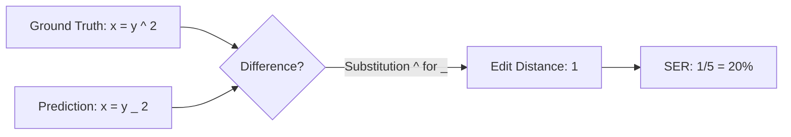

# Chapter 6: Inference and Evaluation

## 1. Greedy Decoding vs Beam Search

**Greedy Decoding:**
At each step, the model simply selects the token with the highest probability (argmax). It is lightning fast, but it is short-sighted. If it makes a slight mistake at step 3, it cannot backtrack, causing a cascading failure.

**Beam Search:**
Instead of keeping 1 path, Beam Search keeps the top $B$ paths (Beam Width, e.g., 5) alive at all times.
1.  At step 1, generate top 5 tokens.
2.  At step 2, for *each* of those 5 tokens, predict the next top 5 (25 total paths).
3.  Calculate the cumulative log-probability of all 25 paths. Keep only the best 5. Repeat.

**Length Penalty:**
Because probabilities are $\le 1.0$, log-probabilities are negative. A sequence of 10 tokens will mathematically always have a lower sum than a sequence of 2 tokens. Beam Search naturally biases towards very short outputs.
You counter this using a **Length Penalty** factor $\alpha$ (e.g., 0.6). The score is divided by $L^\alpha$. This boosts the score of longer, more complete sequences, preventing the model from outputting early `<eos>` tokens.

## 2. OCR Evaluation Metrics

How do we mathematically define if the AI succeeded?

1.  **ExpRate (Expression Recognition Rate)**: Also known as Exact Match. The percentage of predictions that perfectly match the ground truth (ignoring spaces). This is extremely harsh; one wrong comma is a 0.
2.  **Edit Distance (Levenshtein Distance)**: The minimum number of insertions, deletions, or substitutions required to change the prediction into the ground truth. Computed at the *token level*, not the character level.
3.  **SER (Symbol Error Rate)**: Edit Distance divided by the length of the ground truth. E.g., An edit distance of 2 on a 10-token string is an SER of 20%.
4.  **$\le 1$ Error (Leq1)**: The percentage of predictions that had an edit distance of 1 or less. Highly useful because an edit distance of 1 usually implies a trivial typo rather than a complete model failure.

