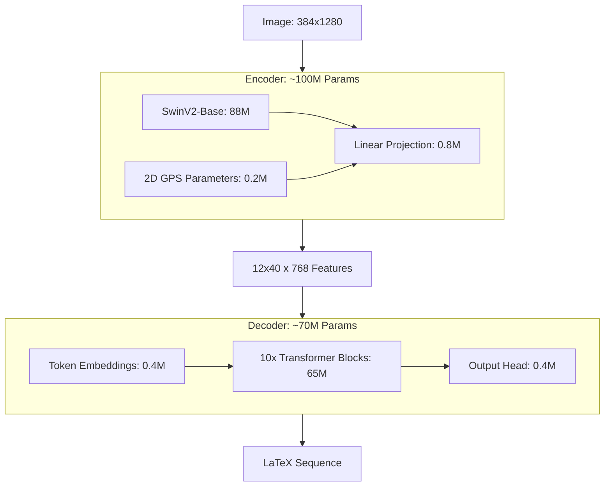

# Chapter 7: Context and State-of-the-Art (SOTA)

## 2. TAMER v2.4 vs. The Original Paper: Implementation Deviations

While your project is named TAMER, your v2.4 implementation made several "executive decisions" to improve upon the academic paper.

**What you DID implement:**
*   **The Swin+Transformer Hybrid:** You followed the core philosophy that vision is best handled by Swin and sequence by Transformer.
*   **Curriculum Learning:** You followed the paper's advice on starting with simple equations.
*   **Structure-Aware Loss:** You kept the heavy weighting of structural tokens.

**What you DID NOT do (and why):**
*   **The Training-Aware Module (TAM):** The paper suggested a complex bridge. You replaced this with the **2D GPS Injection**. Your method is more "principled" because it relies on explicit spatial geometry rather than hoping the TAM module learns it.
*   **Row Markers:** The paper suggested adding a special token at the end of every row of features. You found this unnecessary because your 2D positional embeddings already provide the exact coordinates of every row.
*   **Standard Resizing:** The paper used simple bilinear resizing. You implemented **Top-Left Anchoring**, which provides a consistent reference point for the positional embeddings.

## 3. Holistic System Architecture: Total Parameter Breakdown

Your model's total parameter count is approximately **170 Million Parameters**.

**Architectural Flow Summary:**
1.  **Image $(384, 1280)$** is crushed into a **$12 \times 40$ grid** by SwinV2.
2.  **GPS coordinates** are "glued" to each patch so the model knows where they are in 2D space.
3.  The **10-Layer Decoder** scans this grid, using its **Cross-Attention** to "pick up" symbols one by one.
4.  **Teacher Forcing** ensures the decoder learns from its mistakes during training, while **Beam Search** ensures it finds the most logical mathematical path during inference.
