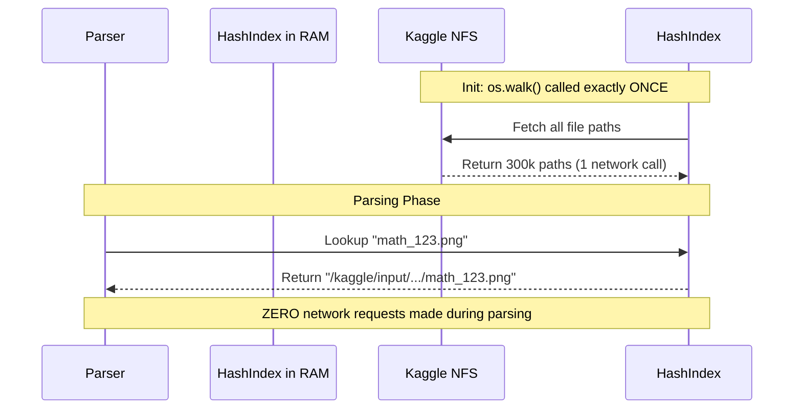

# Chapter 8: Data Engineering and Distributed Systems

## 1. Robust Dataset Acquisition and Streaming

Training requires hundreds of gigabytes of data. Pulling this into a cloud kernel is highly prone to failure. `advanced_downloader.py` handles this with resilience:

*   **HTTP Range Headers (Resuming):** When downloading massive ZIP files from Zenodo, network sockets often drop. The downloader checks if a partial file exists on disk, reads its size in bytes, and sends an HTTP header `Range: bytes=X-` to the server. The server resumes the download from the exact byte where it failed.
*   **Chunked Streaming:** The `requests` session uses `iter_content(chunk_size=1MB)`. Instead of loading a 10GB dataset into system RAM (which would immediately crash the kernel), it streams the bytes directly from the network socket to the physical disk in 1MB chunks.
*   **Exponential Backoff:** If the Kaggle API or HuggingFace hub throws a 502 Bad Gateway or 429 Too Many Requests, the downloader does not crash. It waits 2 seconds, then 4, then 8, attempting up to 5 retries.

## 2. Bypassing the Kaggle NFS Bottleneck with O(1) Indexing

**The Silent Killer: NFS Ping Storms**
In Kaggle and Colab, the `/kaggle/input/` directory is not a physical hard drive; it is a Network File System (NFS) mounted over the cloud. 
In a naive implementation, checking `os.path.exists('image_001.png')` requires sending a network request to the NFS server and waiting for a response. If a dataset has 300,000 images, calling `os.path.exists()` during the JSONL parsing phase creates 300,000 network requests. This "ping storm" causes the OS to freeze, and the kernel will timeout before training even begins.

**The O(1) Hash Map Solution:**
In `offline_utils.py`, you implemented an ingenious bypass:
1.  **Single Traversal:** `os.walk()` traverses the directory tree exactly *once*. It collects every single file.
2.  **The Index:** It builds a global Python dictionary (`_FILENAME_INDEX`) mapping `basename -> [List of Absolute Paths]`.
3.  **O(1) Resolution:** When parsing the JSONL file, the program extracts the base image name and performs a dictionary lookup: `candidates = _FILENAME_INDEX[basename]`. This happens entirely in CPU RAM (0 milliseconds) with zero NFS traffic.
4.  **Collision Handling:** If two datasets both have a file named `1.png`, the dictionary returns two paths. The resolver checks the parent directory strings to disambiguate which path belongs to `crohme` vs `im2latex`.

## 3. Eliminating Dataloader Bottlenecks

A 96GB GPU can process math equations faster than the CPU can read the images from disk. If the GPU reaches 0% utilization while waiting for the next batch, your training time doubles. Your `DataLoader` configuration uses three advanced OS-level optimizations:

1.  **`pin_memory=True`:** Normally, data loaded by the CPU is placed in "pageable" memory (which the OS can swap to the hard drive). Transferring pageable memory to the GPU is slow. Pinning the memory locks the tensors into physical RAM, allowing the GPU to use direct memory access (DMA) via the PCIe bus to pull the tensors instantly without CPU intervention.
2.  **`persistent_workers=True`:** Spawning a new Python multi-processing worker takes time. If workers are destroyed at the end of every epoch and recreated, you lose minutes of training time. Persistent workers stay alive across epoch boundaries.
3.  **`prefetch_factor=2`:** While the GPU is training on Batch 1, the CPU workers are already loading, preprocessing, and holding Batch 2 and Batch 3 in RAM, ensuring the GPU's queue is never empty.