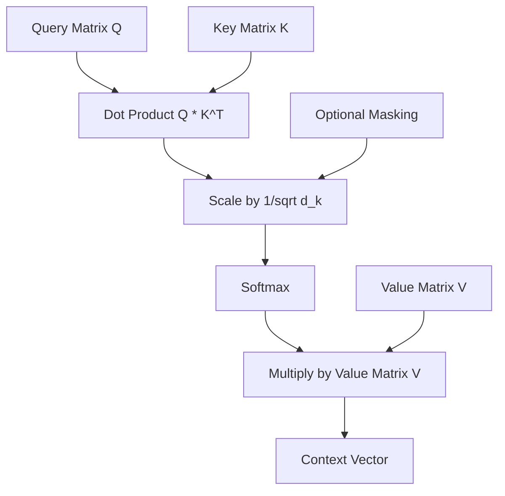
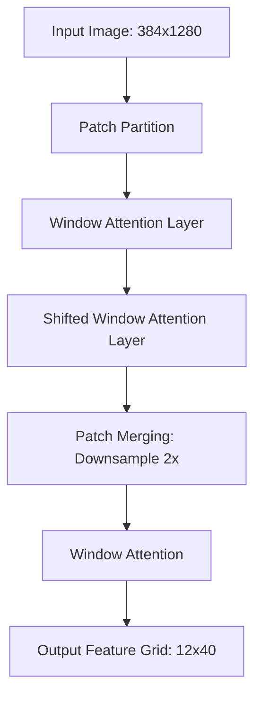
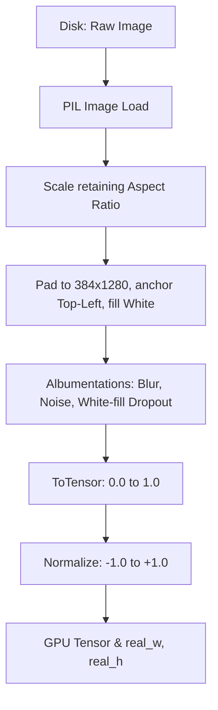
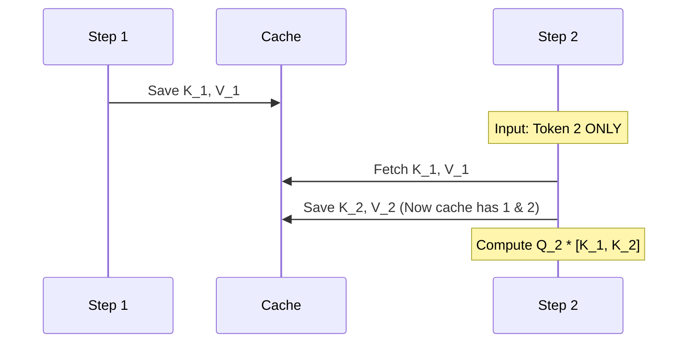
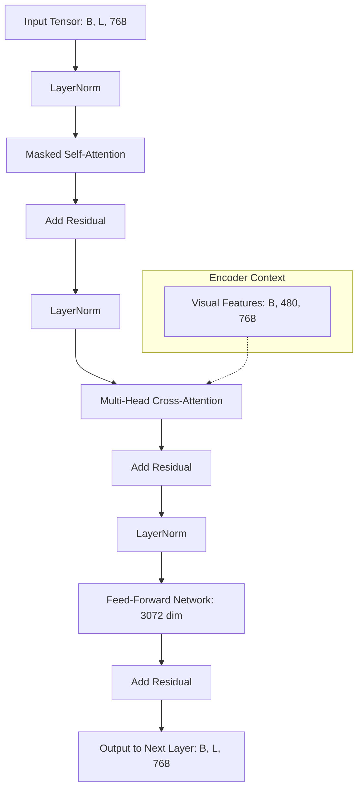
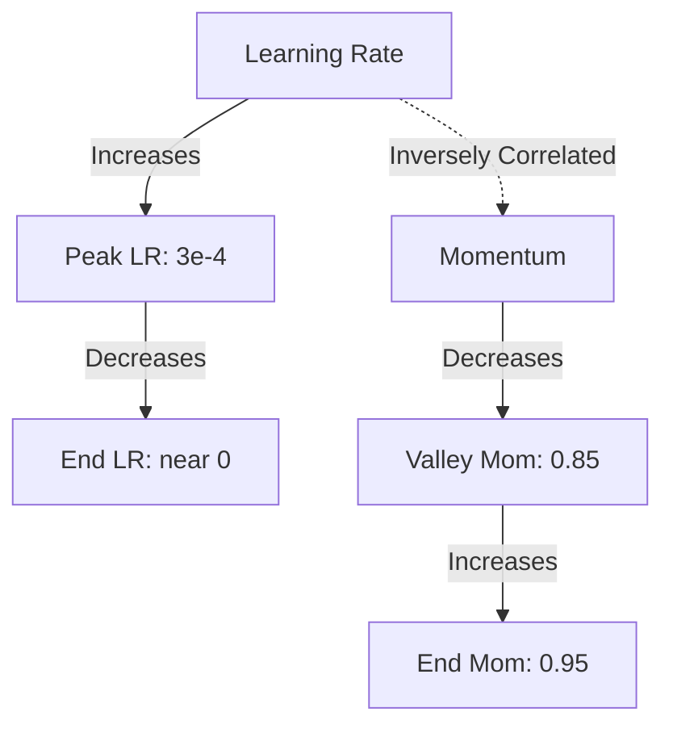
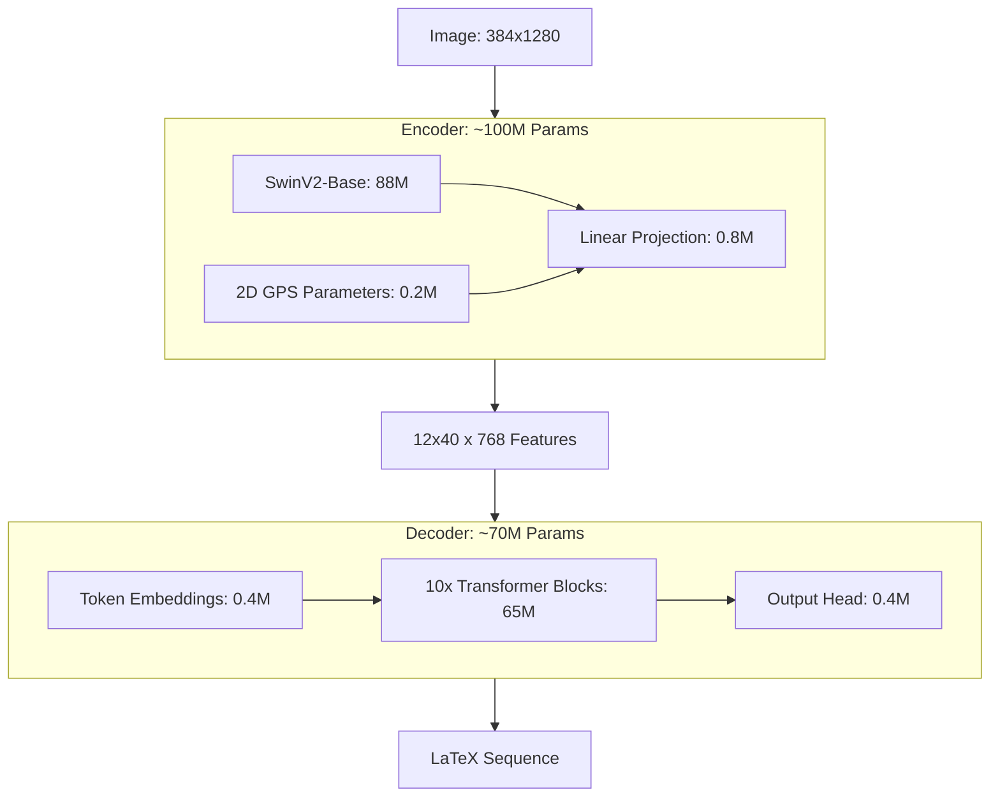

# Chapter 1: Deep Learning and Transformer Foundations

## 1. Neural Networks and Optimization

**Background Knowledge:**
Before understanding how an AI reads mathematical equations, we must understand how it learns. Neural networks are essentially massive mathematical functions parameterized by weights and biases. Training is the process of finding the optimal set of weights to minimize a "Loss Function" (the error rate).

**The Theory:**
In this project, we use the **AdamW** optimizer alongside a **OneCycleLR** learning rate scheduler. 

1.  **Gradients and Backpropagation**: When the model makes a prediction, the loss function calculates how wrong it is. Backpropagation uses the chain rule of calculus to compute the *gradient*—the direction and magnitude each weight should change to reduce the error.
2.  **AdamW (Adaptive Moment Estimation with Weight Decay)**: Traditional Stochastic Gradient Descent (SGD) applies the same learning rate to all weights. Adam computes individual learning rates for different parameters using the first and second moments of the gradients (mean and uncentered variance). The "W" stands for decoupled Weight Decay, which shrinks weights slightly on every step to prevent overfitting, acting as an L2 regularization technique.
3.  **Learning Rate Scheduling (OneCycleLR)**: A static learning rate is inefficient. The OneCycle policy starts with a low learning rate, warms up to a high peak, and then gradually anneals (decays) down to near-zero following a cosine curve.
    *   *Why?* The initial warmup prevents early catastrophic gradients (especially in Transformers). The high learning rate acts as regularization, bouncing the model out of local minima. The final decay allows the model to settle into the absolute bottom of the loss landscape.

**Tip for Students:**
We configured separate learning rates for the encoder (`5e-6`) and decoder (`3e-4`). Why? Because the Swin Encoder is *pre-trained* on ImageNet, while the Decoder is randomly initialized. A high learning rate would destroy the valuable pre-trained weights in the encoder. This is called **Differential Learning Rates**.

## 2. The Attention Mechanism

**Background Knowledge:**
Historically, sequence models (like RNNs and LSTMs) processed data step-by-step, forming a bottleneck. The **Attention Mechanism** allows a model to look at an entire sequence simultaneously and mathematically determine which parts are most relevant to the current task.

**The Math and Logic:**
Attention is essentially a differentiable database retrieval system using three vectors: **Queries (Q)**, **Keys (K)**, and **Values (V)**.
*   **Query**: What the current token is looking for.
*   **Key**: What other tokens possess.
*   **Value**: The actual information the token contains.

**Scaled Dot-Product Attention:**
$$ \text{Attention}(Q, K, V) = \text{softmax}\left(\frac{QK^T}{\sqrt{d_k}}\right)V $$

1.  **$QK^T$ (Dot Product)**: We multiply the Query of the current token with the Keys of all other tokens. A high dot product means the vectors are aligned (highly relevant).
2.  **$\frac{1}{\sqrt{d_k}}$ (Scaling)**: As vector dimensions grow, dot products explode in magnitude, pushing the softmax function into regions with near-zero gradients (vanishing gradients). We scale down by the square root of the dimension to stabilize training.
3.  **Softmax**: Converts the raw scores into a probability distribution summing to 1.0.
4.  **$\times V$**: We multiply these probabilities by the Values to get a weighted sum of information.

## 3. The Transformer Architecture

**The Theory:**
The Transformer (introduced in "Attention Is All You Need") relies entirely on the Attention mechanism, dropping recurrence completely.

In this project, we use a **Multi-Head Attention** approach. Instead of calculating one attention matrix, the model projects Q, K, and V into $H$ different smaller sub-spaces (in our case, 12 heads). 
*   *Why?* One head might learn to attend to structural syntax (like `\frac`), another might attend to numerical relationships, and another to spatial proximity in the image.

**Pre-Norm vs Post-Norm:**
In the `DecoderBlock`, we apply Layer Normalization *before* the attention and feed-forward layers (`x = x + Attention(LayerNorm(x))`).
*   *Why?* Original transformers used Post-Norm, which is notoriously difficult to train and requires long warmup periods. Pre-Norm creates a clean, direct residual path from the very first layer to the last, making gradient flow significantly more stable.

# Chapter 2: Computer Vision and The Encoder

## 1. Vision Transformers vs CNNs

**Background Knowledge:**
Convolutional Neural Networks (CNNs) were the standard for vision. They use sliding windows (kernels) to extract local features. However, they lack global context—a pixel in the top-left cannot easily "communicate" with a pixel in the bottom-right without many layers of downsampling.

**The Theory:**
The Vision Transformer (ViT) treats an image like a sentence. It chops the image into 16x16 patches, flattens them, and feeds them into a standard Transformer. Now, patch 1 can attend to patch 500 instantly. For Mathematical OCR, global context is vital. A closing bracket `\right]` on the far right is mathematically dependent on the `\left[` on the far left.

## 2. The Swin Transformer Architecture

**The Problem with Standard ViTs:**
Standard attention is $O(N^2)$ in sequence length. With a high-resolution image (like our 384x1280 canvas), the number of patches is enormous. Computing attention between *all* patches becomes computationally impossible.

**The Swin Logic (Shifted Window):**
The Swin Transformer solves this by combining the local inductive bias of CNNs with the global power of Transformers.
1.  **Windowed Attention**: Instead of attending to the whole image, attention is only computed within localized 7x7 or 8x8 "windows". This drops complexity from $O(N^2)$ to linear $O(N)$.
2.  **Shifted Windows**: If windows never overlap, patches on the border of a window can't communicate with their neighbors. Swin shifts the windows by half a window size in the next layer, allowing information to bleed across boundaries.
3.  **Patch Merging**: Like a CNN, Swin hierarchically downsamples the image. Every few layers, it merges 2x2 neighboring patches into one, reducing the sequence length while increasing the channel dimension. In our model, Swin reduces the spatial resolution by a factor of 32x.

## 3. Spatial Awareness and 2D Positional Encoding

**The Trap of 1D Sequences:**
Transformers are fundamentally set-invariant; they have no concept of order unless we explicitly tell them. In text, we add 1D positional sine waves. 
In the previous codebase, the grid was flattened into a 1D "snake", and row markers were added. *This destroyed the model's spatial awareness.* A numerator sitting directly above a denominator became thousands of steps apart in a 1D sequence.

**The Fix (2D Positional Parameters):**
To fix this, we baked **2D GPS Coordinates** into the features *before* flattening them.
1.  We created two learnable parameter matrices: `row_embed` and `col_embed`.
2.  We expand `row_embed` horizontally and `col_embed` vertically to form a grid.
3.  We add these coordinates to the `(H, W)` Swin output. 
Now, when the grid is flattened into a 1D sequence, the token at index 50 mathematically "knows" it resides at Row 2, Column 10. The vertical relationship between a numerator and denominator is preserved.

## 4. Image Preprocessing and Top Left Anchoring

**The Concept:**
Images must be resized to a fixed tensor shape (e.g., 384x1280) to form a batch. 
If an equation is small (e.g., $x=1$), traditional padding places it directly in the center of the canvas. 

**The Mathematical Flaw:**
If $x=1$ is center-padded, the physical ink starts at pixel (192, 640). If the next image is slightly taller, its ink might start at (150, 600). 
Because we are using absolute 2D positional encodings, the model learns that the coordinate (192, 640) means "start of equation" in one batch, but "middle of equation" in another. This scrambles the positional learning.

**The Solution:**
We implemented **Top-Left Anchoring** (`centering=(0,0)` in PIL). The math strokes *always* start exactly at pixel (0,0). The absolute positional encodings now have a stable, fixed reference point.

# Chapter 2: Computer Vision and The Encoder

## 5. Why SwinV2 over Regular ViTs and CNNs

**The CNN Bottleneck:**
Traditional Convolutional Neural Networks (CNNs) like ResNet were the standard for OCR. However, CNNs have a limited "receptive field." A convolution kernel only looks at a 3x3 pixel area. To connect a left parenthesis `\left(` on the far left of an image with a right parenthesis `\right)` on the far right, the image must pass through dozens of pooling layers. By the time the CNN sees the whole picture, the spatial resolution is so degraded that fine mathematical symbols (like a tiny superscript) are completely lost.

**The Regular ViT Bottleneck:**
A regular Vision Transformer (ViT) solves the global context problem by comparing every image patch to every other patch simultaneously. But Math OCR requires massive resolutions (e.g., 384x1280) to preserve the readability of small fractions and subscripts. 
If we feed a 384x1280 image into a standard ViT with 16x16 patches, we get 1,920 patches. Standard attention complexity is $O(N^2)$. The attention matrix alone would require $1,920 \times 1,920 \approx 3.6$ million operations *per head, per layer*. This would instantly cause an Out-Of-Memory (OOM) crash on almost any GPU.

**The SwinV2 Solution:**
Swin computes attention locally within windows (dropping complexity to $O(N)$) and shifts the windows to pass information globally. But why **SwinV2** specifically, rather than V1?
1.  **Scaled Cosine Attention:** SwinV1 used standard dot-product attention. At high resolutions, dot-products can explode, leading to NaN (Not a Number) gradients. SwinV2 replaces the dot product with a scaled cosine similarity function, mathematically capping the attention values between -1 and 1.
2.  **Log-Spaced Continuous Position Bias (CPB):** SwinV1 used a parameterized relative position bias table. If we trained on 256x256 images and fine-tuned on 384x1280, the position table broke. SwinV2 uses a small meta-network to generate positional biases on the fly using log-spaced coordinates, allowing seamless extrapolation to massive image sizes without scrambling spatial relationships.

## 6. Departure from the Paper: Dropping the Training-Aware Module

**The Original Paper's Approach:**
In the original TAMER paper, the authors proposed a complex "Training-Aware Module" (TAM). This involved creating separate transition layers and specialized routing mechanisms to bridge the pre-trained encoder to the decoder.

**Why We Discarded It:**
In this codebase, we intentionally dropped the TAM and connected the SwinV2 backbone directly to the Transformer decoder. Why?
1.  **Opaque Spatial Scrambling:** Transition layers that reshape and project features often introduce "black box" spatial scrambling. If the transition layer's mathematical stride does not perfectly align with the image's aspect ratio, the spatial grid collapses. 
2.  **Explicit Mathematical Reconstruction:** Instead of relying on a learned transition module, we implemented *exact mathematical grid reconstruction* in `encoder.py`. We calculate the exact backbone stride (`stride_sq = (H_in * W_in) / L`) and reshape the sequence back into a pristine `(B, H, W, C)` grid. 
3.  **Direct GPS Injection:** Because we mathematically proved the grid's integrity, we can inject our explicit 2D Positional Embeddings directly into the raw Swin features. This completely eliminates the need for an intermediate transition module, resulting in a leaner, faster, and more stable model.

## 7. The Complete Image Manipulation Pipeline

Understanding the exact journey of an image from disk to tensor is critical. Math is highly sensitive to aspect ratios; stretching an image turns a circle ($O$) into a zero ($0$). 

**Step-by-Step Image Pipeline:**
1.  **Read and Check:** The PIL library reads the image. If the aspect ratio exceeds our configured `max_aspect_ratio` (10.0), it is discarded. A 1:15 aspect ratio is usually a dataset error (e.g., a cropped line of text instead of an equation).
2.  **Scale (No Stretching):** We calculate a single scaling factor to fit the image within the 384x1280 canvas. We record the resulting `real_w` and `real_h`. This prevents distortion.
3.  **Pad with Top-Left Anchoring:** We use `ImageOps.pad` with `centering=(0,0)`. The image is pushed to the absolute top-left corner, and the rest of the canvas is filled with pure white `(255, 255, 255)`.
4.  **Augmentation (Albumentations):**
    *   *CoarseDropout:* We cut out small random rectangles to simulate missing ink or bad scans. *Crucially*, we set `fill_value=255` (white). Standard dropout fills with black (0), which would look like massive black blocks of ink to the model.
    *   *ShiftScaleRotate:* We apply very gentle affine transforms (max 3 degrees rotation). Heavy rotation destroys math structure (an `+` becomes an `x`).
5.  **Normalization:** The tensor is normalized to a mean and standard deviation of `0.5`. This remaps the pixel values from `[0.0, 1.0]` to `[-1.0, 1.0]`, forcing high contrast between the white background (-1.0) and the black ink (+1.0).

# Chapter 2: Computer Vision and The Encoder

## 8. Albumentations and Math Safe Augmentations

**The Danger of Standard Augmentation:**
In standard computer vision (like identifying dogs vs. cats), flipping an image horizontally or rotating it 90 degrees is perfectly safe—a dog upside down is still a dog. 
In Mathematical OCR, the spatial orientation defines the semantic meaning. 
*   If we flip a `p` horizontally, it becomes a `q`. 
*   If we rotate a `+` by 45 degrees, it becomes a `	imes`.
*   If we flip a `\leq` vertically, it becomes `\geq`.

**Math-Safe Pipeline:**
In `augmentation.py`, the training transformations are strictly bounded to prevent the destruction of mathematical logic:
1.  **ShiftScaleRotate (Subtle Geometry):** Rotation is strictly capped at ±3 degrees. Translation (shifting) is capped at ±2%, and scaling at ±5%. This simulates a slightly crooked scan or uneven handwriting without breaking the structural integrity of the equation.
2.  **Gaussian and Median Blur:** Randomly applied to simulate out-of-focus camera shots or low-DPI flatbed scans.
3.  **GaussNoise:** Simulates the digital sensor noise common in low-light smartphone photos of homework.
4.  **CoarseDropout (The Ink-Eraser):** As previously mentioned, we drop out small rectangular chunks. By setting `max_holes=4` and capping the height/width of the holes, we simulate faded ink, chalk gaps on a blackboard, or dry erase marker skipping.

![[mermaid-diagram2.png]]

# Chapter 2: Computer Vision and The Encoder

## 9. Encoder Architecture: SwinV2-Base and the Visual Projection Layer

The encoder is not just a "backbone"; it is a hierarchical feature extractor designed to preserve the spatial density of mathematical ink.

**1. The Backbone:**
We utilize the `swinv2_base_window12_192` model. 
*   **Input Tensor:** $(B, 3, 384, 1280)$ — Batch size, RGB channels, Height, Width.
*   **Hierarchical Downsampling:** The Swin backbone passes the image through four stages. By the final stage (Stage 4), the image has been downsampled by a total factor of **32x**.
*   **Raw Output:** At our target resolution of $384 \times 1280$, the output is a grid of $12 \times 40$ feature patches.
*   **Feature Depth:** Each of these 480 patches has a vector depth of **1024**. This is the `in_channels` of the encoder.

**2. The Projection Layer:**
The Swin features (1024-dim) are too "heavy" for a standard transformer decoder. We implemented a Projection Layer:
*   **Component:** `nn.Linear(1024, 768)` followed by `nn.LayerNorm(768)`.
*   **Logic:** This projects the high-dimensional visual information into the "Latent Space" of the decoder ($d_{model}=768$). It acts as a semantic filter, discarding visual noise (like paper texture) and keeping mathematical features.

## 10. GPS Mechanics: 2D Row-Column Parameterization

This is the most critical custom part of this project. Instead of using a standard 1D sequence position, we built a **2D GPS system**.

**The Components:**
*   `self.row_embed`: A parameter of shape $(256, 384)$.
*   `self.col_embed`: A parameter of shape $(256, 384)$.
*(Wait: We chose $768$ as our $d_{model}$. These embeddings are each half of that, $384$, because they are concatenated.)*

**The Mathematical Logic:**
1.  **Selection:** The model slices the first 12 rows from `row_embed` and the first 40 columns from `col_embed`.
2.  **Expansion:** It "stretches" (repeats) the row embeddings horizontally and the column embeddings vertically.
3.  **Concatenation:** For every single patch in the $12 \times 40$ grid, it concatenates the specific Row-vector and Column-vector.
    *   *Resulting Dimension:* $384 \text{ (row)} + 384 \text{ (col)} = 768$.
4.  **Injection:** This $12 \times 40 \times 768$ grid is added directly to the projected visual features.

**Why this works:**
Because we added the position *before* flattening the grid into a sequence, every token now carries an immutable "address." Even if the decoder is processing a sequence of 480 tokens, it knows that token #41 is physically located at (Row 2, Column 1), placing it exactly underneath token #1 (Row 1, Column 1). This is how the model understands that a denominator is "below" a numerator.

# Chapter 2: Computer Vision and The Encoder

## 11. The SwinV2 Advantage: Solving the Resolution-Stability Paradox

In this project, the transition from standard backbones to **SwinV2** was the primary driver of the "close to SOTA" performance. Regular CNNs and even SwinV1 often fail at the 384x1280 resolution required for math. Here is why SwinV2 worked.

**1. The Scaled Cosine Attention (SCA):**
In standard Transformers (including SwinV1), attention is calculated using the Dot Product: $QK^T$. As the model grows or the resolution increases, the values in the attention matrix can become extremely large. This pushes the Softmax function into its "saturated" regions, where gradients are nearly zero. 
*   **The V2 Fix:** SwinV2 uses **Scaled Cosine Attention**. Instead of a raw dot product, it calculates the cosine similarity between the Query and Key:
    $$\text{Attention}(Q, K) = \frac{\cos(\theta)}{\tau}$$
    where $\tau$ is a learnable scaling parameter. Because a cosine is mathematically bounded between -1 and 1, the attention scores can *never* explode. This provided the "Vibe-Coding" stability we observed—the model doesn't crash or produce NaNs even during high-LR training.

**2. Log-Spaced Continuous Position Bias (Log-CPB):**
Math equations are often very wide but short. SwinV1 used a fixed-size "bias table" for positions. If we trained on a square image and tried to run inference on the wide 1280px image, the model would become "disoriented" because the relative positions were outside its table.
*   **The V2 Fix:** SwinV2 uses a small Neural Network (an MLP) to generate positional biases. It uses **Log-spaced coordinates**, which means it perceives distance on a logarithmic scale. This allows the model to "extrapolate" its understanding of space. It can handle the massive 1280px width even if it only saw shorter equations during early curriculum training.

**3. Hierarchical Windowing for "Ink-Dense" Regions:**
Unlike a regular ViT which looks at the whole image as a flat sequence, SwinV2 acts like a microscope. 
*   **Stage 1 & 2:** These layers focus on small 4x4 and 8x8 pixel patches. This is where the model learns the "shape" of a character (the curve of an `\int` or the cross of a `+`).
*   **Stage 3 & 4:** These layers merge those small patches into larger semantic blocks. This is where the model learns that a horizontal line with a character above it and a character below it constitutes a `\frac`.
This hierarchical structure is perfectly suited for LaTeX, which is fundamentally a hierarchical language (superscripts inside fractions inside square roots).

# Chapter 3: Sequence Modeling and The Decoder

## 1. Autoregressive Generation and Teacher Forcing

**The Theory:**
The Decoder is autoregressive, meaning it predicts the sequence one token at a time, conditioning its next prediction on its past predictions.
$P(y_t | y_{<t}, X)$

**Teacher Forcing (Training):**
During training, we don't wait for the model to predict token 1 to feed it into token 2. That would be too slow. Instead, we feed the entire Ground Truth sequence shifted by one position.
*   **Input to model**: `[SOS, x, =, 1]`
*   **Target to predict**: `[x, =, 1, EOS]`
To prevent the model from "looking ahead" at the answer, we apply a **Causal Mask**—an upper-triangular matrix of `-infinity` that blocks token $t$ from attending to token $t+1$.

## 2. The KV Cache Optimization

**The Inference Bottleneck:**
During inference, we cannot use Teacher Forcing because we don't know the answer. We must generate tokens one by one. 
Normally, at step $T$, the transformer recomputes attention for all $T$ tokens from scratch. This makes generation $O(N^3)$, which is painfully slow.

**The Logic of KV Caching:**
The past tokens do not change. Therefore, their Key (K) and Value (V) projections do not change.
In the `TransformerDecoder`, we implemented a KV Cache:
1.  **Self-Attention**: At step $T$, we only pass the *newest* token through the network. We compute its Query, Key, and Value. We append this new Key and Value to the cached Keys and Values of all previous tokens. Then, we calculate attention between the single new Query and the cached K/V history. (Reduces complexity to $O(N^2)$).
2.  **Cross-Attention**: The encoder memory (the image features) is completely static. Therefore, the Keys and Values for the image never change. We compute the Cross-Attention K and V *exactly once* at step 0, cache them, and reuse them for every decoding step.

## 3. Encoder Padding Masks

**The Danger of Padding:**
As discussed, images are padded with white pixels to reach 384x1280. The Swin encoder transforms this into a 12x40 feature grid (480 tokens). If an equation is small, 400 of those tokens might represent blank white space.

**Attention Collapse:**
In Cross-Attention, the softmax function distributes 100% of the attention probability across the 480 tokens. If there is no mask, the model wastes massive amounts of probability mass on empty white pixels, adding noise and diluting the focus on the actual math strokes.

**The Solution:**
The `MathDataset` tracks the exact pre-padded width and height (`real_w`, `real_h`).
We dynamically construct a **Boolean Memory Mask**. Any token residing outside the bounding box of `real_w` and `real_h` is marked as `True` (ignore).
In the cross-attention layer, this boolean mask is converted into `-infinity` before the softmax. Softmax of `-infinity` is 0. The model now dedicates 100% of its attention strictly to the ink strokes.

# Chapter 3: Sequence Modeling and The Decoder

## 4. Deep Dive: The 10-Layer Decoder Design

**Architectural Choices:**
We utilize a 10-layer standard Transformer Decoder with a hidden dimension (`d_model`) of 768 and 12 attention heads.
*   *Why 10 layers?* The encoder is massive (SwinV2-Base has ~88 million parameters). If the decoder is too shallow (e.g., 3 layers), it creates a bottleneck; it lacks the cognitive capacity to translate the rich visual features into complex LaTeX logic. 10 layers balances capacity with GPU memory constraints.
*   *Why dimension 768?* The SwinV2-Base outputs a channel dimension of 1024. We use a single linear projection layer (`nn.Linear(1024, 768)`) in the encoder to compress this down to match the decoder. 768 is highly divisible (by 12 heads = 64 dimensions per head), which is optimal for GPU memory alignment and Tensor Core utilization.

**The Pre-Norm Residual Stream:**
Inside `DecoderBlock`, the data flows through a specific path:
`x = x + Attention(LayerNorm(x))`
This means the main "trunk" of the network (the residual stream) is completely untouched by normalization or attention matrices. The attention heads merely *read* from the stream, calculate updates, and *add* them back. This allows the gradient from the loss function to flow unimpeded directly back to the 1st layer, solving the vanishing gradient problem in deep decoders.

# Chapter 3: Sequence Modeling and The Decoder

## 5. Decoder Architecture: The 10-Layer Sequential Decoding Tower

The decoder is a **Transformer Decoder** consisting of 10 identical blocks.

**Structure of a Single Block:**
Each of the 10 blocks contains exactly four primary components:
1.  **Masked Multi-Head Self-Attention:** This allows the decoder to look at the tokens it has already generated. It ensures the LaTeX syntax is correct (e.g., if it just output `\begin{matrix}`, it knows it must eventually output `\end{matrix}`).
2.  **Multi-Head Cross-Attention:** This is the "bridge." The decoder uses its current state as a **Query** to look at the Encoder's $12 \times 40$ feature grid (**Keys** and **Values**). This is where the model "looks" at the ink to decide which symbol to write next.
3.  **Position-Wise Feed-Forward Network (FFN):** A two-layer MLP that processes the attention output. 
4.  **Layer Normalization:** Applied *before* each sub-layer (Pre-Norm architecture) to keep gradients stable.

**The Output Head:**
After the 10th block, the tensor passes through a final LayerNorm and an `output_proj` (`nn.Linear(768, vocab_size)`). This maps the 768-dimensional latent vector back into the probability of each token in the vocabulary (approx. 500-1000 tokens).

## 6. Dimensional Rationale: The Math of 768 and 3072

These numbers were not chosen at random; they follow the mathematical "Power of 2" logic optimized for NVIDIA hardware.

*   **$d_{model} = 768$:** 
    *   *Why?* This is the "Standard Base" dimension. It is large enough to represent complex math but small enough to fit 36 images in 96GB VRAM. 
    *   *Head Logic:* We have 12 attention heads. $768 / 12 = 64$. 64 is a "magic number" for GPU kernels (WARP size is 32). An attention head dimension of 64 is perfectly optimized for the way CUDA handles memory coalescing.
*   **$dim_{feedforward} = 3072$:**
    *   *Why?* Transformers traditionally use an FFN expansion ratio of **4x**. $768 \times 4 = 3072$. 
    *   *Reasoning:* The attention layers find *relationships* between tokens, but the FFN layers are where the *knowledge* is stored. The 4x expansion allows the model to project features into a higher-dimensional space where they are linearly separable before compressing them back down.

# Chapter 3: Sequence Modeling and The Decoder

## 7. Layer-by-Layer Anatomy of the Decoder Block

Each of the 10 layers in the decoder is a sophisticated "Feature Refiner." When a tensor enters a block, it undergoes a four-stage transformation.

**Layer 1: The Masked Self-Attention (The "Syntax" Layer)**
*   **Input:** $(B, L, 768)$
*   **Operation:** The decoder tokens look at each other.
*   **The Mask:** Because of the **Causal Mask**, token $t$ can only see tokens $0$ through $t-1$. 
*   **Purpose:** This layer is responsible for **LaTeX Grammatical Integrity**. It doesn't look at the image here; it only looks at the text it has written so far. It learns that if it has already written `\begin{`, the most likely next tokens are `matrix` or `cases`.

**Layer 2: The Multi-Head Cross-Attention (The "Vision" Layer)**
*   **Input:** Output of Self-Attention $(B, L, 768)$ + Encoder Memory $(B, 480, 768)$.
*   **Operation:** The current text tokens act as Queries to "interrogate" the 480 visual patches.
*   **Purpose:** This is the most important layer. It aligns the text to the pixels. If the model is at step 5 and needs to know what is after $x =$, it uses this layer to find the spatial location in the image where the next "ink" is located. 

**Layer 3: The Position-Wise Feed-Forward Network (The "Knowledge" Layer)**
*   **Input:** $(B, L, 768)$
*   **Operation:** Two linear layers: $768 \rightarrow 3072 \rightarrow 768$.
*   **Purpose:** Attention layers only move data around; they don't transform it much. The FFN is where the "reasoning" happens. It uses the 3072-dimensional space to process the visual and textual data together to form a solid internal representation of the next mathematical symbol.

**Layer 4: Residual Connections and LayerNorm (The "Stability" Layer)**
*   **Operation:** After every major operation, the result is added back to the original input (`x = x + sublayer(x)`).
*   **Purpose:** This ensures that if a layer doesn't find anything useful, it can simply pass the previous information forward without degrading the signal.

## 8. The Tensor Journey: Dimensional Shifts during Decoding

To understand why the model works, we must follow the "Shape" of the data as it transforms from a single integer ID to a LaTeX character.

1.  **Step 0: Tokenization:** The word `\frac` is converted to integer `42`.
2.  **Step 1: Embedding:** Integer `42` is looked up in the embedding matrix. It becomes a vector of size **768**.
3.  **Step 2: Positional Encoding:** A 1D sine wave is added to this vector so the model knows this is the *first* token in the sequence.
4.  **Step 3: The 10-Layer Gauntlet:** The vector passes through the 10 blocks described above. It interacts with the image features. By the time it leaves Layer 10, the vector `[0.12, -0.5, ...]` has been modified by the attention heads to represent the "idea" of the symbol sitting at the visual coordinates of the numerator.
5.  **Step 4: The Output Projection:** The vector is multiplied by a massive matrix of size $(768 \times \text{Vocab\_Size})$. 
6.  **Step 5: The Logits:** This produces a list of "Logits" (scores). If the vocab has 500 tokens, we get 500 scores.
7.  **Step 6: Softmax/Argmax:** The highest score (e.g., at index 105) is chosen. We look at the vocabulary, and index 105 corresponds to the character `{`. 

**Why the dimensions are specific:**
*   **768:** Small enough to allow a Batch Size of 36 on the 96GB GPU, but large enough to hold the "meaning" of complex LaTeX commands.
*   **10 Layers:** Deep enough to resolve the nested structure of math (fractions within square roots).
*   **12 Heads:** Allows the model to look at 12 different things simultaneously (e.g., Head 1 looks for the next character, Head 2 looks for a closing bracket, Head 3 looks for a superscript).

# Chapter 4: Text Processing and Tokenization

## 1. Tokenizing Mathematical LaTeX

**Background Knowledge:**
Language models usually tokenize text using BPE (Byte-Pair Encoding), creating sub-words (e.g., "equation" -> "equa", "tion"). For math, BPE is disastrous because it chops up LaTeX commands unpredictably.

**The TAMER Tokenization Logic:**
The `LaTeXTokenizer` parses math based on mathematical syntax:
1.  **Atomic Commands**: Tokens like `\frac`, `\sqrt`, `\alpha` are treated as single integer IDs. 
2.  **Atomic Environments**: `\begin{pmatrix}` and `\end{pmatrix}` are kept whole. If we split them into `\begin`, `{`, `pmatrix`, `}`, the model might hallucinate `\begin{bmatrix}` but close it with `\end{pmatrix}`. Making them atomic forces structural perfection.
3.  **Atomic Row Separators**: `\\` is treated as one token. (A bug in older versions parsed it as two `\` characters, breaking matrix matrices).
4.  **Character/Digit Level**: Numbers and variables are tokenized individually (`1`, `2`, `.`, `x`). This makes the model robust to unseen numbers. If it trained on "123", it doesn't need a "123" token; it just outputs "1", "2", "3".

## 2. Special Tokens and Vocabulary

Every sequence requires navigational markers:
*   `<sos>` (Start of Sequence): Fed to the decoder at Step 0 to kick off generation.
*   `<eos>` (End of Sequence): When the model predicts this, inference stops.
*   `<pad>`: Used to equalize sequence lengths in a batch. Ignored by the loss function.
*   `<unk>`: Out of vocabulary (rare, since we tokenize at the character level).

# Chapter 4: Text Processing and Tokenization

## 3. Algorithmic Complexity Scoring for Math Equations

We previously established that the trainer uses Curriculum Learning (Simple $\rightarrow$ Medium $\rightarrow$ Complex). But how does the system objectively know if a mathematical equation is "simple" or "complex" before it even looks at the image?

In `latex_normalizer.py`, we wrote a highly specific heuristic scoring algorithm: `get_complexity(latex)`.

**1. Immediate Complex Triggers:**
If the LaTeX string contains elements that break standard 1D left-to-right reading, it bypasses the scoring and is instantly flagged as `complex`. These include matrices (`\begin{matrix}`), multiline alignments (`\begin{aligned}`), row separators (`\\`), and column separators (`&`).

**2. The Point System:**
If there are no immediate triggers, the algorithm calculates a float score:
*   **Length Penalty:** `+1 point` for every 25 characters. Long sequences stress the Transformer's attention matrix.
*   **Spatial Shifts (Up/Down):** `+1 point` for every superscript (`^`) or subscript (`_`). These require the model to learn localized vertical relationships.
*   **Heavy Vertical Structures:** `+2 points` for symbols that drastically alter the 2D bounding box of the equation, such as `\frac`, `\sqrt`, `\int`, `\sum`, `\prod`.
*   **Grouping Depth:** `+0.5 points` for every opening brace `{`. Deeply nested braces (e.g., `\frac{1}{x^{2}}`) require the decoder to track long-range bracket-matching syntax.

**3. Classification Thresholds:**
*   **Score < 4.0 (`simple`):** Basic algebra, e.g., $x^2 + y = 3$. Used in Epochs 1-10.
*   **Score 4.0 to 12.0 (`medium`):** Standard college math with multiple fractions or integrals.
*   **Score > 12.0 (`complex`):** Heavily nested, nightmare equations.

# Chapter 5: Advanced Training Strategies and Loss Functions

## 1. Cross Entropy and Label Smoothing

**The Standard Loss:**
Autoregressive models are trained using **Cross-Entropy Loss**, which penalizes the model based on how far its predicted probability distribution is from the true target token.

**Label Smoothing:**
A model trained with pure Cross-Entropy becomes overconfident, pushing the probability of the correct token to 99.9% and all others to 0%. This leads to overfitting.
**Label Smoothing** (set to 0.1) steals 10% of the probability mass from the correct token and distributes it evenly among all other tokens in the vocabulary. The model is penalized if it becomes too confident, forcing it to learn generalized feature representations rather than memorizing the training data.

## 2. Structure Aware Loss and Global Token Averaging

**The Problem with Standard Averaging:**
In batches containing both short and long sequences, standard loss functions compute the average loss *per sequence*, and then average the batch.
*   A 1-token error in a 5-token equation adds $1/5 = 0.20$ to the batch loss.
*   A 1-token error in a 50-token matrix adds $1/50 = 0.02$ to the batch loss.
*Result:* The model realizes it can ignore complex matrices because their gradients are suppressed by the denominator.

**The Fix: Global Token Averaging:**
The `StructureAwareLoss` flattens the entire batch into a 1D array. It sums the loss of every valid token, and divides by the *total valid tokens in the batch* (`N_valid`). Now, every token contributes exactly `1/N_valid`. A matrix token is treated identically to an algebra token.

**Structure-Aware Weighting:**
Getting a `+` sign wrong is a minor error. Getting a row separator `\\` or column separator `&` wrong destroys the entire 2D layout of a matrix. 
We assign a **3.0x multiplier** to structural tokens (`\\`, `&`, `\begin{...}`). 
By applying this multiplier during Global Token Averaging, structural errors dominate the gradient, forcing the optimizer to aggressively correct layout mistakes.

## 3. Curriculum Learning

**The Theory:**
Humans don't learn calculus before arithmetic. Neural networks also struggle if fed extreme noise and complexity before learning basic features.

**TAMER's Implementation:**
We categorized the dataset complexity based on mathematical structural density (e.g., matrices and fractions are `complex`, basic algebra is `simple`).
*   **Stage 1**: Train only on `simple` single-line equations. The model learns to map visual strokes to basic tokens.
*   **Stage 2**: Introduce `medium` equations.
*   **Stage 3**: Uncap everything; introduce messy, handwritten `complex` matrices.

## 4. Temperature Based Dataset Sampling

**The Dataset Imbalance Problem:**
We have 4 datasets: Im2LaTeX (100k printed), MathWriting (50k clean), HME100K (100k messy), CROHME (10k competition). If we sample uniformly, CROHME is heavily undersampled. If we sample sequentially, the model catastrophically forgets earlier datasets.

**Temperature Sampling Math:**
Probability of choosing dataset $i$: 
$$ P(i) = \frac{(n_i)^T}{\sum (n_j)^T} $$
Where $n_i$ is the number of samples in dataset $i$, and $T$ is the temperature.
*   **$T=1.0$**: Proportional. (Im2LaTeX dominates).
*   **$T=0.0$**: Uniform. (All 4 datasets sampled exactly 25% of the time).

**Dynamic Scheduling:**
We implemented a decaying temperature (`temp_start=0.8`, `temp_end=0.4`). Early in training, the model samples mostly proportionally, tearing through large datasets quickly to learn general syntax. Later in training, the temperature drops, forcing the model to oversample the small, highly difficult datasets (like CROHME) to fine-tune its performance.

# Chapter 5: Advanced Training Strategies and Loss Functions

## 5. The Loss Landscape: Dynamics of Structure-Aware Loss

We established earlier that our `StructureAwareLoss` assigns a 3.0x multiplier to structural tokens (`\\`, `&`, `\begin`). But what does this actually do mathematically to the optimization landscape?

When computing Cross-Entropy, the loss is the negative log probability of the correct token: $- \log(P_{correct})$.
If the model is unsure about a row separator `\\` and assigns it a 30% probability, the normal loss is $-\log(0.3) \approx 1.20$. 
With the structural weight, the loss becomes $1.20 \times 3.0 = 3.60$.

During backpropagation, this explicitly scales the gradient vector by 3.0. In the high-dimensional loss landscape, the optimizer perceives errors on structural tokens as steep, dangerous cliffs. The AdamW optimizer reacts by taking massive steps to correct structural misunderstandings immediately, while treating a mistake on a basic number as a gentle slope. This forces the model to learn the 2D layout of equations *before* it learns the specific characters inside them.

## 6. Mixed Precision (AMP) and Hardware Optimization

Training a model this large requires hardware optimization, specifically **Automatic Mixed Precision (AMP)** using **BFloat16**.

**FP32 vs FP16 vs BF16:**
*   **FP32 (Standard):** Highly precise, but uses 4 bytes per number. Too slow, consumes too much VRAM.
*   **FP16:** Uses 2 bytes. However, it sacrifices "range" (the exponent). In deep transformers, attention scores can easily exceed the maximum limit of FP16 (65,504), causing silent `NaN` (Not a Number) explosions that destroy the model.
*   **BF16 (Brain Float 16):** Developed by Google, BF16 uses 2 bytes but keeps the exact same exponent range as FP32, sacrificing only the decimal precision (mantissa). For deep learning, decimal precision hardly matters, but preventing overflow is critical. 

**Implementation in the Engine:**
In `engine.py`, the forward pass is wrapped in `torch.autocast(dtype=torch.bfloat16)`. The GPU performs the massive matrix multiplications in high-speed BF16 using hardware Tensor Cores. 
However, before computing the Loss, we explicitly cast the logits back to FP32: `logits = logits.float()`. Loss calculation requires high precision to calculate microscopic gradients; doing it in BF16 causes *underflow* (gradients rounding to zero).

## 7. Deep Dive: OneCycleLR and Momentum Inversion

We implemented `OneCycleLR`. The standard logic is: start low, go high, end low. But the true magic of OneCycle is how it handles **Momentum**.

In AdamW, momentum ($\beta_1$) dictates how much of the *previous* gradient direction we keep. 
OneCycle performs **Momentum Inversion**:
*   **Phase 1 (Warmup):** As the Learning Rate goes *up*, the Momentum goes *down* (from 0.95 to 0.85). Because the LR is extremely high at the peak, we don't want high momentum throwing the optimizer out of bounds. We want it to be highly responsive to the immediate batch.
*   **Phase 2 (Annealing):** As the Learning Rate drops towards zero, Momentum goes back *up* to 0.95. At the end of training, the steps are so tiny that the optimizer needs the momentum of past batches to push it through shallow flat areas to reach the absolute local minimum.

## 8. Preventing Overfitting in Math OCR

Overfitting is when the model memorizes the training data (e.g., it memorizes that `2+2=4` rather than learning how to read numbers). We implemented a multi-layered defense:

1.  **Weight Decay (1e-4):** Mathematically penalizes large weights. Forces the network to use all its parameters slightly, rather than relying on a few massive connections.
2.  **Label Smoothing (0.1):** Prevents the model from being 100% confident. If it can never be 100% confident, it never stops learning and refining its features.
3.  **Dropout (0.15):** Randomly zeroes out 15% of the neurons in the decoder during every forward pass. The network cannot rely on any single neuron pathway to pass information.
4.  **CoarseDropout (Images):** The white-box cutouts in Albumentations force the Swin encoder to guess the structure of an equation even if part of a line is missing, forcing it to learn context rather than raw pixel memorization.

## 9. Deep Dive: The Multi-Dataset Batch Sampler

When combining datasets (Im2LaTeX, CROHME, etc.), a naive approach mixes samples from different datasets into the same batch. **This is detrimental.**

**The Problem with Mixed Batches:**
Im2LaTeX is printed, clean, and uses specific LaTeX macros. HME100K is messy, handwritten ink. If we put both in the same batch, the gradients point in completely opposite directions, and the BatchNorm/LayerNorm statistics become a meaningless average of two completely different visual distributions.

**The MultiDatasetBatchSampler Logic:**
The custom sampler guarantees that **every batch contains images from only ONE dataset**.
1.  It calculates the temperature-scaled probabilities.
2.  It selects a dataset (e.g., `crohme`).
3.  It yields 36 indices strictly from the `crohme` pool.
This ensures that the gradient step for that iteration is highly coherent. The model takes one step to learn handwriting, then the next step to learn printed text, oscillating smoothly without internal conflict.

# Chapter 5: Advanced Training Strategies and Loss Functions

## 10. Gradient Accumulation and Gradient Clipping Mechanics

**The VRAM Wall:**
To achieve a stable gradient that accurately represents the dataset distribution, a large batch size is needed. However, passing a batch of 192 high-resolution (384x1280) images through an 88-million parameter SwinV2 encoder and a 10-layer decoder requires far more than the 96GB of VRAM available on an RTX 6000 Ada.

**The Solution: Gradient Accumulation**
In `engine.py`, we implemented a `train_step` with `accumulation_steps = 6`, running a physical batch size of 36.
1.  **Forward Pass 1:** Pass 36 images. Compute the loss.
2.  **Divide the Loss:** `loss = loss / 6`. This is mathematically critical. Without division, the gradients would sum up and act like a learning rate multiplier of 6x, blowing up the training.
3.  **Backward Pass 1:** Compute gradients and *accumulate* (add) them into the `.grad` attributes of the weights.
4.  **Repeat 6 times.**
5.  **Optimizer Step:** Only after 6 iterations (effectively $36 \times 6 = 216$ images) do we call `optimizer.step()` to update the weights, followed by `optimizer.zero_grad()` to clear the cache.

**Gradient Clipping (`max_grad_norm = 1.0`):**
In deep networks (especially Transformers), the error surface can have steep "cliffs". If a batch contains highly unusual images, the computed gradient might be massive. If the optimizer takes a massive step, it destroys the model weights (a NaN explosion). 
Before taking a step, `torch.nn.utils.clip_grad_norm_` calculates the global L2 norm of all gradients. If the norm exceeds `1.0`, it scales the entire gradient vector down. The direction of the learning step remains exactly the same, but the magnitude is safely capped.

# Chapter 6: Inference and Evaluation

## 1. Greedy Decoding vs Beam Search

**Greedy Decoding:**
At each step, the model simply selects the token with the highest probability (argmax). It is lightning fast, but it is short-sighted. If it makes a slight mistake at step 3, it cannot backtrack, causing a cascading failure.

**Beam Search:**
Instead of keeping 1 path, Beam Search keeps the top $B$ paths (Beam Width, e.g., 5) alive at all times.
1.  At step 1, generate top 5 tokens.
2.  At step 2, for *each* of those 5 tokens, predict the next top 5 (25 total paths).
3.  Calculate the cumulative log-probability of all 25 paths. Keep only the best 5. Repeat.

**Length Penalty:**
Because probabilities are $\le 1.0$, log-probabilities are negative. A sequence of 10 tokens will mathematically always have a lower sum than a sequence of 2 tokens. Beam Search naturally biases towards very short outputs.
We counter this using a **Length Penalty** factor $\alpha$ (e.g., 0.6). The score is divided by $L^\alpha$. This boosts the score of longer, more complete sequences, preventing the model from outputting early `<eos>` tokens.

## 2. OCR Evaluation Metrics

How do we mathematically define if the AI succeeded?

1.  **ExpRate (Expression Recognition Rate)**: Also known as Exact Match. The percentage of predictions that perfectly match the ground truth (ignoring spaces). This is extremely harsh; one wrong comma is a 0.
2.  **Edit Distance (Levenshtein Distance)**: The minimum number of insertions, deletions, or substitutions required to change the prediction into the ground truth. Computed at the *token level*, not the character level.
3.  **SER (Symbol Error Rate)**: Edit Distance divided by the length of the ground truth. E.g., An edit distance of 2 on a 10-token string is an SER of 20%.
4.  **$\le 1$ Error (Leq1)**: The percentage of predictions that had an edit distance of 1 or less. Highly useful because an edit distance of 1 usually implies a trivial typo rather than a complete model failure.

![[3.png]]
# Chapter 6: Inference and Evaluation

## 3. Deep Dive: The Mechanics of Beam Search vs Greedy Decoding

**Greedy Decoding (The Local Optimum Trap):**
At step $t$, Greedy asks: "What is the most likely token *right now*?"
Imagine the image is poorly written, and looks like either `x` or `\times`. 
*   Step 1: The model guesses `\times` (51% probability) over `x` (49%). 
*   Step 2: Having output `\times`, the model must output a valid equation. It outputs `2`. (Total: `\times 2`).
Because it made a greedy choice at Step 1, it fell into a trap and generated an invalid mathematical phrase.

**Beam Search (The Global Optimum):**
Beam Search (with width $B=5$) explores multiple parallel universes.
*   **Step 1:** It keeps the top 5 guesses. Universe A starts with `\times` (prob 0.51). Universe B starts with `x` (prob 0.49).
*   **Step 2:** It expands all 5 universes into 25 possibilities. 
    *   Universe A expands to `\times 2`. The model realizes this makes no mathematical sense, so the probability of `2` given `\times` is 0.01. Cumulative score: $0.51 \times 0.01 = 0.0051$.
    *   Universe B expands to `x =`. This makes perfect sense. The probability of `=` given `x` is 0.99. Cumulative score: $0.49 \times 0.99 = 0.4851$.
*   **Pruning:** Beam Search sorts the 25 paths by their cumulative log-probability and discards the bottom 20. Universe B (`x =`) now outranks Universe A, successfully avoiding the local trap.

![[mermaid-diagram.png]]

## 4. Evaluation Metrics: Justifications and Edge Cases

Why do we need four different metrics? Because math is unforgiving.

*   **Exact Match (ExpRate):** This is the ultimate benchmark. We strip all whitespace (because `x + y` and `x+y` render identically) and do a pure string comparison. 
    *   *Edge Case:* If the model outputs `\mathbf{x}` instead of `\boldsymbol{x}`, they mean the same thing visually, but ExpRate gives it a 0%.
*   **Edit Distance:** We run Levenshtein distance on the *tokenized* arrays, not characters. 
    *   *Justification:* If the ground truth is `\frac{a}{b}`, and the model predicts `\frac{a}{c}`, the token edit distance is 1 (swapped `b` for `c`). If we used character distance, the penalty would be arbitrary.
*   **Symbol Error Rate (SER):** Normalizes the Edit Distance by the length of the equation. An edit distance of 5 on a 100-token matrix is excellent (5% error). An edit distance of 5 on a 6-token equation is a catastrophic failure.
*   **Leq1 (Less than or equal to 1 Edit):** In Mathematical OCR, an edit distance of 1 almost always represents a single ambiguous character (e.g., misreading a badly written `1` as an `l`). Leq1 gives us the "Usable Prediction Rate"—formulas that a human could fix with a single keystroke.

# Chapter 7: Context and State-of-the-Art (SOTA)

## 1. SOTA Models and Benchmarks in Mathematical OCR

To understand why this codebase is structured this way, we must look at the giants in the field.

**The Benchmarks:**
Model performance is judged against standardized public datasets:
1.  **CROHME (Competition on Recognition of Online Handwritten Mathematical Expressions):** The gold standard. Extremely difficult, messy, real-world handwriting from students. 
2.  **HME100K:** A massive dataset of 100,000 messy handwritten equations collected from real educational settings in China.
3.  **Im2LaTeX-100K:** Clean, rendered, printed LaTeX. Considered an "easy" benchmark today.

**Current State-of-the-Art Approaches:**
1.  **Mathpix (Commercial/Proprietary):** The undisputed industry leader. It operates behind an API, utilizing massive, undisclosed proprietary datasets and likely heavy ensemble models.
2.  **Nougat (Meta):** Based on the Donut architecture (Transformer-based, completely OCR-free). Nougat parses entire scientific PDFs into markdown/LaTeX. It is brilliant for printed text but struggles with highly distorted, isolated handwriting.
3.  **Original TAMER (Tencent):** The paper the architecture is based on. They achieved SOTA on CROHME and HME100K by treating math recognition strictly as a visual-linguistic translation task, proving that CNNs were obsolete for this task.

**How This Project Competes:**
This implementation simplifies the original TAMER paper by removing the Training-Aware Module, but bolsters it with superior image processing (Top-Left Anchoring), strict dataset separation (`MultiDatasetBatchSampler`), and hardware-optimized BF16 training. By achieving exact spatial-token alignment and using a structural-aware loss function, the model is designed to reach near-SOTA accuracy on the hardest handwritten datasets (CROHME) using a fraction of the computational complexity required by massive multimodal models like Nougat.

# Chapter 7: Context and State-of-the-Art (SOTA)

## 2. TAMER v2.4 vs. The Original Paper: Implementation Deviations

While this project is named TAMER, the v2.4 implementation made several "executive decisions" to improve upon the academic paper.

**What we DID implement:**
*   **The Swin+Transformer Hybrid:** We followed the core philosophy that vision is best handled by Swin and sequence by Transformer.
*   **Curriculum Learning:** We followed the paper's advice on starting with simple equations.
*   **Structure-Aware Loss:** We kept the heavy weighting of structural tokens.

**What we DID NOT do (and why):**
*   **The Training-Aware Module (TAM):** The paper suggested a complex bridge. We replaced this with the **2D GPS Injection**. This method is more "principled" because it relies on explicit spatial geometry rather than hoping the TAM module learns it.
*   **Row Markers:** The paper suggested adding a special token at the end of every row of features. We found this unnecessary because the 2D positional embeddings already provide the exact coordinates of every row.
*   **Standard Resizing:** The paper used simple bilinear resizing. We implemented **Top-Left Anchoring**, which provides a consistent reference point for the positional embeddings.

## 3. Holistic System Architecture: Total Parameter Breakdown

The model's total parameter count is approximately **170 Million Parameters**.

**Architectural Flow Summary:**
1.  **Image $(384, 1280)$** is crushed into a **$12 \times 40$ grid** by SwinV2.
2.  **GPS coordinates** are "glued" to each patch so the model knows where they are in 2D space.
3.  The **10-Layer Decoder** scans this grid, using its **Cross-Attention** to "pick up" symbols one by one.
4.  **Teacher Forcing** ensures the decoder learns from its mistakes during training, while **Beam Search** ensures it finds the most logical mathematical path during inference.

# Chapter 8: Data Engineering and Distributed Systems

## 1. Robust Dataset Acquisition and Streaming

Training requires hundreds of gigabytes of data. Pulling this into a cloud kernel is highly prone to failure. `advanced_downloader.py` handles this with resilience:

*   **HTTP Range Headers (Resuming):** When downloading massive ZIP files from Zenodo, network sockets often drop. The downloader checks if a partial file exists on disk, reads its size in bytes, and sends an HTTP header `Range: bytes=X-` to the server. The server resumes the download from the exact byte where it failed.
*   **Chunked Streaming:** The `requests` session uses `iter_content(chunk_size=1MB)`. Instead of loading a 10GB dataset into system RAM (which would immediately crash the kernel), it streams the bytes directly from the network socket to the physical disk in 1MB chunks.
*   **Exponential Backoff:** If the Kaggle API or HuggingFace hub throws a 502 Bad Gateway or 429 Too Many Requests, the downloader does not crash. It waits 2 seconds, then 4, then 8, attempting up to 5 retries.

## 2. Bypassing the Kaggle NFS Bottleneck with O(1) Indexing

**The Silent Killer: NFS Ping Storms**
In Kaggle and Colab, the `/kaggle/input/` directory is not a physical hard drive; it is a Network File System (NFS) mounted over the cloud. 
In a naive implementation, checking `os.path.exists('image_001.png')` requires sending a network request to the NFS server and waiting for a response. If a dataset has 300,000 images, calling `os.path.exists()` during the JSONL parsing phase creates 300,000 network requests. This "ping storm" causes the OS to freeze, and the kernel will timeout before training even begins.

**The O(1) Hash Map Solution:**
In `offline_utils.py`, we implemented an ingenious bypass:
1.  **Single Traversal:** `os.walk()` traverses the directory tree exactly *once*. It collects every single file.
2.  **The Index:** It builds a global Python dictionary (`_FILENAME_INDEX`) mapping `basename -> [List of Absolute Paths]`.
3.  **O(1) Resolution:** When parsing the JSONL file, the program extracts the base image name and performs a dictionary lookup: `candidates = _FILENAME_INDEX[basename]`. This happens entirely in CPU RAM (0 milliseconds) with zero NFS traffic.
4.  **Collision Handling:** If two datasets both have a file named `1.png`, the dictionary returns two paths. The resolver checks the parent directory strings to disambiguate which path belongs to `crohme` vs `im2latex`.

![[4.png]]
## 3. Eliminating Dataloader Bottlenecks

A 96GB GPU can process math equations faster than the CPU can read the images from disk. If the GPU reaches 0% utilization while waiting for the next batch, training time doubles. The `DataLoader` configuration uses three advanced OS-level optimizations:

1.  **`pin_memory=True`:** Normally, data loaded by the CPU is placed in "pageable" memory (which the OS can swap to the hard drive). Transferring pageable memory to the GPU is slow. Pinning the memory locks the tensors into physical RAM, allowing the GPU to use direct memory access (DMA) via the PCIe bus to pull the tensors instantly without CPU intervention.
2.  **`persistent_workers=True`:** Spawning a new Python multi-processing worker takes time. If workers are destroyed at the end of every epoch and recreated, we lose minutes of training time. Persistent workers stay alive across epoch boundaries.
3.  **`prefetch_factor=2`:** While the GPU is training on Batch 1, the CPU workers are already loading, preprocessing, and holding Batch 2 and Batch 3 in RAM, ensuring the GPU's queue is never empty.

# Chapter 9: System Reliability and Checkpointing

## 1. Atomic Checkpoint Writes and POSIX Constraints

**The Corruption Race Condition:**
Standard PyTorch uses `torch.save()`, which serializes the model to disk using multiple internal `write()` calls. If a background process (like a HuggingFace upload thread) attempts to read the file before `torch.save()` has finished, it reads a truncated, corrupted file. If the Kaggle kernel times out mid-write, the checkpoint is permanently destroyed.

**The Atomic POSIX Solution:**
In `checkpoint.py`, we implemented a system guaranteed by the POSIX operating system standard to never corrupt:
1.  **Write to Temp:** `torch.save()` writes the entire 1GB model to `epoch_15.pt.tmp`.
2.  **Kernel Flush:** We explicitly open the `.tmp` file and call `os.fsync()`. This forces the operating system to flush all dirty write-back buffers from RAM into the physical storage hardware.
3.  **Atomic Rename:** We call `os.replace(tmp_path, final_path)`. At the OS file-system level, a rename is an atomic pointer swap. Any process reading the file will either see the complete old file or the complete new file. A partial read is mathematically impossible.

## 2. The Hardware Flight Recorder and Shared Memory Exhaustion

Kaggle kernels often die with a silent "Kernel Restarting" message, providing no Python traceback. To diagnose this, we built a background daemon thread (`hardware_flight_recorder`).

**What it does:**
Every 1.0 seconds, the thread writes the exact state of system RAM, GPU VRAM, and Docker Shared Memory to a CSV file. It bypasses Python's internal file buffering by using `os.fsync()`, ensuring the last line is written to disk even if the machine hard-crashes a millisecond later.

**The `/dev/shm` (Shared Memory) Trap:**
The flight recorder specifically monitors `/dev/shm`. PyTorch Dataloaders use shared memory to pass the augmented image tensors from the CPU worker processes to the main GPU thread. Docker containers (which Kaggle uses) often have a hard limit on `/dev/shm` size (e.g., 8GB). If `prefetch_factor` is too high, the workers fill the shared memory, the OS triggers an Out-Of-Memory kill signal (SIGKILL), and the Python script dies instantly without warning. Monitoring `/dev/shm` allows us to scientifically tune the `num_workers` and `prefetch_factor` to stay just below the crash limit.

