Here is the detailed, polished Obsidian note for **2. Installing Docker**, based on the provided material and expanded with essential background knowledge.

---

# 2. Installing Docker

This note covers the installation process of Docker. While installing software usually seems trivial, installing Docker requires understanding how it interacts with your Operating System, especially on Windows.

[[Docker Q2]]

---

## 1. The Docker Architecture Requirement

To understand the installation process, you must remember the core concept from the previous lesson: **Containers share the host OS Kernel.**

Most Docker containers are built to run on **Linux**.

- **On Linux:** Docker runs natively. It talks directly to your computer's kernel.
- **On macOS:** macOS is Unix-based but not Linux. It cannot natively run Linux binaries.
- **On Windows:** Windows is completely different from Linux.

**The Solution:**
To run Linux containers on Mac or Windows, Docker must create a lightweight, hidden Linux environment (a Virtual Machine or Subsystem) to host the Docker Engine. **Docker Desktop** manages this complexity for you.

---

## 2. Docker Desktop vs. Docker Engine

Before installing, distinguish between the two main ways Docker is distributed:

| Feature             | Docker Desktop                               | Docker Engine (Server/Linux) |
| :------------------ | :------------------------------------------- | :--------------------------- |
| **Target Audience** | Developers (Mac/Windows/Linux)               | Servers & Sysadmins (Linux)  |
| **Interface**       | GUI (Dashboard) + CLI                        | CLI (Command Line) Only      |
| **Ease of Use**     | One-click install, manages VMs/WSL           | Requires manual config       |
| **Components**      | Docker Engine, CLI, Compose, Kubernetes, GUI | Docker Engine, CLI, Compose  |

> [!NOTE] Course Context
> This course focuses on **Docker Desktop** for Mac and Windows users, as it provides a visual interface that helps beginners understand what is happening inside Docker.

---

## 3. Installation on Mac

Installing on a Mac is straightforward because the hardware and OS architecture are tightly controlled.

1.  **Download:** Go to [Docker Hub](https://hub.docker.com/) or the Docker website.
2.  **Chip Architecture:** Choose the correct version:
    - **Intel Chip:** For older Macs.
    - **Apple Silicon (M1/M2/M3):** For newer Macs. (This is crucial; Rosetta 2 can handle some translation, but the correct native app is much faster).
3.  **Install:** Drag the Docker icon into the Applications folder.
4.  **Run:** Open Docker from Spotlight. You will see a **White Whale icon** in the top menu bar.

---

## 4. Installation on Windows (WSL 2)

Windows installation is historically complex, but **WSL 2 (Windows Subsystem for Linux version 2)** has revolutionized it.

### What is WSL 2?

WSL 2 allows you to run a full Linux kernel directly inside Windows without the massive overhead of a traditional Virtual Machine (like VirtualBox). Docker Desktop uses WSL 2 to run containers at near-native speed.

### Step-by-Step Installation Guide

If you are on a modern version of Windows 10 or Windows 11, Docker Desktop often handles the prerequisites automatically. However, understanding the manual steps (as detailed in the course) is vital for troubleshooting.

#### Phase 1: Verify Prerequisites

1.  **Check Windows Version:**
    - Press `Win + R`, type `winver`, and hit Enter.
    - Ensure your build version supports WSL 2 (Build 19041+ for Win 10, or any Win 11).

#### Phase 2: Enable Windows Features (PowerShell)

You need to enable the virtualization layers that allow Linux to run. Open **PowerShell as Administrator** and run:

1.  **Enable WSL:**
    ```powershell
    dism.exe /online /enable-feature /featurename:Microsoft-Windows-Subsystem-Linux /all /norestart
    ```
2.  **Enable Virtual Machine Platform:**
    ```powershell
    dism.exe /online /enable-feature /featurename:VirtualMachinePlatform /all /norestart
    ```
3.  **Restart:** Reboot your computer to apply these kernel-level changes.

#### Phase 3: Update the Kernel

1.  Download the **Linux kernel update package** for x64 machines from Microsoft's documentation.
2.  Run the installer.
3.  **Set Default Version:** Tell Windows to use the new, faster architecture (WSL 2) instead of the old translation layer (WSL 1).
    ```powershell
    wsl --set-default-version 2
    ```

#### Phase 4: Install a Linux Distribution

Docker needs a Linux "Userland" to interact with.

1.  Open the **Microsoft Store**.
2.  Search for **Ubuntu** (standard choice).
3.  Click **Get/Install**.
4.  **Launch Ubuntu:** Once installed, open it. It will ask you to create a Unix **username** and **password**.
    - _Tip:_ This username/password is specific to Linux, it does not have to match your Windows login.

#### Phase 5: Install Docker Desktop

1.  Download Docker Desktop for Windows.
2.  Run the installer. Ensure "Use WSL 2 instead of Hyper-V" is checked (it usually is by default).
3.  Once installed, you will see the **White Whale icon** in your system tray (bottom right).

---

## 5. Visualizing the Architecture

Here is how the installation looks architecturally on different systems. Notice how Windows uses WSL 2 to bridge the gap.

```mermaid
flowchart TD
    subgraph "Windows (with WSL2)"
        WinUser[User/Terminal] --> DockerClient[Docker Desktop CLI]
        DockerClient --> WSL2[WSL 2 Linux Kernel]
        WSL2 --> DockerEngine[Docker Daemon]
        DockerEngine --> Containers
    end

    subgraph "macOS"
        MacUser[User/Terminal] --> MacClient[Docker Desktop CLI]
        MacClient --> HyperKit[Lightweight Linux VM]
        HyperKit --> MacEngine[Docker Daemon]
        MacEngine --> MacContainers[Containers]
    end

    subgraph "Linux (Native)"
        LinUser[User/Terminal] --> LinClient[Docker CLI]
        LinClient --> LinEngine["Docker Daemon (Native)"]
        LinEngine --> LinContainers[Containers]
    end

    style WSL2 fill:#f9f,stroke:#333,stroke-width:2px
    style HyperKit fill:#f9f,stroke:#333,stroke-width:2px
    style LinEngine fill:#bbf,stroke:#333,stroke-width:2px
```



---

## 6. The Docker Desktop Dashboard

Once installed and running, the Docker Desktop Dashboard provides a visual overview of your Docker resources.

### The Three Main Tabs:

1.  **Containers:**
    - Lists running (and stopped) instances of your applications.
    - Allows you to `Start`, `Stop`, `Delete`, and view `Logs` or open a terminal inside the container.
    - _Analogy:_ These are the active "houses" built from your blueprints.
2.  **Images:**
    - Lists the blueprints (snapshots) downloaded to your computer.
    - You cannot "edit" an image here, but you can choose to "Run" one to create a container.
    - _Analogy:_ These are the "blueprints" or "installation disks" stored on your hard drive.
3.  **Volumes:**
    - Manages persistent data.
    - Since containers are ephemeral (data is lost when they are deleted), volumes are safe vaults where data is stored permanently.

---

## 7. Troubleshooting & Common Pitfalls

> [!WARNING] Common Installation Issues
>
> - **Virtualization Not Enabled in BIOS:** If Docker fails to start on Windows, check your BIOS/UEFI settings. You must enable `Intel VT-x` or `AMD-V`.
> - **VPN Conflicts:** Sometimes corporate VPNs conflict with Docker's internal network bridge.
> - **"Docker daemon is not running":** If you type `docker` in your terminal and get an error saying the daemon isn't running, it means the Docker Desktop application is closed. Open the app to start the engine.

> [!TIP] Pro Tip: Using the Terminal
> Even though we installed the GUI (Docker Desktop), we will primarily use the terminal (PowerShell, Command Prompt, or Terminal on Mac). The installation of Docker Desktop automatically installs the necessary command-line tools (`docker`, `docker-compose`) into your system's PATH.

## 8. Summary Checklist

- [ ] **Mac:** Drag/Drop install, verify Whale icon.
- [ ] **Windows:** Enabled WSL2, updated kernel, installed Ubuntu, installed Docker Desktop.
- [ ] **Verification:** Open a terminal and type `docker version`. If you see client and server details, you are ready to go.
