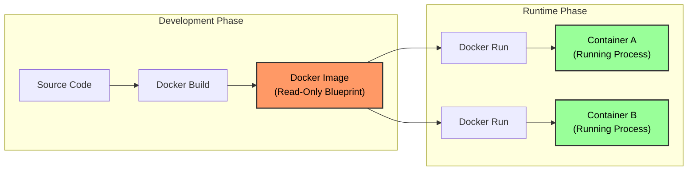

## 1. The High-Level Concept

Before diving into technical details, use this analogy to ground your understanding:

| Concept              | Analogy 1 (OOP Programming)          | Analogy 2 (Cooking)           |
| :------------------- | :----------------------------------- | :---------------------------- |
| **Docker Image**     | **Class** (`class User {}`)          | **Recipe** (The instructions) |
| **Docker Container** | **Instance / Object** (`new User()`) | **Cake** (The actual food)    |

- **The Image** is the static, read-only definition.
- **The Container** is the live, running process created from that definition.
- You can create **multiple** containers from a single image, just as you can bake multiple cakes from one recipe.

---

## 2. Deep Dive: Docker Images

### What is an Image?

An image is a **read-only** template or blueprint. It is a lifeless file stored on your disk (or in a registry like Docker Hub). It contains absolutely everything your application needs to exist, but it is not running.

### What is inside an Image?

An image is not just your code. It is a bundled package containing:

1.  **A Base Operating System:** A slimmed-down OS filesystem (usually Linux-based, like Alpine or Debian).
2.  **Runtime Environment:** The specific tools needed to run code (e.g., Node.js 18.0, Python 3.10).
3.  **Application Code:** Your source files (`index.js`, `app.py`, etc.).
4.  **Dependencies:** All third-party libraries (`node_modules`, `pip` packages).
5.  **Configuration:** Environment variables and system settings.
6.  **Commands:** Instructions on what command to run when the container starts.

### Key Characteristic: Immutability

Images are **Immutable** (Read-Only).

- Once an image is built, it cannot be changed.
- If you change a line of code in your app, you cannot just "edit" the image. You must **build a new image**.
- **Why?** This ensures **consistency**. If Version 1.0 worked yesterday, it will work forever because it never changes.

---

## 3. Deep Dive: Docker Containers

### What is a Container?

A container is a **runnable instance** of an image. When you tell Docker to "run" an image, it takes that static blueprint and brings it to life as a process on your computer.

### How Containers Work

- **Isolation:** A container runs in its own isolated environment. It has its own network, its own IP address (internal to Docker), and its own filesystem.
- **Process Isolation:** The containerized process does not know it is running inside a container; it thinks it has the whole machine to itself.
- **One-to-Many:** You can spin up 50 containers from the exact same image. They will all be identical copies running in parallel.

### The Writable Layer

If images are read-only, how does a container write files (like logs or database entries)?

- When a container starts, Docker adds a thin **Writable Layer** on top of the read-only image layers.
- Any changes made by the running application happen in this temporary layer.
- **Critical Reminder:** If you delete the container, the writable layer is deleted too. **Data inside a container is ephemeral (temporary)** unless you use Volumes (covered in a later lesson).

---

## 4. The Workflow: Image vs. Container

Here is how the development cycle looks using these concepts:

---

## 5. Why is this Powerful?

The separation of Images and Containers solves the "Works on My Machine" problem completely.

### The Old Way vs. The Docker Way

| Scenario        | The Old Way (Manual)                | The Docker Way                             |
| :-------------- | :---------------------------------- | :----------------------------------------- |
| **Developer A** | Installs Node v14 locally.          | Builds an Image containing Node v16.       |
| **Developer B** | Has Node v12. App crashes.          | Pulls the Image. Runs Container. It works. |
| **Production**  | Sysadmin installs wrong dependency. | Sysadmin pulls the Image. Runs Container.  |

> [!TIP] The "Self-Contained" Guarantee
> When you share a Docker Image with a colleague, you aren't just giving them your code. You are giving them the **OS**, the **Language**, the **Libraries**, and the **Code** all at once. They don't need to install _anything_ on their laptop except Docker.

---

## 6. Important Reminders & Gotchas

> [!WARNING] Common Misconception
> Beginners often think a container _contains_ the image.
> **Correction:** A container is a _process_ that uses the image as its filesystem.

> [!NOTE] Comparison to Virtual Machines
>
> - **VM:** Virtualizes the _Hardware_. It runs a full, heavy OS kernel for every VM. Slow to boot (minutes).
> - **Container:** Virtualizes the _OS_. It shares the host kernel but keeps the application process isolated. Fast to boot (milliseconds).

> [!TIP] Pro Tip: Managing Disk Space
> Because images are immutable, every time you update your code and rebuild, you create a _new_ image. Old images often remain on your disk.
>
> - **Dangling Images:** Images that have no name and aren't used are called "dangling" (often listed as `<none>`).
> - Use `docker system prune` occasionally to clean up old, unused images and containers.

## 7. Summary Checklist

- [ ] **Image:** The blueprint (Read-Only). Contains Code + Dependencies + OS Tools.
- [ ] **Container:** The running house (Read/Write). Runs the application in isolation.
- [ ] **Independence:** The host machine (your laptop) does not need Node/Python installed to run a Node/Python container.
- [ ] **Relationship:** You Build an Image $\rightarrow$ You Run a Container.
