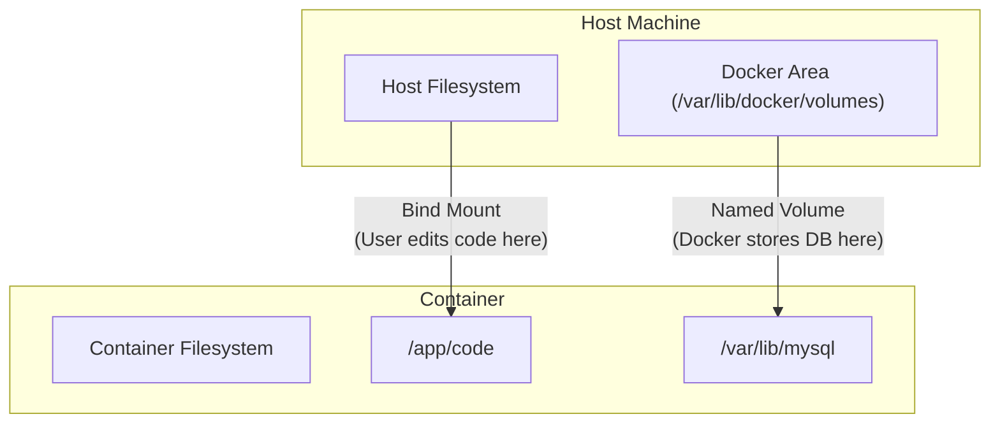

# 3.1 - Data Persistence (Volumes)

_Extension of [[3. Images and Containers]]_

In the previous note, we learned that containers are **ephemeral**. If you delete a container, its writable layer is destroyed, and all data inside is lost. This note explains how to fix that using **Volumes**.

[[Docker Q3]]

## 1. The Problem: Data Loss

By default, files created inside a container are stored on a **Writable Layer**.

- **Scenario:** You run a MySQL container. You add users to the database.
- **Event:** You stop and remove the container (`docker rm`).
- **Result:** The database files are gone. The next time you run MySQL, it starts fresh/empty.

## 2. The Solution: Volumes

**Volumes** are mechanisms to persist data generated by containers. They store data on the **Host** machine, outside the container's lifecycle.

There are three main types of storage mounts:

### A. Named Volumes (The "Managed" Way)

Docker manages a specific area on your hard drive to store this data. You don't usually look at the files directly; you let Docker handle them.[[Qs2]]

- **Best for:** Databases (Postgres, Mongo) where you want persistence but don't need to edit the database files manually.
- **Syntax:** `-v <volume_name>:<container_path>`

```bash
# Create a volume (optional, Docker creates it automatically on run)
docker volume create my_db_data

# Run container attaching the volume to the path where MySQL stores data
docker run -d -v my_db_data:/var/lib/mysql mysql
```

### B. Bind Mounts (The "Developer" Way)

You map a specific folder on your **Host** (e.g., your code folder) to a folder inside the **Container**.

- **Best for:** **Development**. You edit code on your laptop, and the changes appear instantly inside the container.
- **Syntax:** `-v <host_path>:<container_path>`

```bash
# Windows/Mac syntax often requires absolute paths or $(pwd)
docker run -v $(pwd)/src:/app/src node_app
```

### C. Anonymous Volumes

Created if you specify a mount path but no name. Often used to prevent specific folders (like `node_modules`) from being overwritten by a Bind Mount.

## 3. Visualizing Mount Types



## 4. Volume Management Commands

- `docker volume create <name>`: Create a volume.
- `docker volume ls`: List all volumes.
- `docker volume inspect <name>`: See exactly where the data is stored on your host.
- `docker volume rm <name>`: Destroy the volume and its data.
- `docker volume prune`: Remove all unused volumes.
