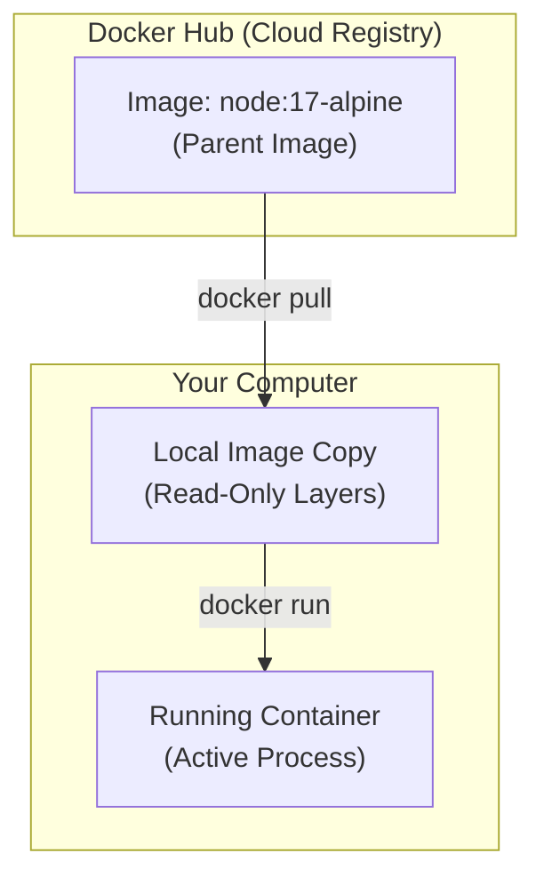

---

## 1. Docker Hub: The GitHub of Containers

**Docker Hub** (hub.docker.com) is the default public registry for Docker images.
*   **Analogy:** Just as developers push code to GitHub and download libraries from npm (Node) or pip (Python), Docker developers push and pull images from Docker Hub.
*   **Repositories:** It contains massive libraries of pre-built images for almost any technology you can imagine (Node.js, Python, Mongo, Postgres, WordPress, etc.).

### Official Images
When searching Docker Hub, look for **Official Images**. These are maintained by the creators of the software (e.g., the Node.js team maintains the `node` image). They are secure, optimized, and best practice.

---

## 2. The Mechanics of an Image: Layers

To understand "Parent Images," you must understand how Docker images are built. They are not single monolithic files; they are composed of **Layers**.

### Stacked Filesystem
*   **Incremental:** Every image is built in steps. Each step adds a new layer on top of the previous one.
*   **Read-Only:** Each layer is a read-only snapshot of the filesystem at that moment.

### The "Parent" Image (Base Image)
When you create your own custom image (e.g., for your specific web app), you rarely start from scratch (an empty void). You start with a **Parent Image**.
*   **Definition:** The initial layer of your image that provides the Operating System and Runtime Environment.
*   **Example:** If you are building a Node.js app, you don't want to manually install Linux, then curl, then Node. You simply use the official `node` image as your parent.
*   **Layering Logic:**
    1.  **Layer 1 (Parent):** `node:alpine` (Contains Linux + Node.js).
    2.  **Layer 2:** You add your source code files.
    3.  **Layer 3:** You run `npm install` to add dependencies.

---

## 3. Tags and Versions

When you see an image name like `node`, it often refers to a specific version. Docker uses **Tags** to identify these versions.

**Syntax:** `image_name:tag`

### Common Tag Types:
1.  **`latest`:** The default tag if you don't specify one.
    *   Example: `docker pull node` is the same as `docker pull node:latest`.
    *   *Warning:* In production, avoid `latest` because it changes over time. Always pin a specific version for consistency.
2.  **Version Number:** Locks the image to a specific software version.
    *   Example: `node:17` or `python:3.9`.
3.  **OS Distribution (The "Flavor"):**
    *   **`alpine`:** A specific tag (e.g., `node:17-alpine`) based on **Alpine Linux**.
    *   **Why Alpine?** It is an ultra-lightweight Linux distribution (approx 5MB). Standard images can be hundreds of MBs. Using Alpine reduces build time and storage space significantly.

---

## 4. Key Commands

### 1. `docker pull`
Downloads an image from Docker Hub to your local machine without running it.
```bash
# Downloads the specific version 17 running on Alpine Linux
docker pull node:17-alpine
```

### 2. `docker images`
Lists all the images currently stored on your computer.
```bash
docker images
```

### 3. `docker run` (Interactive Mode)
We can run a container from these parent images to explore them.

**The Scenario:** You want to run Node.js to test a quick snippet, but you don't want to install Node on your laptop.
```bash
# -it = Interactive Terminal (keeps the session open so you can type)
docker run -it node:17-alpine
```

*   **What happens?**
    1.  Docker checks if you have `node:17-alpine`. If not, it pulls it.
    2.  It starts a container.
    3.  It drops you directly into the Node.js REPL (Read-Eval-Print Loop) inside the container.
    4.  You can type JavaScript commands (`5 + 5`, `console.log('hi')`).
    5.  When you exit (`CTRL+D`), the container stops.

### 4. Exploring the Container OS
You can also drop into the *shell* of the container to look at the filesystem.
```bash
# Overrides the default command (node) and runs a shell (/bin/sh) instead
docker run -it node:17-alpine /bin/sh
```
*   Now you can run Linux commands (`ls`, `cd`, `cat`) inside the container to see the file structure provided by the Parent Image.

---

## 5. Visual Summary: From Hub to Container



## 6. Best Practices

> [!TIP] Choosing a Parent Image
> *   **Use Official Images:** Always prefer `node`, `python`, `postgres` from the official publishers.
> *   **Be Specific:** Use specific tags like `17-alpine` rather than `latest` to ensure your app doesn't break when a new major version is released.
> *   **Go Small:** Prefer `alpine` or `slim` versions to keep your deployments fast.

> [!NOTE] Relationship to Your Future Dockerfile
> In the next lesson, we will create a `Dockerfile`. The very first line of that file will always be `FROM <image>`, where you declare which **Parent Image** you are building upon.