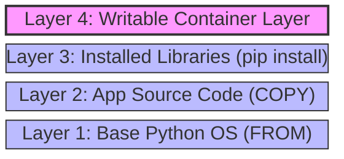

_Extension of [[4. Parent Images and Docker Hub]]_

This note explains the technical architecture of Docker Images. Understanding **Layers** is the secret to building small, fast, and professional images.

[[Docker Q4]]

## 1. What is a Layer?

A Docker image is not a single file. It is a stack of **read-only** layers.

- **Every instruction** in your `Dockerfile` (`FROM`, `RUN`, `COPY`) creates a new layer.
- Each layer stores only the **changes** (deltas) from the previous layer.

## 2. Example: The Python Layer Stack

Consider this simple Dockerfile from the NeuralNine example:

```dockerfile
FROM python:3.12-slim
COPY . /app
RUN pip install -r requirements.txt
```

This creates a stack like this:



## 3. The Power of Layer Caching

Docker is lazy (in a good way). When you rebuild an image:

1.  Docker looks at your Dockerfile.
2.  It checks each line against its cache.
3.  **If the instruction hasn't changed**, it reuses the existing layer from the disk.
4.  **If the instruction HAS changed**, it rebuilds that layer **and every layer after it**.

### Optimization Strategy

This is why order matters. Always put stable commands (like installing OS tools) at the top, and volatile commands (like copying source code) at the bottom.

**Bad Order:**

```dockerfile
COPY . .                   # Source code changes often -> Cache breaks here
RUN pip install pandas     # This re-runs every time code changes (Slow!)
```

**Good Order:**

```dockerfile
COPY requirements.txt .    # Only changes when dependencies change
RUN pip install pandas     # Cached mostly!
COPY . .                   # Source code changes, but the heavy install is already done.
```

## 4. Image Variants (Alpine vs. Slim)

In the NeuralNine material, we discussed image types:

- **`python:3.12` (Full):** Based on Debian. Includes standard libraries. Large (~1GB). Safe for beginners.
- **`python:3.12-slim`:** Based on Debian but stripped down. Smaller (~200MB). Recommended for production.
- **`python:3.12-alpine`:** Based on Alpine Linux. Tiny (~50MB).
  - _Warning:_ Alpine uses a different C-library (`musl` instead of `glibc`). Some Python packages (like NumPy or Pandas) might fail to install or require complex compilation on Alpine.

---
