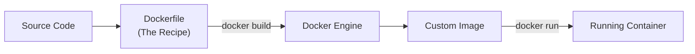
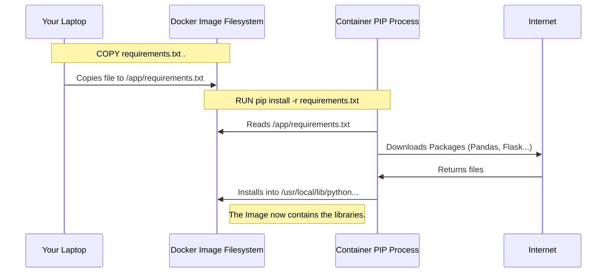

## 1. What is a Dockerfile?

A **Dockerfile** is a text file (named exactly `Dockerfile` with no file extension) that contains a set of instructions. Docker reads these instructions step-by-step to automatically build a Docker Image.

- **Analogy:** If the **Image** is the cake, the **Dockerfile** is the written recipe.
- **Layers:** Each instruction in the Dockerfile creates a new **Layer** in the image.

### The Build Workflow



---

## 2. Anatomy of a Dockerfile

Let's break down the instructions used to containerize a standard Node.js application. (The concepts apply equally to Python, Go, etc.).

### The Example Context

Imagine a project folder with two files:

1.  `app.js` (The web server code)
2.  `package.json` (List of dependencies, e.g., Express)

### The Step-by-Step Instructions

#### 1. `FROM` (The Base)

Every Dockerfile starts with a `FROM` instruction. This defines the **Parent Image**.

```dockerfile
FROM node:17-alpine
```

- **What it does:** It pulls the `node:17-alpine` image from Docker Hub to use as the foundation.
- **Why:** We need a pre-configured OS with Node.js installed so we don't have to build it from scratch.

#### 2. `WORKDIR` (The Setup)

Sets the working directory inside the **image filesystem**.

```dockerfile
WORKDIR /app
```

- **What it does:** It creates a folder called `/app` inside the image and "cd"s (changes directory) into it.
- **Why:** If we don't do this, files will be copied into the root directory `/`, which makes the filesystem messy and can overwrite system files. All subsequent commands run inside `/app`.

#### 3. `COPY` (The Transfer)

Copies files from your **host computer** into the **image**.

```dockerfile
COPY . .
```

- **Syntax:** `COPY <source_on_computer> <destination_in_image>`
- **The first `.`**: Represents the current directory on your computer (where you run the build command).
- **The second `.`**: Represents the current directory inside the image (which is `/app` because of `WORKDIR`).

#### 4. `RUN` (The Build Action)

Executes a command _while the image is being built_.

```dockerfile
RUN npm install
```

- **What it does:** It runs `npm install` inside the image's `/app` directory.
- **Result:** It downloads dependencies listed in `package.json` and creates the `node_modules` folder _inside the image_.
- **Key Concept:** This happens **once** during the build process. The result is baked into the image.

#### 5. `EXPOSE` (The Documentation)

Informs Docker that the container listens on specific ports at runtime.

```dockerfile
EXPOSE 4000
```

- **Note:** This does **not** actually publish the port. It is essentially documentation for the developer and Docker Desktop. You still need to map ports using `-p` when running the container.

#### 6. `CMD` (The Startup Command)

Specifies the command to run when the **container starts**.

```dockerfile
CMD ["node", "app.js"]
```

- **Syntax:** JSON array format is preferred `["executable", "parameter"]`.
- **Crucial Distinction:** Unlike `RUN`, this command is **not** executed during the build. It is saved as metadata and only executes when you type `docker run`.

---

## 3. The Complete Dockerfile

Putting it all together:

```dockerfile
# 1. Specify the parent image
FROM node:17-alpine

# 2. Set the working directory inside the container
WORKDIR /app

# 3. Copy source code from host to container
COPY . .

# 4. Install dependencies (Build time)
RUN npm install

# 5. Document the port
EXPOSE 4000

# 6. Start the application (Runtime)
CMD ["node", "app.js"]
```

---

## 4. Building the Image

Writing the file doesn't create the image. You must use the **Build Command**.

Open your terminal in the same folder as the Dockerfile and run:

```bash
docker build -t myapp .
```

### Breaking down the command:

- `docker build`: Tells the Docker engine to start the build process.
- `-t myapp`: **Tags** (names) the image "myapp". If you don't do this, you get a random ID.
- `.` (The Dot): **Extremely Important.** This tells Docker where to look for the Dockerfile and the files to copy (the "Build Context"). It means "look in the current directory".

---

## 5. Deep Dive: RUN vs. CMD

This is the most common point of confusion for beginners.

| Instruction | When does it happen? | Purpose                                                              | Example                                                     |
| :---------- | :------------------- | :------------------------------------------------------------------- | :---------------------------------------------------------- |
| **RUN**     | **Build Time**       | To install software, libraries, or dependencies _onto the image_.    | `pip install requests`<br>`npm install`<br>`apt-get update` |
| **CMD**     | **Run Time**         | To start the actual process/application when the container wakes up. | `python app.py`<br>`node index.js`<br>`npm start`           |

> [!TIP] The "House" Analogy
>
> - **RUN** is like building the house: You install the plumbing, paint the walls, and assemble the furniture. You do this _once_ before anyone moves in.
> - **CMD** is like opening the front door: It's the action that happens when the resident actually arrives (the container starts).

---

## 6. Optimization: Layer Caching

Docker builds images using a **Layer Caching** system. If you change a file and rebuild, Docker only rebuilds the layers that changed and the layers _after_ it.

**Optimization Strategy:**
Currently, our `COPY . .` line copies `package.json` AND `app.js`. If we change one line of code in `app.js`, Docker sees the `COPY` layer has changed, so it invalidates the cache and re-runs `RUN npm install`. This is slow.

**Better Structure:**

```dockerfile
FROM node:17-alpine
WORKDIR /app

# 1. Copy ONLY the dependency file first
COPY package.json .

# 2. Install dependencies
# If package.json hasn't changed, Docker uses the CACHED version of this layer!
RUN npm install

# 3. Copy the rest of the source code
# This changes often, but it's now AFTER the heavy install step.
COPY . .

CMD ["node", "app.js"]
```

- **Result:** Rebuilding the image after changing code takes milliseconds instead of minutes.

## 7. Deep Dive: Filesystem & Execution Flow

It is crucial to understand that commands in a Dockerfile happen linearly, modifying the image's filesystem step-by-step.

### The `COPY` Destination

When you write `COPY app.py /app`:

- **`/app`** is an **absolute path inside the container image**.
- **Automatic Creation:** If the folder `/app` does not exist in the Linux base image, Docker automatically creates it.
- **The Result:** Your image now contains a folder `/app` with your code inside it. This is completely separate from your computer's filesystem.

### The `RUN` Command and Dependencies

A common mistake is trying to run a command on a file before copying that file.

**Incorrect Flow (Will Crash):**

```dockerfile
FROM python:3.9
# ERROR: pip looks inside the image, but requirements.txt isn't there yet!
RUN pip install -r requirements.txt
COPY requirements.txt .
```

**Correct Flow:**

```dockerfile
FROM python:3.9
# 1. Copy the file from Host -> Image
COPY requirements.txt .

# 2. Run pip inside the image.
# It uses the Image's pip (not your laptop's).
# It reads the copy of requirements.txt we just made.
RUN pip install -r requirements.txt
```

### Visualizing the Pip Process


