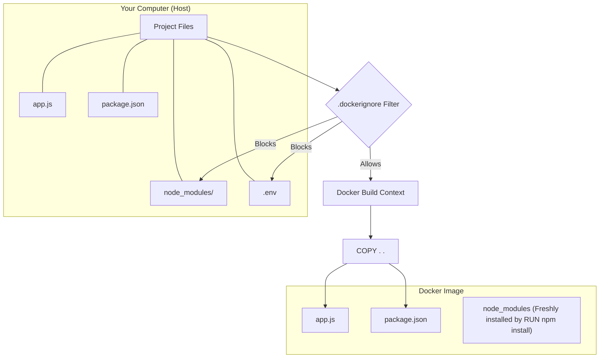

Here is the detailed, polished Obsidian note for **6. The .dockerignore file**. While often overlooked, this simple file is crucial for security, build speed, and image size optimization.

---

# 6. The .dockerignore file

Just as Git has `.gitignore` to prevent unwanted files from entering your version control history, Docker has `.dockerignore` to prevent unwanted files from entering your **Docker Image**.

[[Docker Q6]]

---

## 1. The Problem: Unwanted Files

When you run the command `COPY . .` in your Dockerfile, you are telling Docker: "Copy **everything** from my computer's current folder into the image."

### Why is this dangerous?

1.  **Bloat:** You might copy massive files (like local logs, temporary build artifacts, or huge video files) that make your image unnecessarily large (Gigabytes instead of Megabytes).
2.  **Performance:** Docker has to send all these files to the Docker Engine (the "Build Context") before building starts. Sending 1GB of useless data slows down every build.
3.  **Security:** You might accidentally copy sensitive files like `.env` (containing API keys), AWS credentials, or `.git` history folders into the image, which could then be extracted by anyone who gets the image.
4.  **Conflicts:** The most common issue is copying local **Dependencies**.

### The Specific Case: `node_modules`

- **Scenario:** You have `node_modules` on your host computer (installed via Mac/Windows).
- **The Issue:** If you copy this folder into a Linux container, it might break. Some packages are compiled specifically for the OS they are installed on (e.g., a package compiled for macOS won't work on Linux).
- **The Solution:** We want to install fresh dependencies _inside_ the image using `RUN npm install`, not copy the potentially broken/bloated ones from our host.

---

## 2. The Solution: .dockerignore

A `.dockerignore` file is a plain text file placed in the root directory of your project (alongside the Dockerfile).

### Syntax

It uses the same pattern matching syntax as `.gitignore`.

- Lines starting with `#` are comments.
- `*` matches any sequence of characters.

### Example File Content

```dockerignore
# Ignore the dependency folder (we install this fresh inside the image)
node_modules

# Ignore git history and metadata
.git

# Ignore local environment variables (keep secrets safe)
.env

# Ignore Docker files themselves (optional, but clean)
Dockerfile
.dockerignore

# Ignore logs and temp files
*.log
npm-debug.log
build/
dist/
```

---

## 3. How It Works (The Workflow)

When you run `docker build -t myapp .`:

1.  **Scan:** Docker looks for a `.dockerignore` file in the directory.
2.  **Filter:** If found, it reads the file and excludes any matching patterns from the "Build Context".
3.  **Send:** Only the _remaining_ allowed files are sent to the Docker Engine.
4.  **Build:** When the `COPY . .` instruction executes, it only sees the allowed files. The ignored files effectively "do not exist" to the Docker builder.

### Visualizing the Filter



---

## 4. Best Practices

> [!TIP] Always Ignore `node_modules`
> Even if you don't care about image size, ignoring `node_modules` (or `venv` for Python, `vendor` for PHP) prevents subtle bugs where your container tries to run binaries compiled for the wrong Operating System.

> [!WARNING] Sensitive Data
> Never bake secrets (passwords, API keys) into an image. Ensure `.env` files are in your `.dockerignore`. Pass secrets at runtime using Environment Variables instead.

> [!NOTE] Efficiency
> A smaller build context means faster builds. If your build takes a long time to "Send build context to Docker daemon," check if you are accidentally sending large files that should be ignored.

---

## 5. Summary Checklist

- [ ] **Create File:** Create `.dockerignore` in the project root.
- [ ] **Dependencies:** Add `node_modules` (or equivalent) to the list.
- [ ] **Secrets:** Add `.env`, `.git`, and credentials to the list.
- [ ] **Verify:** Build the image and check that `COPY . .` didn't include the unwanted folders.
