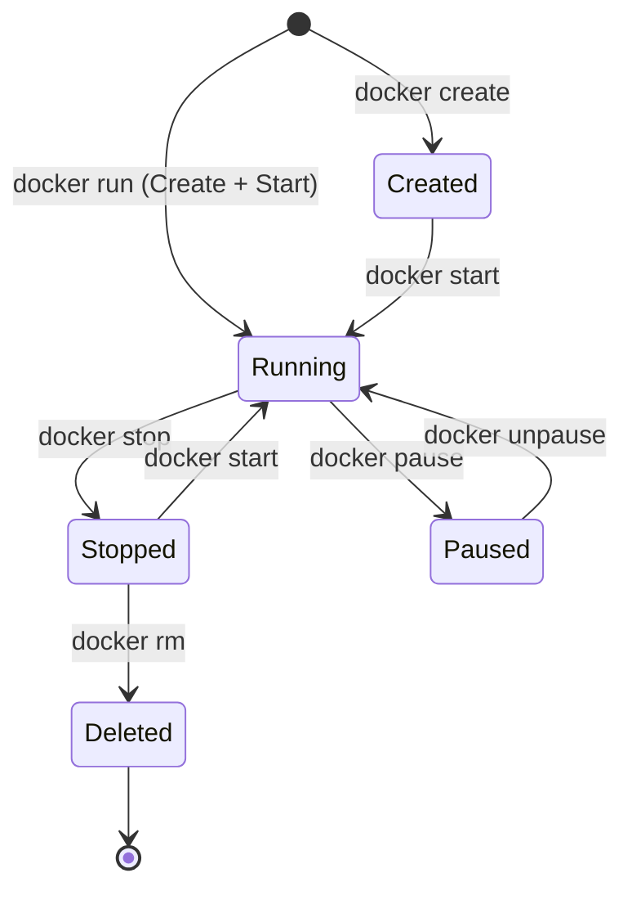

Here is the detailed, polished Obsidian note for **7. Starting and Stopping Containers**.

You asked for this to be "wide," so this note goes beyond simple commands. It covers the **entire lifecycle** of a container, the critical distinction between creating and restarting, advanced port management, and how to maintain a clean system.

---

# 7. Starting, Stopping, and Managing Containers

This lesson covers the day-to-day management of Docker containers. We will move from simply building images to managing the full lifecycle of a running application: creating, naming, mapping ports, stopping, restarting, and deleting.

[[Docker Q7]]

---

## 1. The Container Lifecycle

To manage containers effectively, you must understand the states a container can be in.



---

## 2. The `docker run` Command (The Creator)

The `docker run` command is powerful but often misunderstood. It does two things combined:
1.  **Creates** a new container from an image.
2.  **Starts** that container immediately.

### The Anatomy of a Professional Run Command

When running web servers or background services, you rarely just type `docker run image`. You usually use a combination of flags:

```bash
docker run -d -p 5000:4000 --name my_app_container my_app_image
```

Let's break down every flag in detail:

#### A. Detached Mode (`-d`)
*   **Default Behavior:** If you run `docker run node`, the container attaches to your terminal. It steals your command prompt. If you close the window or press `Ctrl+C`, the container dies.
*   **Detached (`-d`):** Runs the container in the background. It prints the Container ID and immediately gives you your terminal back.
*   **Use Case:** Web servers, databases, and long-running services.

#### B. Port Mapping (`-p`)
This is the bridge between your computer (Host) and the Container.
*   **Syntax:** `-p <HOST_PORT>:<CONTAINER_PORT>`
*   **The Concept:**
    *   The container has its own internal network. It might be listening on port `4000` internally.
    *   Your computer cannot access that port by default.
    *   You must "punch a hole" through the firewall.
*   **Example:** `-p 5000:4000`
    *   You access the app in your browser at `localhost:5000`.
    *   Docker forwards that traffic to port `4000` inside the container.
*   **Conflict Rule:** You cannot map two containers to the same **Host** port (e.g., 5000), but multiple containers can expose the same **Internal** port (4000).

#### C. Naming (`--name`)
*   **Default:** Docker assigns a random adjective-noun name (e.g., `sad_turing`, `zen_bhabha`).
*   **Custom:** `--name my_container` allows you to reference it easily later for stopping or restarting.
*   **Constraint:** Names must be unique. You cannot have two containers named `my_app`.

---

## 3. Viewing Containers (`ps`)

Since detached containers run in the background, you need commands to see them.

*   **`docker ps`**: Lists only **Running** containers.
    *   Shows: Container ID, Image used, Status (Up 5 minutes), and Port Mappings.
*   **`docker ps -a`**: Lists **All** containers (Running + Stopped).
    *   *Why use this?* To find a container that crashed immediately after starting, or to find an old container you want to restart.

---

## 4. Stopping and Restarting

This is the most common point of confusion for beginners: **The difference between `run` and `start`.**

### Stopping
To gracefully shut down a container (sends a SIGTERM signal to the process):
```bash
docker stop <container_name_or_id>
```

### Restarting (`docker start`)
If you have stopped a container, **do not** use `docker run` again.
*   **`docker run`**: Creates a **brand new** fresh container instance (a new ID, fresh writable layer).
*   **`docker start`**: Wakes up an **existing** stopped container. It retains its ID, its logs, and any files written to its writable layer.

```bash
# Correct workflow to resume work:
docker start my_app_container
```
*   *Note:* `docker start` defaults to detached mode. You don't need the `-d` flag.

### Killing (`docker kill`)
If a container is stuck and won't stop (it's frozen), use:
```bash
docker kill <container_name>
```
*   This forces the process to terminate immediately (SIGKILL).

---

## 5. Observability: Logs and Internals

When a container runs in the background (`-d`), you can't see the `console.log` output.

### Docker Logs
To see what the application is saying (errors, access logs):
```bash
docker logs <container_name>
```
*   **Follow Mode:** `docker logs -f <container_name>` (Streams the logs live, like `tail -f`).

### Executing Commands Inside (`docker exec`)
Sometimes you need to "enter" the container to debug files or check configurations.
```bash
docker exec -it <container_name> /bin/sh
# or for some images
docker exec -it <container_name> /bin/bash
```
*   `-it`: Interactive TTY. Connects your keyboard to the container.
*   `/bin/sh`: The shell program to run inside.

---

## 6. Cleanup: Removing Containers

Containers take up disk space. If you `docker run` 10 times, you have 10 containers (1 running, 9 stopped).

### Removing a Single Container
You must stop a container before removing it.
```bash
docker stop my_app
docker rm my_app
```
*   **Force Remove:** `docker rm -f my_app` (Stops and deletes in one go).

### Auto-Cleanup (`--rm`)
For temporary tasks (like running a test or a quick script), use the `--rm` flag with `docker run`.
```bash
docker run --rm python:3.9 print("Hello")
```
*   **Effect:** As soon as the command finishes, Docker automatically deletes the container.

### System Prune (The Nuclear Option)
To clean up **all** stopped containers, unused networks, and dangling images at once:
```bash
docker system prune
```
*   *Warning:* This deletes all stopped containers. Ensure you don't have data in a stopped container you wanted to keep.

---

## 7. Summary Workflow Table

| Goal | Command | Key Flags |
| :--- | :--- | :--- |
| **Create & Start** | `docker run <image>` | `-d` (background)<br>`-p` (ports)<br>`--name` (name) |
| **List Running** | `docker ps` | |
| **List All** | `docker ps -a` | |
| **Stop** | `docker stop <name>` | |
| **Resume** | `docker start <name>` | (No flags needed usually) |
| **View Output** | `docker logs <name>` | `-f` (follow/live) |
| **Enter Shell** | `docker exec -it <name> sh` | |
| **Delete** | `docker rm <name>` | `-f` (force) |
| **Auto-Delete** | `docker run --rm <image>` | `--rm` |