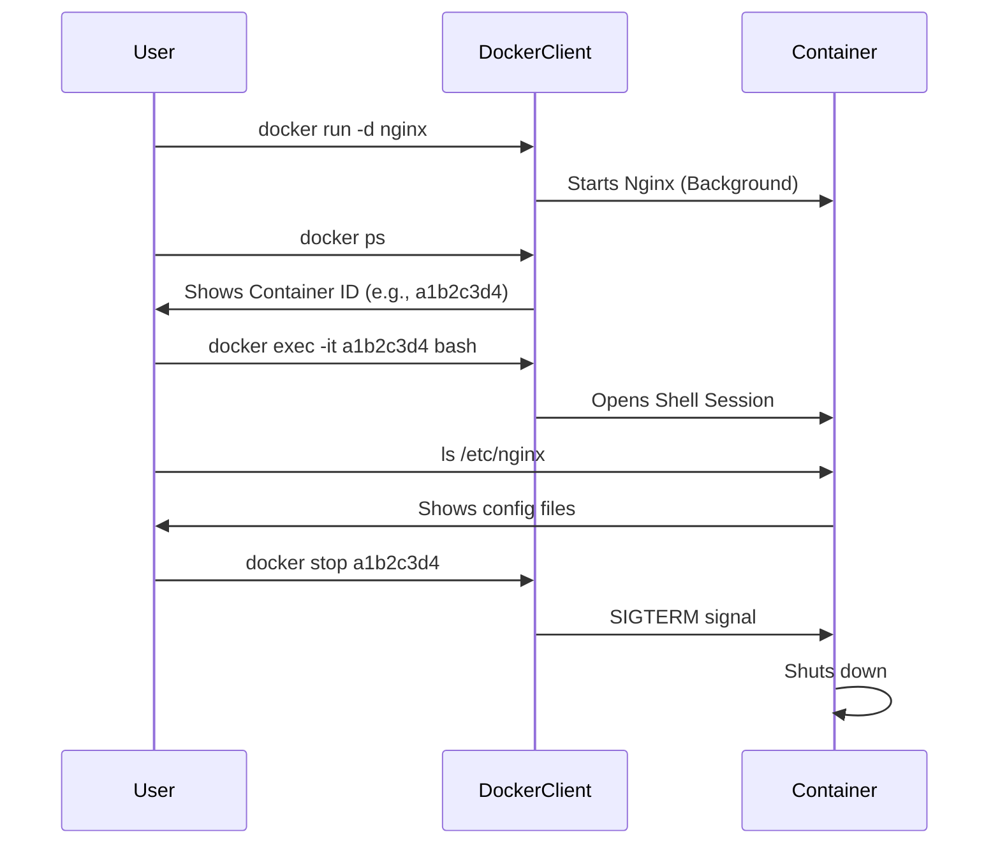

---
# 7.1 - Advanced: Interacting with Containers (Exec)

*Extension of [[7. Starting and Stopping Containers]]*

We often run containers in "Detached Mode" (`-d`). But what if we need to look inside, debug a crash, or run a one-off command? We use `docker exec`.

[[Docker Q7]]

## 1. The `docker exec` Command
This command allows you to run a **new process** inside an **already running** container.

### Common Use Cases:
1.  **Opening a Shell:** To explore the files.
2.  **Running a Script:** e.g., Running a database migration script manually.
3.  **Debugging:** Checking if a config file was copied correctly.

## 2. Understanding `-it`
You will almost always use the flags `-it`.
```bash
docker exec -it <container_name> /bin/bash
```

*   **`-i` (Interactive):** Keeps `STDIN` (Standard Input) open. This means the container can listen to your keyboard input.
*   **`-t` (TTY):** Allocates a pseudo-teletype. This formats the output nicely (colors, cursor formatting) so it looks like a real terminal.

**Without `-it`:** You might send a command, but you won't be able to type anything further or interact with prompts.

## 3. Standard Streams Explained
When you interact with a container, you are dealing with three data streams:
1.  **STDIN (Standard Input):** Your keyboard -> Container.
2.  **STDOUT (Standard Output):** Container -> Your Screen (Normal logs).
3.  **STDERR (Standard Error):** Container -> Your Screen (Error logs).

`docker exec` bridges these streams between your terminal and the container's OS.

---

# 7.2 - Command Cheat Sheet & Cleanup

*Extension of [[7. Starting and Stopping Containers]]*

A consolidated reference of the core commands covered across both Net Ninja and NeuralNine materials, plus cleanup strategies.

## 1. Essential Command Reference

| Action | Command | Note |
| :--- | :--- | :--- |
| **List Running** | `docker ps` | Shows active only. |
| **List All** | `docker ps -a` | Shows active + stopped. |
| **Logs** | `docker logs <name>` | Add `-f` to follow live. |
| **Stop** | `docker stop <name>` | Graceful shutdown (SIGTERM). |
| **Kill** | `docker kill <name>` | Instant shutdown (SIGKILL). |
| **Remove** | `docker rm <name>` | Container must be stopped first. |
| **Inspect** | `docker inspect <name>` | Returns massive JSON with all IPs, paths, and config. |

## 2. System Cleanup (Pruning)
Over time, Docker consumes massive disk space with old layers and stopped containers.

*   **`docker container prune`**: Deletes **all** stopped containers.
*   **`docker image prune`**: Deletes "dangling" images (images with no tag/name, usually result of old builds).
*   **`docker system prune`**: The "Master Sweep".
    *   Removes stopped containers.
    *   Removes dangling images.
    *   Removes unused networks.
    *   *Add `-a` (`docker system prune -a`) to remove ALL unused images, not just dangling ones.*

## 3. Workflow Diagram



---
