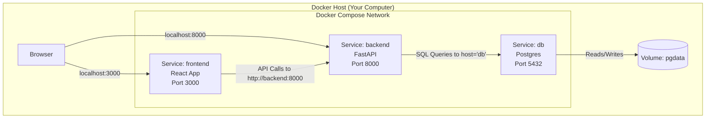

# 8. Docker Compose (Multi-Container Orchestration)

Up to this point, we have used `docker run` to manage one container at a time. But real-world applications (like the Shopping List App in the NeuralNine course) rarely live in isolation. They usually consist of:
1.  **A Frontend** (e.g., React)
2.  **A Backend** (e.g., Python/FastAPI)
3.  **A Database** (e.g., Postgres)

Managing these three with manual `docker run` commands is tedious, error-prone, and makes networking difficult. **Docker Compose** is the solution.

[[Docker Q8]]

---

## 1. What is Docker Compose?

Docker Compose is a tool that allows you to define and run multi-container Docker applications.
*   **Configuration:** You use a YAML file (`docker-compose.yml`) to configure your application's services.
*   **Orchestration:** With a single command (`docker-compose up`), you create and start all the services from your configuration.

### The Shift in Thinking
*   **Docker CLI:** "Imperative" (You tell Docker *what to do* step-by-step).
*   **Docker Compose:** "Declarative" (You tell Docker *what you want the end result to look like*, and it handles the rest).

---

## 2. The `docker-compose.yml` File

In the NeuralNine example, we build a **Shopping List Application**. Let's break down the file structure used to orchestrate the Database, Backend, and Frontend.

### A. The Database Service (Using an Image)
We don't need to write code for the database; we just pull it.

```yaml
version: "3.8"
services:
  db:
    image: postgres:14  # We pull the official image
    environment:
      - POSTGRES_DB=shopping
      - POSTGRES_USER=postgres
      - POSTGRES_PASSWORD=postgres
    volumes:
      - pgdata:/var/lib/postgresql/data  # Named volume for persistence
```

### B. The Backend Service (Building from Source)
The backend is our own Python code, so we need to tell Compose to **build** it, not just pull it.

```yaml
  backend:
    build: ./backend  # Path to the folder containing the Dockerfile
    ports:
      - "8000:8000"   # Map Host:Container
    depends_on:
      - db            # Wait for the 'db' service to start first
    volumes:
      - ./backend:/app # Bind mount for live development
```

### C. The Frontend Service (Building from Source)

```yaml
  frontend:
    build: ./frontend
    ports:
      - "3000:3000"
    depends_on:
      - backend       # Wait for backend
    stdin_open: true  # Fixes some React/Docker exit issues
    tty: true
```

### D. Volumes Definition
At the bottom of the file, we declare the named volumes we used above.

```yaml
volumes:
  pgdata:
```

---

## 3. Key Concepts Explained

### 1. Services
In Compose, a container is referred to as a **Service**. In the file above, `db`, `backend`, and `frontend` are the service names.

### 2. Networking (The Magic)
This is the most important concept in Compose.
*   **Automatic Network:** Compose automatically creates a shared network for all services in the file.
*   **DNS Resolution:** Containers can talk to each other using their **Service Name** as the hostname.
    *   **Example:** In the Python Backend code, when connecting to the database, you **do not** write `localhost` or an IP address. You simply write `"db"`.
    *   `db_host = "db"`
    *   Docker automatically resolves the string `"db"` to the internal IP address of the Postgres container.

### 3. `depends_on`
Docker starts containers fast. Sometimes the backend starts before the database is ready to accept connections, causing a crash.
*   `depends_on: - db` tells Docker: "Start the database container first, then start me."

### 4. Build Context
*   `image: postgres`: Means "Download this from Docker Hub."
*   `build: ./backend`: Means "Look in the `./backend` folder, find the `Dockerfile` there, build an image from it, and then run it."

---

## 4. Commands

Once you have your `docker-compose.yml` file, you control the entire stack with simple commands.

| Command | Description |
| :--- | :--- |
| **`docker-compose up`** | Builds (if needed), creates, starts, and attaches to containers for a service. |
| **`docker-compose up -d`** | Detached mode: Runs containers in the background. |
| **`docker-compose down`** | Stops and **removes** containers, networks, and images defined in the config. |
| **`docker-compose build`** | Rebuilds the images (useful if you changed your `Dockerfile`). |
| **`docker-compose ps`** | Lists the running containers managed by this Compose file. |

---

## 5. Visualizing the Architecture

Here is how the NeuralNine Shopping List App looks when running via Compose:



---

## 6. Summary Checklist

- [ ] **One File:** `docker-compose.yml` defines the whole stack.
- [ ] **Services:** Define the components (App, DB, Cache).
- [ ] **Networking:** Use service names (`db`, `backend`) as hostnames inside the code.
- [ ] **Persistence:** Use named volumes in the `volumes` section for databases.
- [ ] **Workflow:** `docker-compose up -d` to start, `docker-compose down` to stop and clean up.