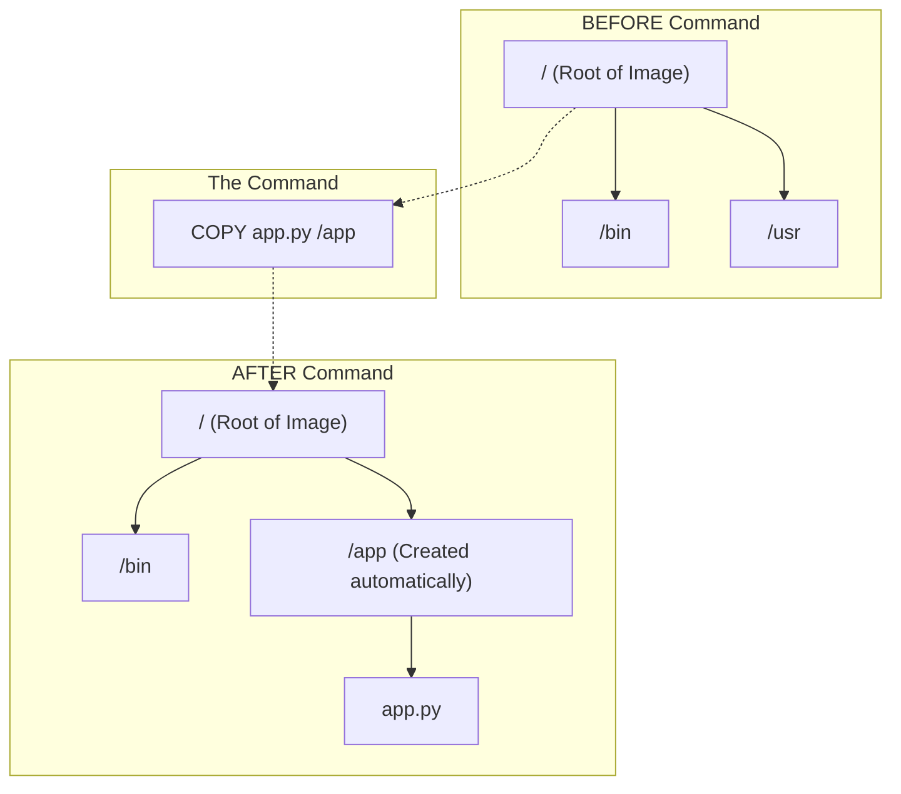

```
COPY app.py /app
```

>what does the  the `/app` mean is the destination in the next docker container ?
what is the "file system " before that command and after it 


```
RUN pip install -r requirements.txt
```


>in here we didn't copy the requirement into the docker file system yet a and if im right we are using the pip fro n the docker how did it get the requirement from is it the the one from docker or ours from the our code base 


### The Answers

#### Question 1: What does `/app` mean in `COPY app.py /app`?

In the command `COPY app.py /app`:

1.  **The Source (`app.py`):** This file is on your **Host Computer** (your laptop).
2.  **The Destination (`/app`):** This path is inside the **Image/Container** being built.

**What is the "File System" Before and After?**

*   **Before this command:** The image essentially looks like a fresh installation of Linux (Debian or Alpine). It has standard folders like `/bin`, `/usr`, `/var`, but it likely does **not** have a folder named `/app`.
*   **During the command:** Docker sees that you want to put the file into `/app`. Since `/app` doesn't exist, Docker **automatically creates the directory** `/app` inside the image.
*   **After the command:** The image now has a folder named `app` at the root of its filesystem, and inside that folder is a copy of your python file.

**Visualizing the Filesystem State:**



---

#### Question 2: `RUN pip install -r requirements.txt` logic

You asked: *"In here we didn't copy the requirement into the docker file system yet... how did it get the requirement?"*

**The Answer:**
If you run `RUN pip install -r requirements.txt` **BEFORE** you copy the `requirements.txt` file into the image, **the build will fail.** It will crash with an error saying `requirements.txt: No such file or directory`.

The `pip` command is running **inside the container image**. It is isolated. It **cannot** see the files on your laptop unless you explicitly `COPY` them in first.

**The Correct Order:**
You must copy the file *first*, then run the install.

```dockerfile
# Step 1: Copy the file from Laptop -> Container Image
COPY requirements.txt .  

# Step 2: Now the container has the file, so pip can read it!
RUN pip install -r requirements.txt
```

**Which `pip` is it using?**
It is using the **Container's `pip`**.
*   It is **NOT** using the python/pip installed on your laptop (Host).
*   It comes from the `FROM python:3.12` line at the top of your Dockerfile.
*   When `pip` installs packages (like pandas or numpy), it installs them into the **Container's** library folder (e.g., `/usr/local/lib/python3.12/site-packages` inside the image). Your laptop remains untouched.

---
