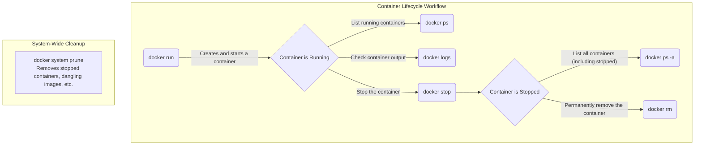

# Docker Core Commands

This note covers the essential commands for managing Docker containers, from creation and inspection to cleanup. 

---

## 1. `docker run`: Creating and Running Containers

**Definition:** Creates and starts a new container from a specified Docker image.

**Usage:**
```bash
docker run [OPTIONS] IMAGE [COMMAND] [ARG...]
```

**Common Options & Concepts:**

*   **Foreground vs. Detached Mode:**
    *   **Foreground (default):** The container is tied to your terminal. `CTRL+C` stops it.
        ```bash
        docker run python:3.12-slim
        ```
    *   **Detached (`-d`):** The container runs in the background. Ideal for servers and services.
        ```bash
        docker run -d --name my_web_server nginx
        ```

*   **Interactive Mode (`-it`):** Connects your terminal to the container for interactive sessions.
    ```bash
    docker run -it ubuntu /bin/bash
    ```

*   **Port Mapping (`-p`):** Exposes container ports to your host machine.
    ```bash
    docker run -d -p 8080:80 nginx
    ```

*   **Naming (`--name`):** Assigns a human-readable name to your container.
    ```bash
    docker run -d --name my_api my_api_image
    ```

*   **Keeping Containers Alive with `sleep`:**
    A container exits when its main process finishes. Use `sleep` to keep a container running for debugging or testing.
    ```bash
    # Keep a container running for 1 hour
    docker run -d --name temp_container ubuntu sleep 3600

    # Keep a container running indefinitely
    docker run -d --name long_running_container ubuntu sleep infinity
    ```

---

## 2. `docker ps`: Listing Containers

**Definition:** Lists your containers.

*   **`docker ps`**: Lists **only running** containers.
    ```bash
    docker ps
    ```
*   **`docker ps -a`**: Lists **all** containers (running, stopped, and exited).
    ```bash
    docker ps -a
    ```

**Key Information Displayed:**
*   `CONTAINER ID`: Unique identifier.
*   `IMAGE`: The image used to create the container.
*   `COMMAND`: The command running inside the container.
*   `STATUS`: `Up`, `Exited`, `Created`.
*   `PORTS`: Port mappings.
*   `NAMES`: The container's name.

---

## 3. `docker logs`: Inspecting Container Output

**Definition:** Fetches and displays the logs of a container.

**Usage:**
```bash
docker logs [OPTIONS] CONTAINER
```

**Common Options:**
*   `-f` or `--follow`: Follow the log output in real-time.
*   `--tail N`: Show the last `N` lines of the logs.

**Example:**
```bash
# View all logs of my_api
docker logs my_api

# Follow the logs of my_api in real-time
docker logs -f my_api
```

---

## 4. `docker system prune`: Cleaning Up

**Definition:** Removes unused Docker resources to free up disk space.

**Usage:**
```bash
# Removes stopped containers, unused networks, dangling images, and build cache
docker system prune
```

*   To remove **all unused images** (not just dangling ones), use the `-a` flag:
    ```bash
    docker system prune -a
    ```

**Targeted Pruning:**
You can also prune specific resource types:
*   `docker container prune`: Removes all stopped containers.
*   `docker image prune`: Removes all dangling images.
*   `docker volume prune`: Removes all unused volumes.

**Note:** There is no `docker ls` command. Use `docker ps` to list containers and `docker images` to list images.

---

## 5. Visual Workflow

Here is a flowchart of the basic Docker container lifecycle, which you can view in Obsidian:

