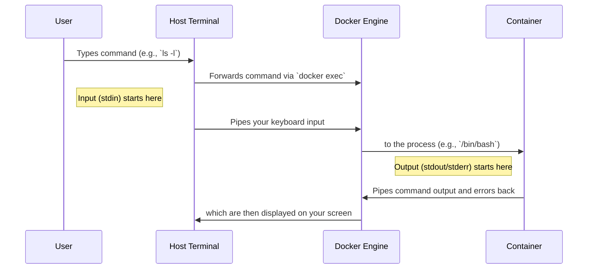

# Interacting with Running Containers (docker exec)

## Clarification / Context

This note explains how the `docker exec -it` command works at a deeper level. It covers how your commands in a terminal interact with a running container, the role of standard streams (`stdin`, `stdout`, `stderr`), and why the `-i` and `-t` flags are essential.

---

## 1. Containers as Isolated Environments

- A **container** is an isolated environment that behaves like a miniature operating system:
    
    - It has its own **filesystem**, **processes**, and **network stack**.
        
    - Commands executed inside the container are running in the **container's OS environment**, not directly on your host OS.
        
- Example:
    

```bash
docker run -it ubuntu /bin/bash
```

- The `/#` prompt you see is **inside the container**, not on your host machine.
    

---

## 2. How Commands Are Sent to the Container

You are not typing directly “inside” the container. Instead, Docker sets up a **communication channel** between your host terminal and the container process. Think of it like a phone call:

1. **Dialing the Container:**
    

```bash
docker exec -it <container_id> /bin/sh
```

- This tells Docker: “Start `/bin/sh` in this container and connect it to my terminal.”
    

2. **Host Terminal = Phone Handset:**
    

- The terminal on your host machine sends keystrokes to Docker.
    

3. **Container Shell = Receiver:**
    

- The `/bin/sh` process inside the container listens for input from this channel.
    

4. **Typing a Command:**
    

```bash
ls
```

- Keystrokes go from your keyboard → host terminal → Docker → container stdin.
    

5. **Getting Output:**
    

- The shell executes the command, producing output:
    

```
bin  dev  etc  home  ...
```

- Output flows back from container stdout → Docker → host terminal → your screen.
    

---

## 3. Standard Streams (Technical Explanation)

The communication channel uses three standard streams:

|Stream|Purpose|
|---|---|
|**stdin**|Receives input from your keyboard (interactive input)|
|**stdout**|Sends normal output from the container to your terminal|
|**stderr**|Sends error messages from the container to your terminal|

- The `-i` flag keeps **stdin open** so you can type commands.
    
- The `-t` flag allocates a **pseudo-TTY** so output is properly formatted, like a real terminal.
    

---

## 4. Flow Diagram (Text Version)



- This diagram illustrates the **bidirectional flow** of input and output.
    

---

## 5. Why `docker exec -it` is Important

1. **Debugging and Exploration:**
    
    - Inspect running containers:
        
        ```bash
        docker exec -it my-container /bin/bash
        ```
        
    - Check filesystem, logs, processes.
        
2. **One-time Commands:**
    
    - Run a single command inside a running container without opening a shell:
        
        ```bash
        docker exec my-container ls /app
        ```
        
3. **Background Tasks:**
    
    - With `-d`, run commands in the background:
        
        ```bash
        docker exec -d my-container touch /tmp/example.txt
        ```
        
4. **Automation Scripts:**
    
    - Useful in CI/CD pipelines to run commands inside containers programmatically.
        

---

## 6. Important Notes

- `docker exec` **requires the container to be running**. It will not work on stopped containers.
    
- You are **never typing directly inside the container**; Docker pipes your input to the process and pipes output back.
    
- Using `-it` is optional for non-interactive commands. Without it:
    
    - Commands still run, but you cannot interact with a shell or see nicely formatted terminal output.
        

---

## 7. Example Workflow

1. Start a container:
    

```bash
docker run -d --name test-container ubuntu sleep 3600
```

- The container runs in the background for 1 hour.
    

2. Connect interactively:
    

```bash
docker exec -it test-container /bin/bash
```

- Opens `/bin/bash` inside the container.
    

3. Inspect files:
    

```bash
ls /usr
cat /etc/os-release
```

4. Exit:
    

```bash
exit
```

- Returns you to your host terminal.
    

---

This expanded note gives a **complete understanding of `docker exec -it`**, explaining both the user-level experience and the technical mechanisms behind the scenes.
