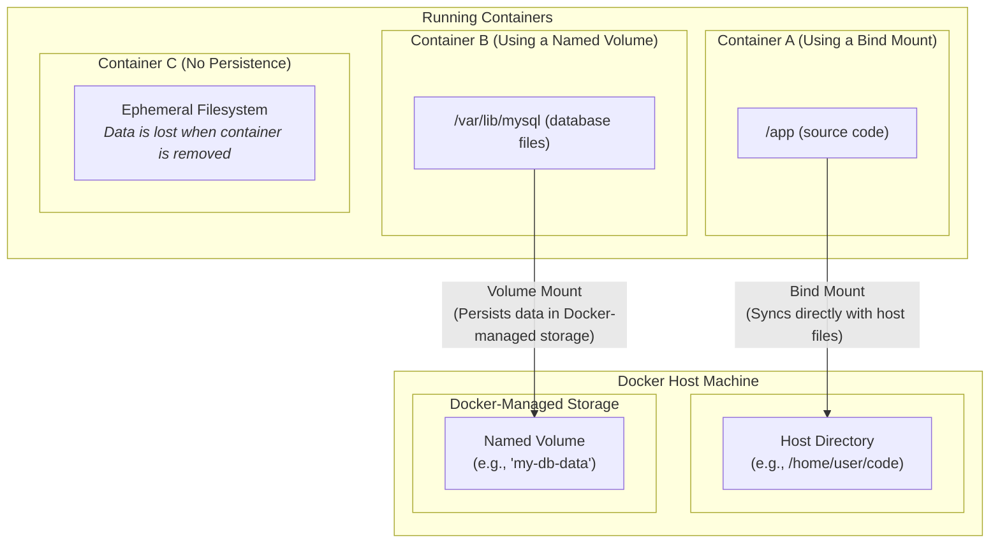

Volumes in Docker are a mechanism to persist data generated and used by containers. They allow containers to store data outside the container’s writable layer, so it isn’t lost when the container is removed. Let me break it down in detail:

---

## 1. **What is a Volume?**

A **volume** is a storage location managed by Docker that exists independently of containers. Unlike files inside a container's filesystem, data in a volume persists even if the container is deleted. Think of it as an external hard drive specifically for containers.

- **Key points:**
    
    - Lives outside the container’s filesystem.
        
    - Can be shared among multiple containers.
        
    - Managed by Docker (you don’t have to handle file paths manually unless you want to mount specific directories).
        

---

## 2. **Why Use Volumes?**

- **Data Persistence:** If a container is deleted, the data in a volume remains.
    
- **Sharing Data Between Containers:** Multiple containers can access the same volume.
    
- **Decoupling Data from Container Lifecycle:** You can update, delete, or recreate containers without losing data.
    
- **Backup and Restore:** Volumes make it easy to backup container data.
    

---

## 3. **Types of Volumes**

1.  **Named Volumes**
    - Created and managed by Docker.
    - You give them a name, e.g., `mydata`.
    - Usage:
      ```bash
      docker volume create mydata
      docker run -v mydata:/app/data myimage
      ```

2.  **Anonymous Volumes**
    - Created automatically if you mount a path without specifying a name.
    - Useful for temporary storage.

3.  **Bind Mounts**
    - Mount a directory from your host into the container.
    - Gives direct access to host files.
    - Usage:
      ```bash
      docker run -v /host/path:/container/path myimage
      ```

---

## 4. **How to Use Volumes**

- **Create a named volume:**
  ```bash
  docker volume create myvolume
  ```
- **Run a container with a volume:**
  ```bash
  docker run -d -v myvolume:/data myimage
  ```
- **List volumes:**
  ```bash
  docker volume ls
  ```
- **Inspect a volume:**
  ```bash
  docker volume inspect myvolume
  ```
- **Remove a volume:**
  ```bash
  docker volume rm myvolume
  ```    

---

## 5. **Example**

Imagine you have a MySQL container. The database files must persist even if the container is deleted:

```bash
docker volume create mysql_data
docker run -d \
  --name my_mysql \
  -v mysql_data:/var/lib/mysql \
  -e MYSQL_ROOT_PASSWORD=root \
  mysql:latest
```

Here:

- `mysql_data` is the volume.
    
- `/var/lib/mysql` is the path inside the container where MySQL stores its data.
    
- If the container is removed, the data remains in `mysql_data`.
    

---

**In short:**  
Volumes are Docker’s way to persist and manage data independently from containers. They make containers stateless and allow data sharing and backup. Without volumes, any data written inside a container would disappear when the container is removed.

---


Using a file system with Docker usually means **mounting directories or files from your host machine into a container** so the container can read or write to them. There are two main ways to do this: **volumes** and **bind mounts**. Here’s how to use them step by step:

---

## 1. **Using a Volume (Docker-managed file system)**

Volumes are recommended when you want Docker to manage the storage for you.

### Steps:

1. **Create a volume:**
    

```bash
docker volume create myvolume
```

2. **Run a container and mount the volume:**
    

```bash
docker run -d \
  -v myvolume:/app/data \
  --name mycontainer \
  myimage
```

- `/app/data` is the path **inside the container**.
    
- Any files written to `/app/data` will be stored in the Docker volume `myvolume` and persist even if the container is deleted.
    

3. **Access the volume (optional):**
    

```bash
docker run -it --rm -v myvolume:/data alpine sh
```

- Opens a shell inside an Alpine container with the volume mounted at `/data`.
    

---


## 2. **Using a Bind Mount (host file system)**

Bind mounts let you use a specific folder from your host machine inside the container.

### Example:

```bash
docker run -d \
  -v /home/user/myfiles:/app/data \
  --name mycontainer \
  myimage
```

- `/home/user/myfiles` is a folder on your host.
    
- `/app/data` is where the container can read/write files.
    
- Any changes in the container will affect the host folder immediately, and vice versa.
    

---


## 3. **Tips for Using File Systems in Docker**

- Use **volumes** for app data that needs persistence and portability.
    
- Use **bind mounts** when you need direct access to host files (like source code during development).
    
- Avoid writing to the container’s internal filesystem if you need the data to survive container removal.
    
- You can combine both for different purposes:
    
    - Volume for persistent data.
        
    - Bind mount for code development.
        

---


### Example: Using Both

```bash
docker run -d \
  -v myvolume:/var/lib/mysql \
  -v /home/user/mysql-config:/etc/mysql/conf.d \
  --name mysql \
  mysql:latest
```

- Database files go in `myvolume` (persistent).
    
- Configuration files come from host (`/home/user/mysql-config`) so you can edit them easily.
    

---

## Visualizing Data Persistence

This diagram shows how the different data storage methods relate to the host and container.


