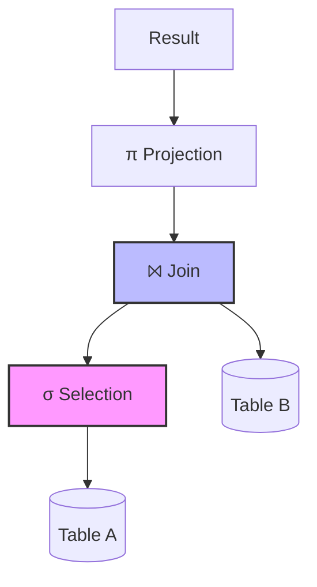

# Relational Model & Algebraic Operators

## 1. Core Concepts
> [!INFO] Essential Background
> The **Relational Model** (Codd, 1970) is based on set theory. It ensures data independence (physical storage vs. logical view).
> *   **Relation:** A table.
> *   **Tuple:** A row (record).
> *   **Attribute:** A column (field).
> *   **Domain:** The set of allowable values for an attribute (e.g., Integers, Dates).

### Keys and Constraints
1.  **Primary Key (PK):** A minimal set of attributes that uniquely identifies a tuple. Cannot be NULL.
2.  **Foreign Key (FK):** An attribute in one table that refers to the PK of another table. Enforces **Referential Integrity**.
3.  **Superkey:** Any set of attributes that identifies a tuple (PK is the *minimal* superkey).

---

## 2. Relational Algebra Operators
These are the building blocks for Query Optimization (TD4). SQL is just a user-friendly wrapper around these mathematical operations.

### Unary Operators (Act on 1 table)

#### Selection ($\sigma$)
*   **Symbol:** $\sigma_{condition}(R)$
*   **SQL Equivalent:** `WHERE` clause.
*   **Purpose:** Filters **rows** (horizontal slicing).
*   **Example:** $\sigma_{Salary > 2000}(Employee)$

#### Projection ($\pi$)
*   **Symbol:** $\pi_{columns}(R)$
*   **SQL Equivalent:** `SELECT column1, column2` clause.
*   **Purpose:** Filters **columns** (vertical slicing) and removes duplicates in pure algebra.
*   **Example:** $\pi_{Name, Age}(Employee)$

### Binary Operators (Act on 2 tables)

#### Cartesian Product ($\times$)
*   **Symbol:** $R \times S$
*   **SQL Equivalent:** `FROM R, S` (without a WHERE condition).
*   **Result:** Combines *every* row of R with *every* row of S.
*   **Size:** If R has $N$ rows and S has $M$ rows, result has $N \times M$ rows.
> [!WARNING] Performance Killer
> Avoid Cartesian Products in optimized queries. They generate massive intermediate datasets.

#### Join ($\bowtie$)
The most critical operator in relational DBs.
*   **Symbol:** $R \bowtie_{condition} S$
*   **Definition:** A Cartesian Product followed by a Selection. $\sigma(R \times S)$.
*   **Natural Join ($R \bowtie S$):** Joins on attributes with the same name automatically.

#### Division ($\div$)
*   **Symbol:** $R \div S$
*   **Use Case:** "Find X that is associated with **ALL** Y".
*   **Example:** Find students who have taken **all** courses.
*   **SQL Implementation:** SQL has no `DIVIDE BY` operator. We must use `NOT EXISTS` logic (Double Negation).
    *   *Logic:* Find students where there is **no** course that they have **not** taken.

---

## 3. Algebraic Trees (Query Trees)
Used in **TD4 (Optimization)**. The database engine converts SQL into a tree to figure out the fastest execution plan.

> [!TIP] Optimization Heuristic
> Always **Push Selections Down**.
> Applying a filter ($\sigma$) *before* a Join ($\bowtie$) drastically reduces the size of the data entering the join, making the query faster.