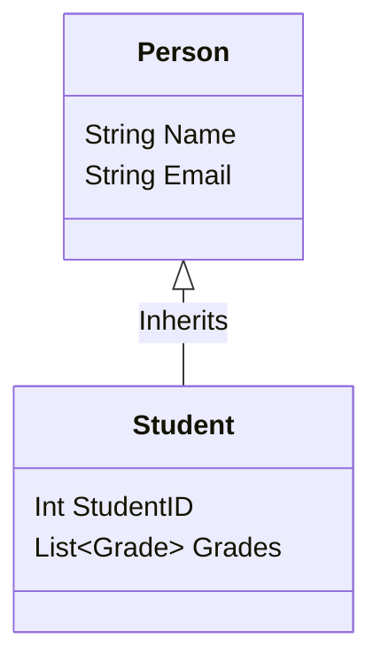

# Database Classifications

## 1. Object-Oriented Databases (OODB)
Integrates OOP concepts (C++, Java) directly into storage.
*   **Features:** Inheritance, Polymorphism, Encapsulation.
*   **Advantage:** Eliminates "Impedance Mismatch" (no need for ORM like Hibernate).
*   **Use Case:** CAD, Engineering simulations, Complex nested data.
*   **Examples:** ObjectDB, db4o.

## 2. NoSQL ("Not Only SQL")
Designed for horizontal scalability and unstructured data.

| Type | Description | Use Case | Example |
| :--- | :--- | :--- | :--- |
| **Key-Value** | Simple Hash Map. Fastest. | Session caching, Shopping carts | Redis, DynamoDB |
| **Document** | Stores JSON/BSON. Flexible schema. | Content Management, Catalogs | MongoDB |
| **Column-Family** | Stores columns separately. High write speed. | Big Data Analysis | Cassandra, HBase |
| **Graph** | Nodes and Edges. | Social Networks, Fraud Detection | Neo4j |

## 3. Specialized Databases
*   **Multimedia DB:** optimized for BLOBs (Images, Audio). Supports content-based retrieval.
*   **Time-Series DB:** Optimized for timestamped data (IoT sensors, Server logs). Example: InfluxDB.