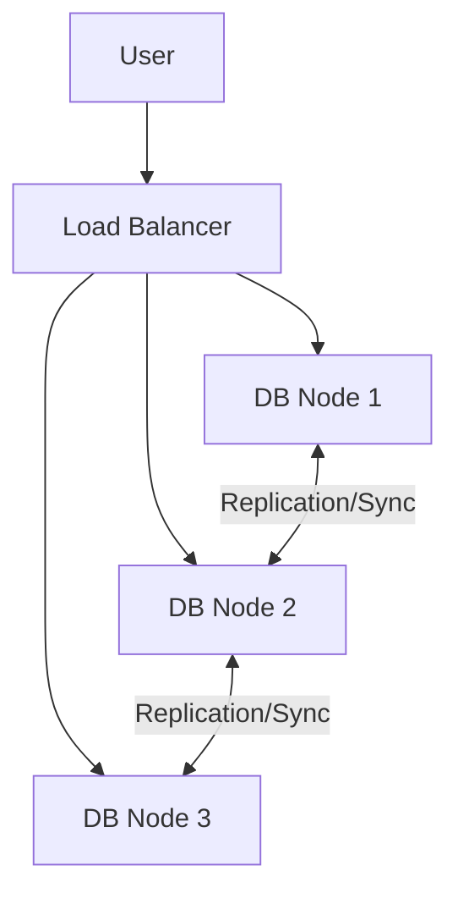

# Database Architectures

## 1. Client-Server Architecture
The standard centralized model.
*   **Client:** Sends queries (SQL) and displays results.
*   **Server:** Stores data, processes queries, manages transactions.
*   **Pros:** Easy to manage, centralized security.
*   **Cons:** Single Point of Failure (SPOF). Performance bottleneck if users increase.

## 2. Distributed Architecture
Data is spread across multiple nodes (computers).

### Strategies
1.  **Replication:**
    *   *Concept:* Copy the same data to multiple servers.
    *   *Pros:* High Availability (if Node A fails, Node B works). Read performance is high.
    *   *Cons:* Write consistency is hard (Syncing data takes time).
2.  **Fragmentation (Sharding):**
    *   *Concept:* Split the table. Rows 1-100 on Server A, 101-200 on Server B.
    *   *Pros:* Write performance (Parallel processing).
    *   *Cons:* Complex queries (Joins across servers are slow).

