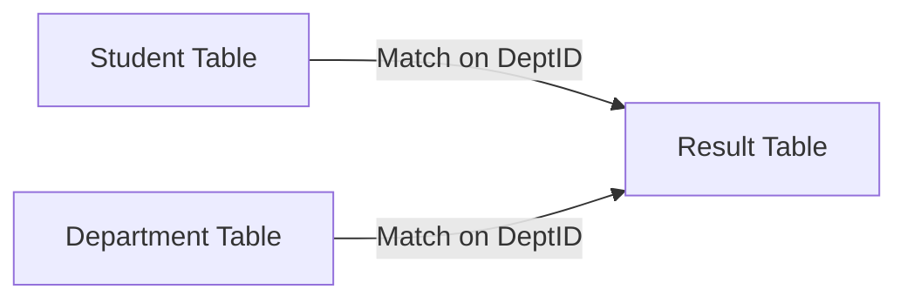

# Advanced Operators: Joins and Division

## 1. The Join Family ($\bowtie$)
The Join is the most powerful operator. It connects data across tables.
Mathematically, a Join is a **Cartesian Product** followed by a **Selection**:
$$ R \bowtie_{cond} S = \sigma_{cond} (R \times S) $$

| Join Type | Symbol | Description | SQL Equivalent |
| :--- | :---: | :--- | :--- |
| **Theta Join** | $R \bowtie_{\theta} S$ | Joins tables based on an arbitrary condition (e.g., $R.a > S.b$). | `JOIN ... ON R.a > S.b` |
| **Equi-Join** | $R \bowtie_{=} S$ | A Theta Join where the condition is strictly Equality ($=$). | `JOIN ... ON R.id = S.id` |
| **Natural Join** | $R \bowtie S$ | Automatically joins on columns with the **same name** and removes duplicate columns. | `NATURAL JOIN` |
| **Left Outer Join** | $R \bowtie_L S$ | Keeps all rows from $R$, even if no match in $S$ (fills with NULL). | `LEFT JOIN` |

### Visualizing a Natural Join
If we have `Student(ID, Name, DeptID)` and `Department(DeptID, DeptName)`:



*   **Algebra:** $Student \bowtie Department$
*   **SQL:** 
    ```sql
    SELECT * 
    FROM Student S, Department D 
    WHERE S.DeptID = D.DeptID;
    ```

---

## 2. The Division Operator ($\div$)
The Division operator is the hardest concept in Relational Algebra. It is used to answer questions involving **"ALL"** or **"EVERY"**.

> [!TIP] How to spot a Division?
> Look for keywords like:
> *   "Find students who took **all** courses."
> *   "Find pilots who can fly **every** plane type."
> *   "Find clients who bought **all** products."

### Definition
Given $R(A, B)$ and $S(B)$, the division $R \div S$ returns values of $A$ that are associated with **every** value of $B$ in $S$.

### The "Magic" Formula (Derivation)
Since SQL has no `DIVIDE` command, we must derive it using fundamental operators (Difference and Product).

$$ R \div S = \pi_A(R) - \pi_A( (\pi_A(R) \times S) - R ) $$

**Logic Breakdown:**
1.  **$\pi_A(R)$**: Get a list of all candidates (e.g., all Students).
2.  **$\pi_A(R) \times S$**: Imagine every candidate took every course (Perfect World).
3.  **$(\dots) - R$**: Subtract what they *actually* took. The result is what they **missed**.
4.  **Total - Missed**: If we remove the students who missed at least one course, we are left with those who took **all**.

### SQL Implementation (The Double Negative)
To perform division in SQL (TD3), we use `NOT EXISTS`.

**Query:** Find students who took ALL courses in the 'Core' module.

```sql
SELECT S.Name 
FROM Student S
WHERE NOT EXISTS (
    -- Look for a course...
    SELECT C.CourseID 
    FROM Courses C 
    WHERE C.Type = 'Core'
    AND NOT EXISTS (
        -- ...that the student has NOT taken
        SELECT * 
        FROM Enrolled E
        WHERE E.StudentID = S.StudentID 
        AND E.CourseID = C.CourseID
    )
);
```
*Translation:* "Find students where there is **no** core course that they have **not** enrolled in."

### Alternative SQL (Aggregation)
Often easier to write in exams:
```sql
SELECT StudentID
FROM Enrolled
WHERE CourseID IN (SELECT CourseID FROM Courses WHERE Type = 'Core')
GROUP BY StudentID
HAVING COUNT(DISTINCT CourseID) = (SELECT COUNT(*) FROM Courses WHERE Type = 'Core');
```
*Translation:* "Find students whose count of taken core courses equals the total number of core courses."
