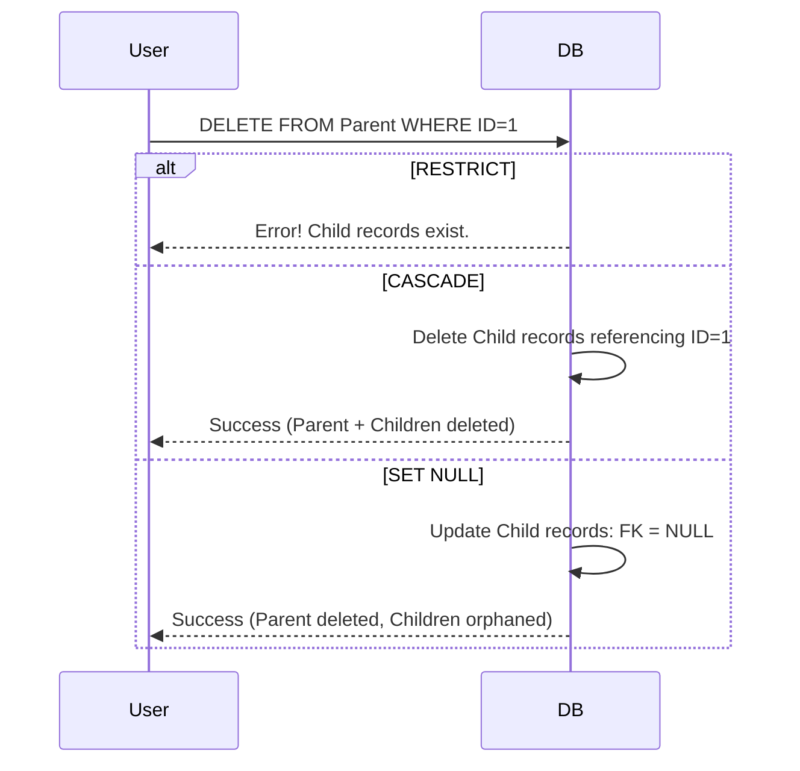

# Foreign Key Behaviors

**Concept:** Ensures that a relationship between two tables remains valid. If `Order` references `Customer`, the Customer must exist.

## What happens when the Parent is Deleted?
You must define the behavior for the Child records.

### 1. CASCADE
*   **Action:** Delete the child automatically.
*   **Use Case:** Strong composition. If a `Post` is deleted, its `Comments` should also be deleted.

### 2. SET NULL
*   **Action:** Keep the child, but remove the link (Set FK to NULL).
*   **Use Case:** Loose association. If an `Employee` leaves, their `Tasks` should remain but be unassigned.

### 3. RESTRICT (Default)
*   **Action:** Block the deletion. Throw an error.
*   **Use Case:** Data protection. You cannot delete a `Category` if `Products` are still using it.

### 4. SET DEFAULT
*   **Action:** Change the FK to a specific default ID.
*   **Use Case:** Fallback. If a `Teacher` leaves, assign students to a "Substitute Teacher" ID.

